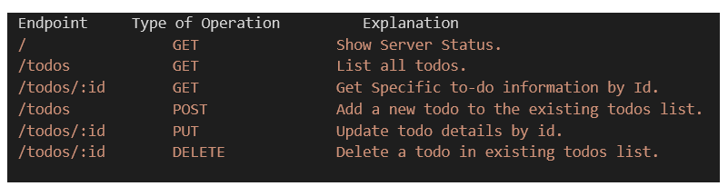
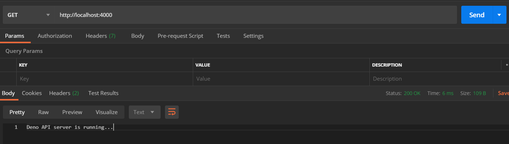
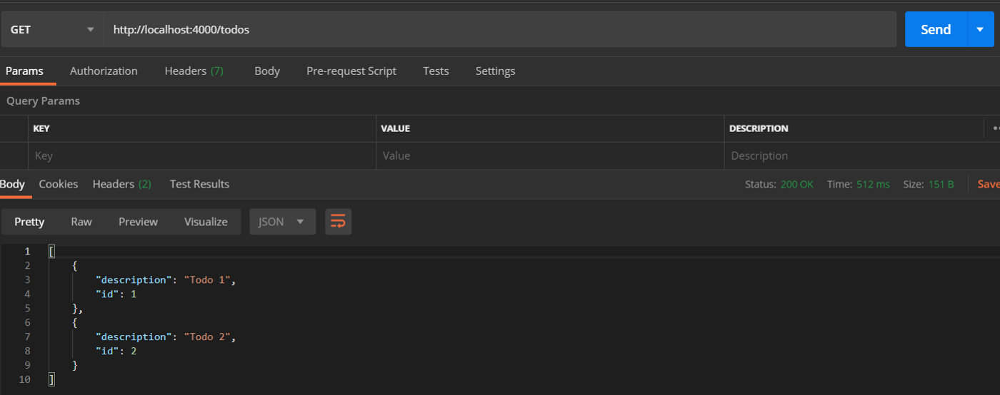
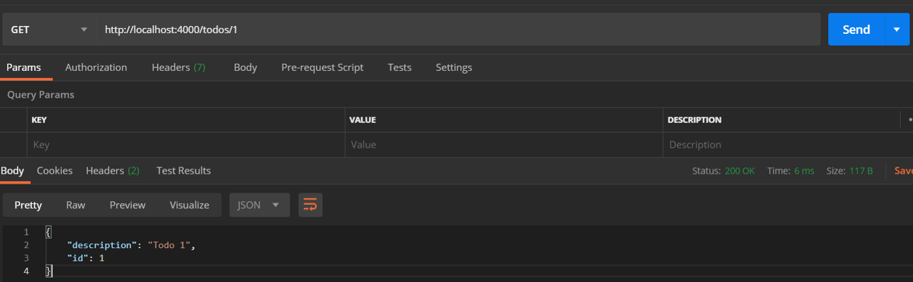
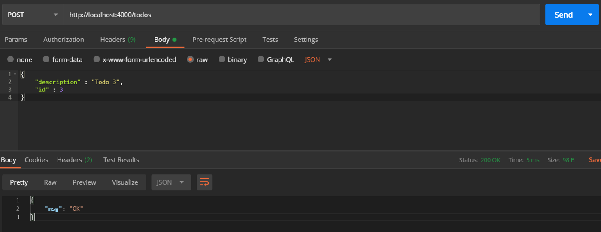
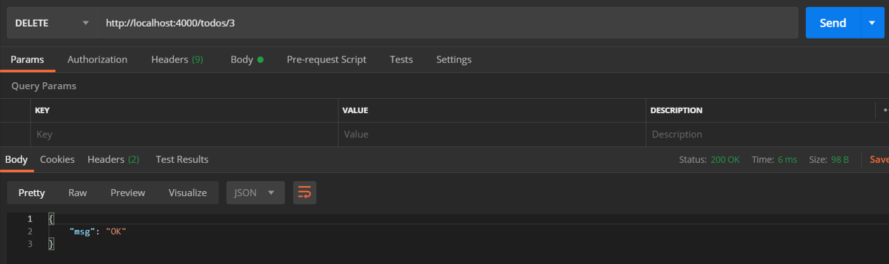

转载自 [使用 Deno 和 Oak 构建 CRUD API](https://juejin.cn/post/6844904179392069645)

相对于 Node 来说，Deno 是相当新的环境。开发者在学习 Deno 的时候通常想做的第一件事就是构建 CRUD API。Deno 有一系列的项目帮助我们实现这个目的，包括 [deno-express](https://github.com/NMathar/deno-express)、[oak](https://github.com/oakserver/oak)、[servest](https://github.com/keroxp/servest)、[deno-drash](https://github.com/drashland/deno-drash) 和 [pogo](https://github.com/sholladay/pogo)。在这篇文章，我们将会使用 Deno 和 Oak 学习构建一个待办事项清单。

#### 我们要构建什么?

Oak 是一个受到 [Koa](https://github.com/koajs/koa) 启发的项目，Koa 是一个很受欢迎并提供 HTTP 服务的 Node.js 中间件框架。我们将会使用 oak 和 Deno 构建一个处理待办实现清单的小应用。我们将要创建的 API 如下面的 Endpoint 显示。



#### 我们如何构建它?

我们需要在我们的项目库中创建两个文件，分别是 **app.ts** 和 **routes.ts**。一个用于应用，另一个则是用于服务的路由。

**app.ts** 文件的内容如下面的文件显示。看看我们是如何在 **app.ts** 文件中从 oak 引入 Application 模块的。我们在第 8 行创建了新的 oak 应用。我们让这个应用使用了稍后将会在 **routes.ts** 文件中定义的路由。现在，这个应用将可以运行在第 6 行指定的地址和第 5 行指定的端口上。

```tsx
import { Application } from 'https://deno.land/x/oak/mod.ts';
import { router } from "./routes.ts";

const env = Deno.env.toObject()
const PORT = env.PORT || 4000
const HOST = env.HOST || '127.0.0.1'

const app = new Application()

app.use(router.routes())
app.use(router.allowedMethods())

console.log(`Listening on port ${PORT}...`)

await app.listen(`${HOST}:${PORT}`)

```

我们将会在 **routes.ts** 中创建一个 Todo 接口，该接口包含两个字段 **id** 和 **description**。我们将会使待办事项的 id 和待办事项的描述分别存储在这两个字段上。我们还有一个待办事项清单，其中包含首次返回时使用的初始清单。

```tsx
interface Todo {
    description: string
    id: number
}

let todos: Array<Todo> = [
    {
        description: 'Todo 1',
        id: 1,
    },
    {
        description: 'Todo 2',
        id: 2,
    },
]

```

我们现在来定义一些支持待办事项的列表操作的相关函数，通过 id 获取指定的待办事项，创建新的待办事项，通过 id 更新/删除指定待办事项的描述。可以从下面的文件中看到类似的代码。

```tsx
export const getTodos = ({ response }: { response: any }) => {
    response.body = todos
}

export const getTodo = ({
    params,
    response,
}: {
    params: {
        id: string
    }
    response: any
}) => {
    const todo = todos.filter((todo) => todo.id === parseInt(params.id))
    if (todo.length) {
        response.status = 200
        response.body = todo[0]
        return
    }

    response.status = 400
    response.body = { msg: `Cannot find todo ${params.id}` }
}

export const addTodo = async ({
    request,
    response,
}: {
    request: any
    response: any
}) => {
    const body = await request.body()
    const { description, id }: { description: string; id: number } = body.value
    todos.push({
        description: description,
        id: id,
    })

    response.body = { msg: 'OK' }
    response.status = 200
}

export const updateTodo = async ({
    params,
    request,
    response,
}: {
    params: {
        id: string
    }
    request: any
    response: any
}) => {
    const temp = todos.filter((existingTodo) => existingTodo.id === parseInt(params.id))
    const body = await request.body()
    const { description }: { description: string } = body.value.description

    if (temp.length) {
        temp[0].description = description
        response.status = 200
        response.body = { msg: 'OK' }
        return
    }

    response.status = 400
    response.body = { msg: `Cannot find todo ${params.id}` }
}

export const removeTodo = ({
    params,
    response,
}: {
    params: {
        id: string
    }
    response: any
}) => {
    const lengthBefore = todos.length
    todos = todos.filter((todo) => todo.id !== parseInt(params.id))

    if (todos.length === lengthBefore) {
        response.status = 400
        response.body = { msg: `Cannot find todo ${params.id}` }
        return
    }

    response.body = { msg: 'OK' }
    response.status = 200
}

export const getHome = ({ response }: { response: any }) => {
    response.body = 'Deno API server is running...'
    response.status = 200
}

```

我们通过下面的函数创建并导出了路由。

```tsx
import { Router } from 'https://deno.land/x/oak/mod.ts'

export const router = new Router()
router
    .get('/', getHome)
    .get('/todos', getTodos)
    .get('/todos/:id', getTodo)
    .post('/todos', addTodo)
    .put('/todos/:id', updateTodo)
    .delete('/todos/:id', removeTodo)

```

运行以下命令即可让应用运行在 [http://localhost:4000](http://localhost:4000/) 上

> **deno run — allow-env — allow-net app.ts**	

现在，应用运行在 localhost:4000 上，使用 postman 或者其他类似的工具来测试这些 API 路由接口。以下是使用 postman 测试得到的结果的屏幕截图。











**如果你想克隆我在文章中使用的代码，以此观察它是如何工作的。你可以使用下面的链接在 GitHub 上查看。**

**源码链接 :**[ https://github.com/Kailashw/deno-api-oak](https://github.com/Kailashw/deno-api-oak)

源码有错误，文章代码正常运行