JavaScript 数据结构与算法学习笔记（专辑）是作者根据哔哩哔哩 [《JavaScript 数据结构与算法》](https://www.bilibili.com/video/BV1x7411L7Q7?p=1) 视频教程整理而得，供大家参与查阅，欢迎指出错误。

本专辑所有文章&源码&测试环境均托管在 [GitHub](https://github.com/XPoet/js-data-structures-and-algorithms)，如需转载，请注明出处。

推荐大家按目录顺序来学习，由浅入深，循序渐进，轻松搞定 JavaScript 数据结构与算法。

## 一 前言

### 1 什么是数据结构？

####  1.1 数据结构的定义

- 官方定义

  无

- 民间定义

  - “数据结构是数据对象，以及存在于该对象的实例和组成实例的数据元素之间的各种联系。这些联系可以通过定义相关的函数来给出。” — 《数据结构、算法与应用》
  - “数据结构是 ADT（抽象数据类型 Abstract Data Type）的物理实现。” — 《数据结构与算法分析》
  - “数据结构（data structure）是计算机中存储、组织数据的方式。通常情况下，精心选择的数据结构可以带来最优效率的算法。” —中文维基百科

- 从自己角度认识

  在计算机中，存储和组织数据的方式。

#### 1.2 数据结构在生活中应用

我们知道，计算机中数据量非常庞大，如何以高效的方式组织和存储呢?

例如：一个庞大的图书馆中存放了大量的书籍，我们不仅仅要把书放进入，还应该在合适的时候能够取出来。

图书摆放的插入和寻找两个相关操作：

- 操作 1：新书怎么插入？
- 操作 2：怎么找到某本指定的书？

图书各种摆放方式：

- 方法 1：随便放
  - 操作 1：哪里有空位放哪里。
  - 操作 2：找某本书，累死。
- 方法 2：按照书名的拼音字母顺序排放
  - 操作 1：新进一本《阿 Q 正传》， 按照字母顺序找到位置，插入。
  - 操作 2：二分查找法。
- 方法 3：把书架划分成几块区域，按照类别存放，类别中按照字母顺序
  - 操作 1：先定类别，二分查找确定位置，移出空位。
  - 操作 2：先定类别，再二分查找。

结论：

- 解决问题方法的效率，根据数据的组织方式有关。
- 计算机中存储的数据量相对于图书馆的书籍来说数据量更大，数据更加多。
- 以什么样的方式，来存储和组织我们的数据才能在使用数据时更加方便呢?
- 这就是数据结构需要考虑的问题。

#### 1.3 常见的数据结构

- 数组（Aarray）
- 栈（Stack）
- 链表（Linked List）
- 图（Graph）
- 散列表（Hash）
- 队列（Queue）
- 树（Tree）
- 堆（Heap）

> 注意：数据结构与算法==与语言无关==，常见的编程语言都有**直接或间接**的使用上述常见的数据结构。

### 2 什么是算法？

#### 2.1 算法（Algorithm）的定义

- 一个有限指令集，每条指令的描述不依赖于语言。
- 接收一些输入（==有些情况下不需要输入==）。
- 产生输出。
- 一定在有限步骤之后终止。

#### 2.2 算法通俗理解

- Algorithm 这个单词本意就是解决问题的办法/步骤逻辑。
- 数据结构的实现，离不开算法。

#### 2.3 算法案例

假如上海和杭州之间有一条高架线，高架线长度是 1,000,000 米，有一天高架线中有其中一米出现了故障，请你想出一种算法，可以快速定位到处问题的地方。

线性查找

- 从上海的起点开始一米一米的排查，最终一定能找到出问题的线段。
- 但是如果线段在另一头，我们需要排查 1,000,000 次，这是最坏的情况，平均需要 500,000 次。

二分查找

- 从中间位置开始排查，看一下问题出在上海到中间位置，还是中间到杭州的位置。
- 查找对应的问题后，再从中间位置分开，重新锁定一半的路程。
- 最坏的情况，需要多少次可以排查完呢? 最坏的情况是 20 次就可以找到出问题的地方。
- 怎么计算出来的呢? log(1000000, 2)，以 2 位底，1000000 的对数 ≈ 20。（这个为什么是对数呢，因为1000000除以2，再除以2，最后到没有可除。就是1000000取2的对数）

结论：
你会发现，解决问题的办法有很多，但是好的算法对比于差的算法，效率天壤之别。

## 二 数组

### 1 创建和初始化数组

- new Array()

  ```javascript
  const daysOfWeek = new Array(
    "Sunday",
    "Monday",
    "Tuesday",
    "Wednesday",
    "Thursday",
    "Friday",
    "Saturday"
  );
  ```

- []

  ```javascript
  const daysOfWeek = [
    "Sunday",
    "Monday",
    "Tuesday",
    "Wednesday",
    "Thursday",
    "Friday",
    "Saturday",
  ];
  ```

### 2 数组常见操作

#### 2.1 添加元素

- 添加一个元素到数组的最后位置 `array.push(item)`
- 在数组首位插入一个元素 `array.unshift(item)`
- 在指定索引位置插入元素 `array.splice(index, 0, item)`

> splice() 第二个参数为 0 时，表示插入数据。

```javascript
let myArray = [1, 2, 3];
// 在 索引 0 的位置，插入 A
myArray.splice(0, 0, "A");
console.log(myArray); //--> ['A', 1, 2, 3]
```

#### 2.2 删除元素

- 删除数组最后的元素 `array.pop(item)`

- 删除数组首位的元素 `array.shift(item)`

- 删除指定索引位置的元素 `array.splice(start, number)`

  例如：

  ```javascript
  let myArray2 = [1, 2, 3, 4, 5];
  // 删除索引 4 位置起，2 个元素
  myArray2.splice(4, 2);
  console.log(myArray2); //--> [1, 2, 3]
  ```

#### 2.3 修改元素

- 修改指定索引位置的元素 `array.splice(index, 1, item)`

  ```javascript
  let myArray3 = [1, 2, 3, 4, 5, 6];
  // 修改 索引 1 的位置的元素为 AA
  myArray2.splice(1, 1, "AA");
  console.log(myArray3); //--> [1, "AA", 3, 4, 5, 6]
  ```

- 修改指定索引位置的几个元素 `array.splice(index, number, item)`

  ```javascript
  let myArray4 = [1, 2, 3, 4, 5, 6, 7];
  // 在 索引 2 的位置起，修改两个元素为 AA BB
  myArray2.splice(2, 2, "AA", "BB");
  console.log(myArray3); //--> [1, 2, "AA", "BB", 5, 6, 7]
  ```

## 三 栈

数组是一个线性结构，并且可以在数组的任意位置插入和删除元素。
但是有时候，我们为了实现某些功能，必须对这种任意性加以限制。
栈和队列就是比较常见的==受限的线性结构==。

### 1 什么是栈

栈（stack）是一种运算受限的线性表：

- `LIFO（last in first out）`表示就是后进入的元素，第一个弹出栈空间。
- 其限制是仅允许在表的一端进行插入和删除运算。这一端被称为栈顶，相对地，把另一端称为栈底。
- 向一个栈插入新元素又称作进栈、入栈或压栈，它是把新元素放到栈顶元素的上面，使之成为新的栈顶元素；
- 从一个栈删除元素又称作出栈或退栈，它是把栈顶元素删除掉，使其相邻的元素成为新的栈顶元素。


栈的特点：**先进后出，后进先出**。

### 2 程序中的栈结构

- 函数调用栈：A(B(C(D())))：
  即 A 函数中调用 B，B 调用 C，C 调用 D；在 A 执行的过程中会将 A 压入栈，随后 B 执行时 B 也被压入栈，函数 C 和 D 执行时也会被压入栈。所以当前栈的顺序为：A->B->C->D（栈顶）；函数 D 执行完之后，会弹出栈被释放，弹出栈的顺序为 D->C->B->A;

- 递归：
  为什么没有停止条件的递归会造成栈溢出？比如函数 A 为递归函数，不断地调用自己（因为函数还没有执行完，不会把函数弹出栈），不停地把相同的函数 A 压入栈，最后造成栈溢出（Queue Overfloat）。

### 3 练习

题目：有 6 个元素 6，5，4，3，2，1 按顺序进栈，问下列哪一个不是合法的出栈顺序？

- A：5 4 3 6 1 2 （√）
- B：4 5 3 2 1 6 （√）
- C：3 4 6 5 2 1 （×）
- D：2 3 4 1 5 6 （√）

题目所说的按顺序进栈指的==不是一次性全部进栈==，而是有进有出，进栈顺序为 6 -> 5 -> 4 -> 3 -> 2 -> 1。

解析：

- A 答案：65 进栈，5 出栈，4 进栈出栈，3 进栈出栈，6 出栈，21 进栈，1 出栈，2 出栈（整体入栈顺序符合 654321）。
- B 答案：654 进栈，4 出栈，5 出栈，3 进栈出栈，2 进栈出栈，1 进栈出栈，6 出栈（整体的入栈顺序符合 654321）。
- C 答案：6543 进栈，3 出栈，4 出栈，之后应该 5 出栈而不是 6，所以错误。
- D 答案：65432 进栈，2 出栈，3 出栈，4 出栈，1 进栈出栈，5 出栈，6 出栈。符合入栈顺序。

### 4 栈结构实现

#### 4.1 栈常见的操作

- `push()` 添加一个新元素到栈顶位置。
- `pop()` 移除栈顶的元素，同时返回被移除的元素。
- `peek()` 返回栈顶的元素，不对栈做任何修改（该方法不会移除栈顶的元素，仅仅返回它）。
- `isEmpty()` 如果栈里没有任何元素就返回 `true`，否则返回 `false`。
- `size()` 返回栈里的元素个数。这个方法和数组的 `length` 属性类似。
- `toString()` 将栈结构的内容以字符串的形式返回。

#### 4.2 JavaScript 代码实现栈结构

其实没写啥特别的，用的都是数组的基本方法

```javascript
// 栈结构的封装
class Map {
  constructor() {
    this.items = [];
  }

  // push(item) 压栈操作，往栈里面添加元素
  push(item) {
    this.items.push(item);
  }

  // pop() 出栈操作，从栈中取出元素，并返回取出的那个元素
  pop() {
    return this.items.pop();
  }

  // peek() 查看栈顶元素
  peek() {
    return this.items[this.items.length - 1];
  }

  // isEmpty() 判断栈是否为空
  isEmpty() {
    return this.items.length === 0;
  }

  // size() 获取栈中元素个数
  size() {
    return this.items.length;
  }

  // toString() 返回以字符串形式的栈内元素数据
  toString() {
    let result = "";
    for (let item of this.items) {
      result += item + " ";
    }
    return result;
  }
}
```

#### 4.3 测试封装的栈结构

```javascript
// push() 测试
stack.push(1);
stack.push(2);
stack.push(3);
console.log(stack.items); //--> [1, 2, 3]

// pop() 测试
console.log(stack.pop()); //--> 3

// peek() 测试
console.log(stack.peek()); //--> 2

// isEmpty() 测试
console.log(stack.isEmpty()); //--> false

// size() 测试
console.log(stack.size()); //--> 2

// toString() 测试
console.log(stack.toString()); //--> 1 2
```

### 5 栈结构的简单应用

利用栈结构的特点封装实现十进制转换为二进制的方法。

#### 5.1 代码实现

```javascript
function dec2bin(dec) {
  // new 一个 Map，保存余数
  const stack = new Map();

  // 当不确定循环次数时，使用 while 循环
  while (dec > 0) {
    // 除二取余法
    stack.push(dec % 2); // 获取余数，放入栈中
    dec = Math.floor(dec / 2); // 除数除以二，向下取整
  }
  // stack 现在为0010011
  let binaryString = "";
  // 不断地从栈中取出元素（0 或 1），并拼接到一起。
  while (!stack.isEmpty()) {
    binaryString += stack.pop();
  }

  return binaryString;
}
```

#### 5.2 测试

```javascript
// dec2bin() 测试
console.log(dec2bin(100)); //--> 1100100
console.log(dec2bin(88)); //--> 1011000

```

## 四 队列

### 1 认识队列

队列（Queue）是一种运算受限的线性表，特点：先进先出。(FIFO：First In First Out)

**受限之处：**

- 只允许在表的前端（front）进行删除操作。
- 只允许在表的后端（rear）进行插入操作。

生活中类似队列结构的场景：

- 排队，比如在电影院，商场，甚至是厕所排队。
- 优先排队的人，优先处理。 (买票、结账、WC)。


#### 1.1 队列图解


#### 1.2 队列在程序中的应用

- 打印队列：计算机打印多个文件的时候，需要排队打印。
- 线程队列：当开启多线程时，当新开启的线程所需的资源不足时就先放入线程队列，等待 CPU 处理。

### 2 队列的实现

队列的实现和栈一样，有两种方案：

- 基于数组实现。
- ==基于链表实现==。

#### 2.1 队列常见的操作

- `enqueue(element)` 向队列尾部添加一个（或多个）新的项。
- `dequeue()` 移除队列的第一（即排在队列最前面的）项，并返回被移除的元素。
- `front()` 返回队列中的第一个元素——最先被添加，也将是最先被移除的元素。队列不做任何变动（不移除元素，只返回元素信息与 Map 类的 peek 方法非常类似）。
- `isEmpty()` 如果队列中不包含任何元素，返回 true，否则返回 false。
- `size()` 返回队列包含的元素个数，与数组的 length 属性类似。
- `toString()` 将队列中的内容，转成字符串形式。

#### 2.2 代码实现

```javascript
class Queue {
  constructor() {
    this.items = [];
  }

  // enqueue(item) 入队，将元素加入到队列中
  enqueue(item) {
    this.items.push(item);
  }

  // dequeue() 出队，从队列中删除队头元素，返回删除的那个元素
  dequeue() {
    return this.items.shift();
  }

  // front() 查看队列的队头元素
  front() {
    return this.items[0];
  }

  // isEmpty() 查看队列是否为空
  isEmpty() {
    return this.items.length === 0;
  }

  // size() 查看队列中元素的个数
  size() {
    return this.items.length;
  }

  // toString() 将队列中的元素以字符串形式返回
  toString() {
    let result = "";
    for (let item of this.items) {
      result += item + " ";
    }
    return result;
  }
}
```

#### 2.3 测试代码

```javascript
const queue = new Queue();

// enqueue() 测试
queue.enqueue("a");
queue.enqueue("b");
queue.enqueue("c");
queue.enqueue("d");
console.log(queue.items); //--> ["a", "b", "c", "d"]

// dequeue() 测试
queue.dequeue();
queue.dequeue();
console.log(queue.items); //--> ["c", "d"]

// front() 测试
console.log(queue.front()); //--> c

// isEmpty() 测试
console.log(queue.isEmpty()); //--> false

// size() 测试
console.log(queue.size()); //--> 2

// toString() 测试
console.log(queue.toString()); //--> c d
```

### 3 队列的应用

使用队列实现小游戏：**击鼓传花**。

分析：传入一组数据集合和设定的数字 number，循环遍历数组内元素，遍历到的元素为指定数字 number 时将该元素删除，直至数组剩下一个元素。

(此例是模拟以==相同的人数频率number==，向下击鼓传花)

#### 3.1  代码实现

```javascript
// 利用队列结构的特点实现击鼓传花游戏求解方法的封装
function passGame(nameList, number) {
  // 1、new 一个 Queue 对象
  const queue = new Queue();

  // 2、将 nameList 里面的每一个元素入队
  for (const name of nameList) {
    queue.enqueue(name);
  }

  // 3、开始数数
  // 队列中只剩下 1 个元素时就停止数数
  while (queue.size() > 1) {
    // 不是 number 时，重新加入到队尾
    // 是 number 时，将其删除

    for (let i = 0; i < number - 1; i++) {
      // number 数字之前的人重新放入到队尾（即把队头删除的元素，重新加入到队列中）
      queue.enqueue(queue.dequeue());
    }

    // number 对应这个人，直接从队列中删除
    // 由于队列没有像数组一样的下标值不能直接取到某一元素，
    // 所以采用，把 number 前面的 number - 1 个元素先删除后添加到队列末尾，
    // 这样第 number 个元素就排到了队列的最前面，可以直接使用 dequeue 方法进行删除
    queue.dequeue();
  }

  // 4、获取最后剩下的那个人
  const endName = queue.front();

  // 5、返回这个人在原数组中对应的索引
  return nameList.indexOf(endName);
}
```

#### 3.2 测试代码

```javascript
// passGame() 测试
const names = ["lily", "lucy", "tom", "tony", "jack"];
const targetIndex = passGame(names, 4);
console.log("击鼓传花", names[targetIndex]); //--> lily
```

数据变化过程

~~tony~~ jack lily lucy tom

~~tom~~ jack lily lucy

~~jack~~ lily lucy

~~lucy~~ lily

## 五 优先队列

### 1 场景

生活中类似**优先队列**的场景：

- 优先排队的人，优先处理。 (买票、结账、WC)。（这不就是普通情况吗）
- 排队中，有紧急情况（特殊情况）的人可优先处理。

### 2 优先队列

优先级队列主要考虑的问题：

- 每个元素不再只是一个数据，还包含优先级。
- 在添加元素过程中，根据优先级放入到正确位置。

### 3 优先队列的实现

#### 3.1 代码实现

基本只有入队方法变化。仅是比较下优先级，找到大于当前数据优先级的位置就插入它的位置，因为数据优先级是顺序排列，所以找到一次就可以break退出循环了

```javascript
// 优先队列内部的元素类
class QueueElement {
  constructor(element, priority) {
    this.element = element;
    this.priority = priority;
  }
}

// 优先队列类（继承 Queue 类）
export class PriorityQueue extends Queue {
  constructor() {
    super();
    // 生成了 this.items
  }

  // enqueue(element, priority) 入队，将元素按优先级加入到队列中
  // 重写 enqueue()
  enqueue(element, priority) {
    // 根据传入的元素，创建 QueueElement 对象
    const queueElement = new QueueElement(element, priority);

    // 判断队列是否为空（调用本地方法isEmpty）
    if (this.isEmpty()) {
      // 如果为空，不用判断优先级，直接添加
      this.items.push(queueElement);
    } else {
      // 定义一个变量记录是否成功添加了新元素
      let added = false;

      for (let i = 0; i < this.items.length; i++) {
        // 让新插入的元素进行优先级比较，priority 值越小，优先级越大
        if (queueElement.priority < this.items[i].priority) {
          // 在指定的位置插入元素
          this.items.splice(i, 0, queueElement);
          added = true;
          break;
        }
      }

      // 如果遍历完所有元素，优先级都大于新插入的元素，就将新插入的元素插入到最后
      if (!added) {
        this.items.push(queueElement);
      }
    }
  }

  // dequeue() 出队，从队列中删除前端元素，返回删除的元素
  // 继承 Queue 类的 dequeue()
  dequeue() {
    return super.dequeue();
  }

  // front() 查看队列的前端元素
  // 继承 Queue 类的 front()
  front() {
    return super.front();
  }

  // isEmpty() 查看队列是否为空
  // 继承 Queue 类的 isEmpty()
  isEmpty() {
    return super.isEmpty();
  }

  // size() 查看队列中元素的个数
  // 继承 Queue 类的 size()
  size() {
    return super.size();
  }

  // toString() 将队列中元素以字符串形式返回
  // 重写 toString()
  toString() {
    let result = "";
    for (let item of this.items) {
      result += item.element + "-" + item.priority + " ";
    }
    return result;
  }
}
```

#### 3.2 测试代码

```javascript
const priorityQueue = new PriorityQueue();

// 入队 enqueue() 测试
priorityQueue.enqueue("A", 10);
priorityQueue.enqueue("B", 15);
priorityQueue.enqueue("C", 11);
priorityQueue.enqueue("D", 20);
priorityQueue.enqueue("E", 18);
console.log(priorityQueue.items);
//--> output:
// QueueElement {element: "A", priority: 10}
// QueueElement {element: "C", priority: 11}
// QueueElement {element: "B", priority: 15}
// QueueElement {element: "E", priority: 18}
// QueueElement {element: "D", priority: 20}

// 出队 dequeue() 测试
priorityQueue.dequeue();
priorityQueue.dequeue();
console.log(priorityQueue.items);
//--> output:
// QueueElement {element: "B", priority: 15}
// QueueElement {element: "E", priority: 18}
// QueueElement {element: "D", priority: 20}

// isEmpty() 测试
console.log(priorityQueue.isEmpty()); //--> false

// size() 测试
console.log(priorityQueue.size()); //--> 3

// toString() 测试
console.log(priorityQueue.toString()); //--> B-15 E-18 D-20
```

## 六 单向链表

### 1 认识链表

#### 1.1 链表和数组

链表和数组一样，可以用于存储一系列的元素，但是链表和数组的实现机制完全不同。

##### 1.1.1 数组

- 存储多个元素，数组（或列表）可能是最常用的数据结构。

- 几乎每一种编程语言都有默认实现数组结构，提供了一个便利的 `[]` 语法来访问数组元素。

- 数组缺点：

  - 数组的创建需要申请一段连续的内存空间(一整块内存)，并且大小是固定的，当前数组不能满足容量需求时，需要扩容。 (一般情况下是申请一个更大的数组，比如 2 倍，然后将原数组中的元素复制过去)

  - 在数组开头或中间位置插入数据的成本很高，需要进行大量元素的位移。

##### 1.1.2 链表

- 存储多个元素，另外一个选择就是使用链表。
- 不同于数组，链表中的元素在内存中==不必是连续的空间==。

- 链表的每个元素由==一个存储元素本身的节点和一个指向下一个元素的引用==(有些语言称为指针)组成。

- 链表优点：

  - 内存空间不必是连续的，可以充分利用计算机的内存，实现灵活的内存动态管理。
  - 链表不必在创建时就确定大小，并且大小可以无限延伸下去。
  - 链表在插入和删除数据时，时间复杂度可以达到 O(1)，相对数组效率高很多。

- 链表缺点：(为啥不能直接通过下标值访问到呢？？？？？)

  - 访问任何一个位置的元素时，需要从头开始访问。(无法跳过第一个元素访问任何一个元素)

  - 无法通过下标值直接访问元素，需要从头开始一个个访问，直到找到对应的元素。

  - 虽然可以轻松地到达下一个节点，但是回到前一个节点是很难的。

### 2 单向链表

单向链表类似于火车，有一个火车头，火车头会连接一个节点，节点上有乘客，并且这个节点会连接下一个节点，以此类推。

- 链表的火车结构

  

- 链表的数据结构

  head 属性指向链表的第一个节点。
  链表中的最后一个节点指向 `null`。
  当链表中一个节点也没有的时候，head 直接指向 `null`。

  

- 给火车加上数据后的结构

  

#### 2.1 链表中的常见操作

- `append(element)` 向链表尾部添加一个新的项。
- `insert(position, element)` 向链表的特定位置插入一个新的项。
- `get(position)` 获取对应位置的元素。
- `indexOf(element)` 返回元素在链表中的索引。如果链表中没有该元素就返回-1。
- `update(position, element)` 修改某个位置的元素。
- `removeAt(position)` 从链表的特定位置移除一项。
- `remove(element)` 从链表中移除一项。
- `isEmpty()` 如果链表中不包含任何元素，返回 true，如果链表长度大于 0 则返回 false。
- `size()` 返回链表包含的元素个数，与数组的 length 属性类似。
- `toString()` 由于链表项使用了 Node 类，就需要重写继承自 JavaScript 对象默认的 toString 方法，让其只输出元素的值。

#### 2.2 单向链表的封装

##### 2.2.1 创建单向链表类

先创建单向链表类 LinkedList，添加基本属性，再逐步实现单向链表的常用方法。

```javascript
class LinkedList {
  // 初始链表长度为 0
  length = 0;

  // 初始 head 为 null，head 指向链表的第一个节点
  head = null;

  // 内部类（链表里的节点 Node）
  Node = class {
    data;
    next = null;
    constructor(data) {
      this.data = data;
    }
  };
}
```

##### 2.2.2 实现 append() 方法

###### 2.2.2.1 代码实现

```javascript
// append() 往链表尾部追加数据
append(data) {

    // 1、创建新节点
    const newNode = new this.Node(data);

    // 2、追加新节点
    if (this.length === 0) {// 链表长度为 0 时，即只有 head 的时候
    	// head直接指向新节点
    	this.head = newNode;

    } else {// 链表长度大于 0 时，在最后面添加新节点
      // 把head指向的当前节点给currentNode
      let currentNode = this.head;

      // 当 currentNode.next 不为空时，
      // 循序依次找最后一个节点，即节点的 next 为 null 时
      while (currentNode.next !== null) {
          currentNode = currentNode.next;
      }

      // 最后一个节点的 next 指向新节点
      currentNode.next = newNode;
    }

    // 3、追加完新节点后，链表长度 + 1
    this.length++;

}
```

###### 2.2.2.2 过程图解

- 首先让 `currentNode` 指向第一个节点。（==~~应该是当前节点，也不一定是第一个节点~~，额，好像不是， this.head一直要指向第一个节点==）

  

- 通过 `while` 循环使 `currentNode` 指向最后一个节点，最后通过 `currentNode.next = newNode`，让最后一个节点指向新节点 `newNode`。

  

###### 2.2.2.3 代码测试

```javascript
const linkedList = new LinkedList();
// 测试 append 方法
linkedList.append("AA");
linkedList.append("BB");
linkedList.append("CC");
console.log(linkedList);
```


##### 2.2.3 实现 toString() 方法

###### 2.2.3.1 代码实现

```javascript
toString() {
    let currentNode = this.head;
    let result = '';

    // 遍历所有的节点，拼接为字符串，直到节点为 null
    while (currentNode) {
    result += currentNode.data + ' ';
    currentNode = currentNode.next;
    }

    return result;
}
```

###### 2.2.3.2 代码测试

```javascript
// 测试 toString 方法
console.log(linkedList.toString()); //--> AA BB CC
```

##### 2.2.4 实现 insert() 方法

###### 2.2.4.1 代码实现

- 过程：注意是从头（head）开始一步一步next遍历数据，直到遍历到插入位置，把数据挂入（next）
- 注意：因为是通过next指向数据，所以插入数据的前后数据node都必须准备好，才能通过next完整准确挂入数据。

```javascript
// insert() 在指定位置（position）插入节点
insert(position, data) {
    // position 新插入节点的位置
    // position = 0 表示新插入后是第一个节点
    // position = 1 表示新插入后是第二个节点，以此类推

    // 1、对 position 进行越界判断，不能小于 0 或大于链表长度
    if (position < 0 || position > this.length) return false;

      // 2、创建新节点
      const newNode = new this.Node(data);

      // 3、插入节点
      if (position === 0) { // position = 0 的情况
      // 让新节点的 next 指向 原来的第一个节点，即 head
      newNode.next = this.head;
 			// this.head始终指向第一个数据
      // head 赋值为 newNode
      this.head = newNode;
    } else { // 0 < position <= length 的情况

      // 初始化一些变量
      let currentNode = this.head; // 当前节点初始化为 head
      let previousNode = null; // head 的 上一节点为 null
      let index = 0; // head 的 index 为 0

      // 在 0 ~ position 之间遍历，不断地更新 currentNode 和 previousNode
      // 直到找到要插入的位置
      while (index++ < position) {
          previousNode = currentNode;
          currentNode = currentNode.next;
      }

      // 在当前节点和当前节点的上一节点之间插入新节点，即它们的改变指向
      newNode.next = currentNode;
      previousNode.next = newNode;
    }

    // 更新链表长度
    this.length++;
    return newNode;
}
```

###### 2.2.4.2 代码测试

```javascript
// 测试 insert 方法
linkedList.insert(0, "123");
linkedList.insert(2, "456");
console.log(linkedList.toString()); //--> 123 AA 456 BB CC
```

##### 2.2.5 实现 getData() 方法

获取指定位置（position）的 data。

###### 2.2.5.1 代码实现

```javascript
getData(position) {
    // 1、position 越界判断
    if (position < 0 || position >= this.length) return null;

    // 2、获取指定 position 节点的 data
    let currentNode = this.head;
    let index = 0;

    while (index++ < position) {
    currentNode = currentNode.next;
    }
    // 3、返回 data
    return currentNode.data;
}
```

###### 2.2.5.2 代码测试

```javascript
// 测试 getData 方法
console.log(linkedList.getData(0)); //--> 123
console.log(linkedList.getData(1)); //--> AA
```

##### 2.2.6 实现 indexOf() 方法

indexOf(data) 返回指定 data 的 index，如果没有，返回 -1。

###### 2.2.6.1 代码实现

```javascript
indexOf(data) {

    let currentNode = this.head;
    let index = 0;

    while (currentNode) {
    if (currentNode.data === data) {
        return index;
    }
    currentNode = currentNode.next;
    index++;
    }

    return -1;
}
```

###### 2.2.6.2 代码测试

```javascript
// 测试 indexOf 方法
console.log(linkedList.indexOf("AA")); //--> 1
console.log(linkedList.indexOf("ABC")); //--> -1
```

##### 2.2.7 实现 update() 方法

update(position, data) 修改指定位置节点的 data。

###### 2.2.7.1 代码实现

```javascript
update(position, data) {
    // 涉及到 position 都要进行越界判断
    // 1、position 越界判断
    if (position < 0 || position >= this.length) return false;

    // 2、痛过循环遍历，找到指定 position 的节点
    let currentNode = this.head;
    let index = 0;
    while (index++ < position) {
    currentNode = currentNode.next;
    }

    // 3、修改节点 data
    currentNode.data = data;

    return currentNode;
}
```

###### 2.2.7.2 代码测试

```javascript
// 测试 update 方法
linkedList.update(0, "12345");
console.log(linkedList.toString()); //--> 12345 AA 456 BB CC
linkedList.update(1, "54321");
console.log(linkedList.toString()); //--> 12345 54321 456 BB CC

```

##### 2.2.8 实现 removeAt() 方法

removeAt(position) 删除指定位置的节点。

###### 2.2.8.1 代码实现

注意：此处的删除是，让上一节点的 next 指向到当前的节点的 next，相当于删除了当前节点。

```javascript
removeAt(position) {
    // 1、position 越界判断
    if (position < 0 || position >= this.length) return null;

    // 2、删除指定 position 节点
    let currentNode = this.head;
    if (position === 0) {
    // position = 0 的情况
    this.head = this.head.next;

    } else {
    // position > 0 的情况
    // 通过循环遍历，找到指定 position 的节点，赋值到 currentNode

    let previousNode = null;
    let index = 0;

    while (index++ < position) {
        previousNode = currentNode;
        currentNode = currentNode.next;
    }

    // 巧妙之处，让上一节点的 next 指向到当前的节点的 next，相当于删除了当前节点。
    previousNode.next = currentNode.next;
    }

    // 3、更新链表长度 -1
    this.length--;

    return currentNode;
}
```

###### 2.2.8.2 代码测试

```javascript
// 测试 removeAt 方法
linkedList.removeAt(3);
console.log(linkedList.toString()); //--> 12345 54321 456 CC
```

##### 2.2.9 实现 remove() 方法

remove(data) 删除指定 data 所在的节点。

###### 2.2.9.1 代码实现

```javascript
remove(data) {
    this.removeAt(this.indexOf(data));
}
```

###### 2.2.9.2 代码测试

````javascript
// 测试 remove 方法
linkedList.remove("CC");
console.log(linkedList.toString()); //--> 12345 54321 456

````

##### 2.2.10 实现 isEmpty() 方法

isEmpty() 判断链表是否为空。

###### 2.2.10.1 代码实现

```javascript
isEmpty() {
    return this.length === 0;
}
```

###### 2.2.10.2 代码测试

```javascript
// 测试 isEmpty 方法
console.log(linkedList.isEmpty()); //--> false
```

##### 2.2.11 实现 size() 方法

size() 获取链表的长度。

###### 2.2.11.1 代码实现

```javascript
size() {
    return this.length;
}
```

###### 2.2.11.2 代码测试

```javascript
// 测试 size 方法
console.log(linkedList.size()); //--> 3

```

##### 2.2.12 完整实现

```javascript
class LinkedList {
  // 初始链表长度为 0
  length = 0;

  // 初始 head 为 null，head 指向链表的第一个节点
  head = null;

  // 内部类（链表里的节点 Node）
  Node = class {
    data;
    next = null;

    constructor(data) {
      this.data = data;
    }
  };

  // ------------ 链表的常见操作 ------------ //

  // append() 往链表尾部追加数据
  append(data) {
    // 1、创建新节点
    const newNode = new this.Node(data);

    // 2、追加新节点
    if (this.length === 0) {
      // 链表长度为 0 时，即只有 head 的时候
      this.head = newNode;
    } else {
      // 链表长度大于 0 时，在最后面添加新节点
      let currentNode = this.head;

      // 当 currentNode.next 不为空时，
      // 循序依次找最后一个节点，即节点的 next 为 null 时
      while (currentNode.next !== null) {
        currentNode = currentNode.next;
      }

      // 最后一个节点的 next 指向新节点
      currentNode.next = newNode;
    }

    // 3、追加完新节点后，链表长度 + 1
    this.length++;
  }

  // insert() 在指定位置（position）插入节点
  insert(position, data) {
    // position 新插入节点的位置
    // position = 0 表示新插入后是第一个节点
    // position = 1 表示新插入后是第二个节点，以此类推

    // 1、对 position 进行越界判断，不能小于 0 或大于链表长度
    if (position < 0 || position > this.length) return false;

    // 2、创建新节点
    const newNode = new this.Node(data);

    // 3、插入节点
    if (position === 0) {
      // position = 0 的情况
      // 让新节点的 next 指向 原来的第一个节点，即 head
      newNode.next = this.head;

      // head 赋值为 newNode
      this.head = newNode;
    } else {
      // 0 < position <= length 的情况

      // 初始化一些变量
      let currentNode = this.head; // 当前节点初始化为 head
      let previousNode = null; // head 的 上一节点为 null
      let index = 0; // head 的 index 为 0

      // 在 0 ~ position 之间遍历，不断地更新 currentNode 和 previousNode
      // 直到找到要插入的位置
      while (index++ < position) {
        previousNode = currentNode;
        currentNode = currentNode.next;
      }

      // 在当前节点和当前节点的上一节点之间插入新节点，即它们的改变指向
      newNode.next = currentNode;
      previousNode.next = newNode;
    }

    // 更新链表长度
    this.length++;
    return newNode;
  }

  // getData() 获取指定位置的 data
  getData(position) {
    // 1、position 越界判断
    if (position < 0 || position >= this.length) return null;

    // 2、获取指定 position 节点的 data
    let currentNode = this.head;
    let index = 0;

    while (index++ < position) {
      currentNode = currentNode.next;
    }

    // 3、返回 data
    return currentNode.data;
  }

  // indexOf() 返回指定 data 的 index，如果没有，返回 -1。
  indexOf(data) {
    let currentNode = this.head;
    let index = 0;

    while (currentNode) {
      if (currentNode.data === data) {
        return index;
      }
      currentNode = currentNode.next;
      index++;
    }

    return -1;
  }

  // update() 修改指定位置节点的 data
  update(position, data) {
    // 涉及到 position 都要进行越界判断
    // 1、position 越界判断
    if (position < 0 || position >= this.length) return false;

    // 2、痛过循环遍历，找到指定 position 的节点
    let currentNode = this.head;
    let index = 0;
    while (index++ < position) {
      currentNode = currentNode.next;
    }

    // 3、修改节点 data
    currentNode.data = data;

    return currentNode;
  }

  // removeAt() 删除指定位置的节点
  removeAt(position) {
    // 1、position 越界判断
    if (position < 0 || position >= this.length) return null;

    // 2、删除指定 position 节点
    let currentNode = this.head;
    if (position === 0) {
      // position = 0 的情况
      this.head = this.head.next;
    } else {
      // position > 0 的情况
      // 通过循环遍历，找到指定 position 的节点，赋值到 currentNode

      let previousNode = null;
      let index = 0;

      while (index++ < position) {
        previousNode = currentNode;
        currentNode = currentNode.next;
      }

      // 巧妙之处，让上一节点的 next 指向到当前的节点的 next，相当于删除了当前节点。
      previousNode.next = currentNode.next;
    }

    // 3、更新链表长度 -1
    this.length--;

    return currentNode;
  }

  // remove() 删除指定 data 的节点
  remove(data) {
    this.removeAt(this.indexOf(data));
  }

  // isEmpty() 判断链表是否为空
  isEmpty() {
    return this.length === 0;
  }

  // size() 获取链表的长度
  size() {
    return this.length;
  }

  // toString() 链表数据以字符串形式返回
  toString() {
    let currentNode = this.head;
    let result = "";

    // 遍历所有的节点，拼接为字符串，直到节点为 null
    while (currentNode) {
      result += currentNode.data + " ";
      currentNode = currentNode.next;
    }

    return result;
  }
}
```

## 七 双向链表

### 1 单向链表和双向链表

#### 1.1 单向链表

- 只能从头遍历到尾或者从尾遍历到头（一般从头到尾）。
- 链表相连的过程是单向的，==实现原理是上一个节点中有指向下一个节点的引用==。
- 单向链表有一个比较明显的缺点：可以轻松到达下一个节点，但回到前一个节点很难，在实际开发中, 经常会遇到需要回到上一个节点的情况。

#### 1.2 双向链表

- 既可以从头遍历到尾，也可以从尾遍历到头。
- 链表相连的过程是双向的。实现原理是一个节点既有向前连接的引用，也有一个向后连接的引用。
- 双向链表可以有效的解决单向链表存在的问题。
- 双向链表缺点：
  - 每次在插入或删除某个节点时，都需要处理==四个引用==，而不是两个，实现起来会困难些。
  - 相对于单向链表，所占内存空间更大一些。
  - 但是，相对于双向链表的便利性而言，这些缺点微不足道。

### 2 双向链表结构


- 双向链表不仅有 head 指针指向第一个节点，而且有==tail 指针==指向最后一个节点。

- 每一个节点由三部分组成：item 储存数据、prev 指向前一个节点、next 指向后一个节点。
- 双向链表的第一个节点的 prev 指向 null。
- 双向链表的最后一个节点的 next 指向 null。

### 3 双向链表常见的操作

- `append(element)` 向链表尾部追加一个新元素。
- `insert(position, element)` 向链表的指定位置插入一个新元素。
- `getElement(position)` 获取指定位置的元素。
- `indexOf(element)` 返回元素在链表中的索引。如果链表中没有该元素就返回 -1。
- `update(position, element)` 修改指定位置上的元素。
- `removeAt(position)` 从链表中的删除指定位置的元素。
- `remove(element)` 从链表删除指定的元素。
- `isEmpty()` 如果链表中不包含任何元素，返回 `trun`，如果链表长度大于 0 则返回 `false`。
- `size()` 返回链表包含的元素个数，与数组的 `length` 属性类似。
- `toString()` 由于链表项使用了 Node 类，就需要重写继承自 JavaScript 对象默认的 `toString` 方法，让其只输出元素的值。
- `forwardString()` ==返回正向遍历节点字符串形式==。
- `backwordString()` ==返回反向遍历的节点的字符串形式==。

### 4 双向链表的封装

#### 4.1 创建双向链表类 DoublyLinkedList

- DoublyNode 类继承单向链表的 Node 类，新添加 `this.prev` 属性，该属性用于指向上一个节点。
- DoublyLinkedList 类继承 LinkedList 类，新添加 `this.tail` 属性，该属性指向末尾的节点。

```javascript
// 双向链表的节点类（继承单向链表的节点类）
class DoublyNode extends Node {
  constructor(element) {
    super(element);
    this.prev = null;
  }
}

// 双向链表类继承单向链表类
class DoublyLinkedList extends LinkedList {
  constructor() {
    super();
    this.tail = null;
  }
}
```

#### 4.2 append(element)

```javascript
// append(element) 往双向链表尾部追加一个新的元素
// 重写 append()
append(element) {

  // 1、创建双向链表节点
  const newNode = new DoublyNode(element);

  // 2、追加元素
  if (this.head === null) {
    // 链表没有元素时，首尾的键都指向newNode
    this.head = newNode;
    this.tail = newNode;
  } else {
    // ！！跟单向链表不同，不用通过循环找到最后一个节点

    //左边都是键，右边都是Node
    this.tail.next = newNode; //newNode接上一个节点的next键
    newNode.prev = this.tail; //newNode的prev键接上一个节点
    this.tail = newNode;// 最后this.tail键还指向最后一个节点
  }

  this.length++;
}
```

#### 4.3 insert(position, element)

注意：

- 首尾插入时，都是设置新插入节点和前面（或者后面）节点的单边关系（两个连接）（pre和next）
- 中间插入时，要处理新插入节点和前后两面的双边关系（四个连接）（两个pre和next）

```javascript
// insert(position, data) 插入元素
// 重写 insert()
insert(position, element) {
    // 1、position 越界判断
    if (position < 0 || position > this.length) return false;

    // 2、创建新的双向链表节点
    const newNode = new DoublyNode(element);

    // 3、判断多种插入情况
    if (position === 0) { // 在第 0 个位置插入

      if (this.head === null) {
        this.head = newNode;
        this.tail = newNode;
      } else {
        // 单边建立连接
        newNode.next = this.head;
        this.head.perv = newNode;
        // this.head指向头部元素
        this.head = newNode;
      }

    } else if (position === this.length) { // 在最后一个位置插入
      // 单边建立连接
      this.tail.next = newNode;
      newNode.prev = this.tail;
      // this.tail指向尾部元素
      this.tail = newNode;
    } else { // 在 0 ~ this.length 位置中间插入

      let targetIndex = 0;
      let currentNode = this.head;
      let previousNode = null;

      // 找到要插入位置的节点
      while (targetIndex++ < position) {
        previousNode = currentNode;
        currentNode = currentNode.next;
      }

      // 双边建立连接
      previousNode.next = newNode;
      newNode.prev = previousNode;

      newNode.next = currentNode;
      currentNode.prev = newNode;
    }

    this.length++;

    return true;
  }
```

#### 4.4 removeAt(position)

```javascript
// removeAt() 删除指定位置的节点
// 重写 removeAt()
removeAt(position) {
  // 1、position 越界判断
  if (position < 0 || position > this.length - 1) return null;

  // 2、根据不同情况删除元素
  let currentNode = this.head;
  if (position === 0) { // 删除第一个节点的情况

    if (this.length === 1) { // 链表内只有一个节点的情况
      this.head = null;
      this.tail = null;
    } else { // 链表内有多个节点的情况
      // 把this.head指向下一个节点，下一个节点前pre设置为null
      this.head = this.head.next;
      this.head.prev = null;
    }

  } else if (position === this.length - 1) { // 删除最后一个节点的情况
    // 存删除节点
    currentNode = this.tail;
    // 把this.tail指向上一个节点，上一个节点后next设置为null
    this.tail.prev.next = null;
    this.tail = this.tail.prev;

  } else { // 删除 0 ~ this.length - 1 里面节点的情况

    let targetIndex = 0;
    let previousNode = null;
    while (targetIndex++ < position) {
      previousNode = currentNode;
      currentNode = currentNode.next;
    }
    // 删除节点的上一个节点和删除节点的后一个节点建立关系
    previousNode.next = currentNode.next;
    currentNode.next.perv = previousNode;

  }

  this.length--;
  return currentNode.data;
}
```

#### 4.5 update(position, data)

```javascript
// update(position, data) 修改指定位置的节点
// 重写 update()
update(position, data) {
  // 1、删除 position 位置的节点
  const result = this.removeAt(position);

  // 2、在 position 位置插入元素
  this.insert(position, data);
  return result;
}
```

#### 4.6 forwardToString()

```javascript
  // forwardToString() 链表数据从前往后以字符串形式返回
  forwardToString() {
    let currentNode = this.head;
    let result = '';

    // 遍历所有的节点，拼接为字符串，直到节点为 null
    while (currentNode) {
      result += currentNode.data + '--';
      currentNode = currentNode.next;
    }

    return result;
  }
```

#### 4.7 backwardString()

```javascript
  // backwardString() 链表数据从后往前以字符串形式返回
  backwardString() {
    let currentNode = this.tail;
    let result = '';

    // 遍历所有的节点，拼接为字符串，直到节点为 null
    while (currentNode) {
      result += currentNode.data + '--';
      currentNode = currentNode.prev;
    }

    return result;
  }
```

#### 4.8 其他方法的实现

双向链表的其他方法通过继承单向链表来实现。

#### 4.9 完整实现

```javascript
class DoublyLinkedList extends LinkedList {
  constructor() {
    super();
    this.tail = null;
  }
  
  class DoublyNode extends Node {
    constructor(element) {
      super(element);
      this.prev = null;
    }
  }

  // ------------ 链表的常见操作 ------------ //
  // append(element) 往双向链表尾部追加一个新的元素
  // 重写 append()
  append(element) {
    // 1、创建双向链表节点
    const newNode = new DoublyNode(element);

    // 2、追加元素
    if (this.head === null) {
      this.head = newNode;
      this.tail = newNode;
    } else {
      // ！！跟单向链表不同，不用通过循环找到最后一个节点
      // 巧妙之处
      this.tail.next = newNode;
      newNode.prev = this.tail;
      this.tail = newNode;
    }

    this.length++;
  }

  // insert(position, data) 插入元素
  // 重写 insert()
  insert(position, element) {
    // 1、position 越界判断
    if (position < 0 || position > this.length) return false;

    // 2、创建新的双向链表节点
    const newNode = new DoublyNode(element);

    // 3、判断多种插入情况
    if (position === 0) {
      // 在第 0 个位置插入

      if (this.head === null) {
        this.head = newNode;
        this.tail = newNode;
      } else {
        //== 巧妙之处：相处腾出 this.head 空间，留个 newNode 来赋值 ==//
        newNode.next = this.head;
        this.head.perv = newNode;
        this.head = newNode;
      }
    } else if (position === this.length) {
      // 在最后一个位置插入

      this.tail.next = newNode;
      newNode.prev = this.tail;
      this.tail = newNode;
    } else {
      // 在 0 ~ this.length 位置中间插入

      let targetIndex = 0;
      let currentNode = this.head;
      let previousNode = null;

      // 找到要插入位置的节点
      while (targetIndex++ < position) {
        previousNode = currentNode;
        currentNode = currentNode.next;
      }

      // 交换节点信息
      previousNode.next = newNode;
      newNode.prev = previousNode;

      newNode.next = currentNode;
      currentNode.prev = newNode;
    }

    this.length++;

    return true;
  }

  // getData() 继承单向链表
  getData(position) {
    return super.getData(position);
  }

  // indexOf() 继承单向链表
  indexOf(data) {
    return super.indexOf(data);
  }

  // removeAt() 删除指定位置的节点
  // 重写 removeAt()
  removeAt(position) {
    // 1、position 越界判断
    if (position < 0 || position > this.length - 1) return null;

    // 2、根据不同情况删除元素
    let currentNode = this.head;
    if (position === 0) {
      // 删除第一个节点的情况

      if (this.length === 1) {
        // 链表内只有一个节点的情况
        this.head = null;
        this.tail = null;
      } else {
        // 链表内有多个节点的情况
        this.head = this.head.next;
        this.head.prev = null;
      }
    } else if (position === this.length - 1) {
      // 删除最后一个节点的情况

      currentNode = this.tail;
      this.tail.prev.next = null;
      this.tail = this.tail.prev;
    } else {
      // 删除 0 ~ this.length - 1 里面节点的情况

      let targetIndex = 0;
      let previousNode = null;
      while (targetIndex++ < position) {
        previousNode = currentNode;
        currentNode = currentNode.next;
      }

      previousNode.next = currentNode.next;
      currentNode.next.perv = previousNode;
    }

    this.length--;
    return currentNode.data;
  }

  // update(position, data) 修改指定位置的节点
  // 重写 update()
  update(position, data) {
    // 1、删除 position 位置的节点
    const result = this.removeAt(position);

    // 2、在 position 位置插入元素
    this.insert(position, data);
    return result;
  }

  // remove(data) 删除指定 data 所在的节点（继承单向链表）
  remove(data) {
    return super.remove(data);
  }

  // isEmpty() 判断链表是否为空
  isEmpty() {
    return super.isEmpty();
  }

  // size() 获取链表的长度
  size() {
    return super.size();
  }

  // forwardToString() 链表数据从前往后以字符串形式返回
  forwardToString() {
    let currentNode = this.head;
    let result = "";

    // 遍历所有的节点，拼接为字符串，直到节点为 null
    while (currentNode) {
      result += currentNode.data + "--";
      currentNode = currentNode.next;
    }

    return result;
  }

  // backwardString() 链表数据从后往前以字符串形式返回
  backwardString() {
    let currentNode = this.tail;
    let result = "";

    // 遍历所有的节点，拼接为字符串，直到节点为 null
    while (currentNode) {
      result += currentNode.data + "--";
      currentNode = currentNode.prev;
    }

    return result;
  }
}
```

#### 4.10 代码测试

```javascript
const doublyLinkedList = new DoublyLinkedList();

// append() 测试
doublyLinkedList.append("ZZ");
doublyLinkedList.append("XX");
doublyLinkedList.append("CC");
console.log(doublyLinkedList);

// insert() 测试
doublyLinkedList.insert(0, "00");
doublyLinkedList.insert(2, "22");
console.log(doublyLinkedList);

// getData() 测试
console.log(doublyLinkedList.getData(1)); //--> ZZ

// indexOf() 测试
console.log(doublyLinkedList.indexOf("XX")); //--> 3
console.log(doublyLinkedList);

// removeAt() 测试
doublyLinkedList.removeAt(0);
doublyLinkedList.removeAt(1);
console.log(doublyLinkedList);

// update() 测试
doublyLinkedList.update(0, "111111");
console.log(doublyLinkedList);

// remove() 测试
console.log(doublyLinkedList.remove("111111"));
console.log(doublyLinkedList.remove("22222"));
console.log(doublyLinkedList);

// forwardToString() 测试
console.log(doublyLinkedList.forwardToString());

// backwardString() 测试
console.log(doublyLinkedList.backwardString());
```

## 八 集合

几乎每种编程语言中，都有集合结构。集合比较常见的实现方式是哈希表，这里使用 JavaScript 的 Object 进行封装。

### 1 集合特点

- 集合通常是由一组**无序的**、**不能重复的**元素构成。
- 数学中常指的集合中的元素是可以重复的，但是计算机中集合的元素不能重复。
- 集合是特殊的数组。
  - 特殊之处在于里面的元素没有顺序，也不能重复。
  - 没有顺序意味着==不能通过下标值进行访问==，不能重复意味着相同的对象在集合中只会存在一份。

### 2 封装集合

ES6 中的 `Set` 就是一个集合类，这里我们重新封装一个 `Set` 类，了解集合的底层实现。

#### 2.1 集合常见的操作

- `add(value)` 向集合添加一个新的项。
- `remove(value)` 从集合移除一个值。
- `has(value)` 如果值在集合中，返回 `true`，否则返回`false`。
- `clear()` 移除集合中的所有项。
- `size()` 返回集合所包含元素的数量。与数组的 `length` 属性类似。
- `values()` 返回一个包含集合中所有值的数组。
- 还有其他的方法，用的不多，这里不做封装。

#### 2.2 Set项键值相等

https://es6.ruanyifeng.com/#docs/set-map

https://developer.mozilla.org/zh-CN/docs/Web/JavaScript/Reference/Global_Objects/Set

`keys`方法、`values`方法、`entries`方法返回的都是遍历器对象（详见《Iterator 对象》一章）。由于 Set 结构没有键名，只有键值（或者说键名和键值是同一个值），所以`keys`方法和`values`方法的行为完全一致。

```javascript
let set = new Set(['red', 'green', 'blue']);

for (let item of set.keys()) {
  console.log(item);
}
// red
// green
// blue

for (let item of set.values()) {
  console.log(item);
}
// red
// green
// blue

for (let item of set.entries()) {
  console.log(item);
}
// ["red", "red"]
// ["green", "green"]
// ["blue", "blue"]
```

#### 2.3 代码实现

所以下列代码中的set项的key值和value值相等

```javascript
// 集合结构的封装
class Set {
  constructor() {
    this.items = {};
  }

  // has(value) 判断集合中是否存在 value 值，存在返回 true，否则返回 false
  has(value) {
    return this.items.hasOwnProperty(value);
  }

  // add(value) 往集合中添加 value
  add(value) {
    if (this.has(value)) return false;
    this.items[value] = value;
    return true;
  }

  // remove(value) 删除集合中指定的 value
  remove(value) {
    // 如果集合不存在该 value，返回 false
    if (!this.has(value)) return false;
    delete this.items[value];
  }

  // clear() 清空集合中所有 value
  clear() {
    this.items = {};
  }

  // size() 获取集合中的 value 个数
  size() {
    return Object.keys(this.items).length;
  }

  // values() 获取集合中所有的 value
  values() {
    return Object.keys(this.items);
  }
}
```

#### 2.4 代码测试

```javascript
const set = new Set();

// add() 测试
set.add("abc");
set.add("abc");
set.add("123");
set.add("zxc");
console.log(set); //--> {items: {123: "123", abc: "abc", zxc: "zxc"}}

// has() 测试
console.log(set.has("123")); //--> true
console.log(set.has("456")); //--> false

// remove() 测试
set.remove("abc");
console.log(set); //--> {items: {123: "123", zxc: "zxc"}}

// size() 测试
console.log(set.size()); //--> 2

// values() 测试
console.log(set.values()); //--> ["123", "zxc"]

// clear() 测试
set.clear();
console.log(set.values()); //--> []
```

### 3 集合间的操作

- 并集：对于给定的两个集合，返回一个包含两个集合中所有元素的新集合。
- 交集：对于给定的两个集合，返回一个包含两个集合中共有元素的新集合。
- 差集：对于给定的两个集合，返回一个包含所有存在于第一个集合且不存在于第二个集合的元素的新集合。
- 子集：验证一个给定集合是否是另一个集合的子集。


#### 3.1 并集的实现

```javascript
// union() 求两个集合的并集
union(otherSet) {
    // 1、创建一个新集合
    let unionSet = new Set();

    // 2、将当前集合（this）的所有 value，添加到新集合（unionSet）中
    for (let value of this.values()) {
        unionSet.add(value);
    }

    // 3、将 otherSet 集合的所有 value，添加到新集合（unionSet）中
    for (let value of otherSet.values()) {
        unionSet.add(value); // add() 已经有重复判断
    }

    return unionSet;
}
```

#### 3.2 交集的实现

```javascript
// intersection() 求两个集合的交集
intersection(otherSet) {

    // 1、创建一个新集合
    let intersectionSet = new Set();

    // 2、从当前集合中取出每一个 value，判断是否在 otherSet 集合中存在
    for (let value of this.values()) {
        if (otherSet.has(value)) {
            intersectionSet.add(value);
        }
    }

    return intersectionSet;
}
```

#### 3.3 差集的实现

```javascript
// difference() 差集
difference(otherSet) {

    // 1、创建一个新集合
    let differenceSet = new Set();

    // 2、从当前集合中取出每一个 value，判断是否在 otherSet 集合中存在，不存在的即为差集
    for (let value of this.values()) {
        if (!otherSet.has(value)) {
            differenceSet.add(value);
        }
    }

    return differenceSet;
}
```

#### 3.4 子集的实现

this是不是otherSet的子集

```javascript
// subset() 子集
subset(otherSet) {

    // 从当前集合中取出每一个 value，判断是否在 otherSet 集合中存在，有不存在的返回 false
    // 遍历完所有的，返回 true
    for (let value of this.values()) {
        if (!otherSet.has(value)) {
            return false;
        }
    }
    return true;
}
```

### 4 完整实现

```javascript
// 集合结构的封装
export default class Set {
  constructor() {
    this.items = {};
  }

  // has(value) 判断集合中是否存在 value 值，存在返回 true，否则返回 false
  has(value) {
    return this.items.hasOwnProperty(value);
  }

  // add(value) 往集合中添加 value
  add(value) {
    if (this.has(value)) return false;
    this.items[value] = value;
    return true;
  }

  // remove(value) 删除集合中指定的 value
  remove(value) {
    // 如果集合不存在该 value，返回 false
    if (!this.has(value)) return false;
    delete this.items[value];
  }

  // clear() 清空集合中所有 value
  clear() {
    this.items = {};
  }

  // size() 获取集合中的 value 个数
  size() {
    return Object.keys(this.items).length;
  }

  // values() 获取集合中所有的 value
  values() {
    return Object.keys(this.items);
  }

  // ------- 集合间的操作 ------- //
  // union() 求两个集合的并集
  union(otherSet) {
    // 1、创建一个新集合
    let unionSet = new Set();

    // 2、将当前集合（this）的所有 value，添加到新集合（unionSet）中
    for (let value of this.values()) {
      unionSet.add(value);
    }

    // 3、将 otherSet 集合的所有 value，添加到新集合（unionSet）中
    for (let value of otherSet.values()) {
      unionSet.add(value); // add() 已经有重复判断
    }

    return unionSet;
  }

  // intersection() 求两个集合的交集
  intersection(otherSet) {
    // 1、创建一个新集合
    let intersectionSet = new Set();

    // 2、从当前集合中取出每一个 value，判断是否在 otherSet 集合中存在
    for (let value of this.values()) {
      if (otherSet.has(value)) {
        intersectionSet.add(value);
      }
    }

    return intersectionSet;
  }

  // difference() 差集
  difference(otherSet) {
    // 1、创建一个新集合
    let differenceSet = new Set();

    // 2、从当前集合中取出每一个 value，判断是否在 otherSet 集合中存在，不存在的即为差集
    for (let value of this.values()) {
      if (!otherSet.has(value)) {
        differenceSet.add(value);
      }
    }

    return differenceSet;
  }

  // subset() 子集
  subset(otherSet) {
    // 从当前集合中取出每一个 value，判断是否在 otherSet 集合中存在，有不存在的返回 false
    // 遍历完所有的，返回 true
    for (let value of this.values()) {
      if (!otherSet.has(value)) {
        return false;
      }
    }
    return true;
  }
}
```

## 九 字典

### 1 字典特点

- 字典存储的是**键值对**，主要特点是**一一对应**。
- 比如保存一个人的信息
  - 数组形式：`[19，"Tom", 1.65]`，可通过下标值取出信息。
  - 字典形式：`{"age": 19, "name": "Tom", "height": 165}`，可以通过 `key` 取出 `value`。
- 此外，在字典中 key 是不能重复且无序的，而 Value 可以重复。

### 2 字典和映射的关系

- 有些编程语言中称这种映射关系为**字典**，如 Swift 中的 `Dictonary`，Python 中的 `dict`。
- 有些编程语言中称这种映射关系为 **Map**，比如 Java 中的 `HashMap` 和 `TreeMap` 等，Javascript的Map

### 3 字典常见的操作

- `set(key,value)` 向字典中添加新元素。
- `remove(key)` 通过使用键值来从字典中移除键值对应的数据值。
- `has(key)` 如果某个键值存在于这个字典中，则返回 `true`，反之则返回 `false`。
- `get(key)` 通过键值查找特定的数值并返回。
- `clear()` 将这个字典中的所有元素全部删除。
- `size()` 返回字典所包含元素的数量。与数组的 `length` 属性类似。
- `keys()` 将字典所包含的所有键名以数组形式返回。
- `values()` 将字典所包含的所有数值以数组形式返回。

### 4 Map定义（JS）

它类似于对象，也是键值对的集合，==但是“键”的范围不限于字符串==，各种类型的值（包括对象）都可以当作键。也就是说，Object 结构提供了“字符串—值”的对应，Map 结构提供了“值—值”的对应，是一种更完善的 Hash 结构实现。如果你需要“键值对”的数据结构，Map 比 Object 更合适。

下面代码使用 Map 结构的`set`方法，将对象`o`当作`m`的一个键，然后又使用`get`方法读取这个键，接着使用`delete`方法删除了这个键。

```javascript
const m = new Map();
const o = {p: 'Hello World'};

m.set(o, 'content')
m.get(o) // "content"

m.has(o) // true
m.delete(o) // true
m.has(o) // false
```

疑问，我用普通的对象object同样可以实现啊

```javascript
const m1 = {}
const o = {p: 'Hello World'};
const b = {b: 'Hello World bbbb'};
m1[o] = 'content'
m1.b = "content"
console.log(m1[o]); // content
console.log(m1[b]); // content
console.log(m1.b); // content
```


### 5 字典封装

#### 5.1 代码实现

```javascript
// 字典结构的封装
export default class Map {
  constructor() {
    this.items = {};
  }

  // has(key) 判断字典中是否存在某个 key
  has(key) {
    return this.items.hasOwnProperty(key);
  }

  // set(key, value) 在字典中添加键值对
  set(key, value) {
    this.items[key] = value;
  }

  // remove(key) 在字典中删除指定的 key
  remove(key) {
    // 如果集合不存在该 key，返回 false
    if (!this.has(key)) return false;
    delete this.items[key];
  }

  // get(key) 获取指定 key 的 value，如果没有，返回 undefined
  get(key) {
    return this.has(key) ? this.items[key] : undefined;
  }

  // 获取所有的 key
  keys() {
    return Object.keys(this.items);
  }

  // 获取所有的 value
  values() {
    return Object.values(this.items);
  }

  // size() 获取字典中的键值对个数
  size() {
    return this.keys().length;
  }

  // clear() 清空字典中所有的键值对
  clear() {
    this.items = {};
  }
}
```

#### 5.2 代码测试

```javascript
const map = new Map();

// set() 测试
map.set("name", "XPoet");
map.set("age", 18);
map.set("email", "i@xpoet.cn");
console.log(map); // {items: {name: "XPoet", age: 18, email: "i@xpoet.cn"}}

// has() 测试
console.log(map.has("name")); //--> true
console.log(map.has("address")); //--> false

// remove() 测试
map.remove("name");
console.log(map); // {age: 18, email: "i@xpoet.cn"}

// get() 测试
console.log(map.get("age")); //--> 18

// keys() 测试
console.log(map.keys()); //--> ["age", "email"]

// values() 测试
console.log(map.values()); //--> [18, "i@xpoet.cn"]

// size() 测试
console.log(map.size()); //--> 2
```

## 十 哈希表

### 1 认识哈希表

哈希表是一种非常重要的数据结构，几乎所有的编程语言都直接或者间接应用这种数据结构。

哈希表通常是基于数组实现的，但是相对于数组，它存在更多优势：

- 哈希表可以提供非常快速的 **插入-删除-查找** 操作。
- 无论多少数据，插入和删除值都只需接近常量的时间，==即 **O(1)** 的时间复杂度==。实际上，只需要几个机器指令即可完成。
- 哈希表的==速度比树还要快==，基本可以瞬间查找到想要的元素。
- 哈希表==相对于树来说编码要简单==得多。

哈希表同样存在不足之处：

- 哈希表中的数据是没有顺序的，所以不能以一种固定的方式（比如从小到大 ）来遍历其中的元素。
- 通常情况下，哈希表中的 `key` 是不允许重复的，不能放置相同的 `key`，用于保存不同的元素。

哈希表是什么？

- 哈希表并不好理解，不像数组、链表和树等可通过图形的形式表示其结构和原理。
- 哈希表的结构就是数组，但它**神奇之处在于对下标值的一种变换**，这种变换我们可以称之为**哈希函数**，通过哈希函数可以获取 HashCode。

通过以下案例了解哈希表：

- 案例二：存储联系人和对应的电话号码：当要查找张三（比如）的号码时，若使用数组：由于不知道存储张三数据对象的下标值，所以查找起来十分麻烦，使用链表时也同样麻烦。而使用哈希表就能通过哈希函数把张三这个名称转换为它对应的下标值，再通过下标值查找效率就非常高了。

也就是说：哈希表最后还是基于数据来实现的，只不过哈希表能够==通过哈希函数把字符串转化为对应的下标值==，建立字符串和下标值的映射关系。

### 2 认识哈希化

为了把字符串转化为对应的下标值，需要有一套编码系统，为了方便理解我们创建这样一套编码系统：比如 a 为 1，b 为 2，c 为 3，以此类推 z 为 26，空格为 27（不考虑大写情况）。

有了编码系统后，将字母转化为数字也有很多种方案：

- 方案一：数字相加。

  例如 cats 转化为数字：`3 + 1 + 20 + 19 = 43`，那么就把 43 作为 cats 单词的下标值储存在数组中；

  但是这种方式会存在这样的问题：很多的单词按照该方式转化为数字后都是 43，比如 was。而在数组中一个下标值只能储存一个数据，所以该方式不合理。

- 方案二：幂的连乘。

  我们平时使用的大于 10 的数字，就是用幂的连乘来表示它的唯一性的。
  比如： `6543 = 6 * 10^3 + 5 * 10^2 + 4 * 10 + 3`；这样单词也可以用该种方式来表示：`cats = 3 * 27^3 + 1 * 27^2 + 20 * 27 + 17 = 60337`。

  虽然该方式可以保证字符的唯一性，但是如果是较长的字符（如 aaaaaaaaaa）所表示的数字就非常大，此时要求很大容量的数组，然而其中却有许多下标值指向的是无效的数据（比如不存在 zxcvvv 这样的单词），==造成了数组空间的浪费==。

两种方案总结：

- 第一种方案（让数字相加求和）产生的数组下标太少。
- 第二种方案（与 27 的幂相乘求和）产生的数组下标又太多。

现在需要一种压缩方法，把幂的连乘方案系统中得到的**巨大整数范围压缩到可接受的数组范围中**。可以通过==**取余**==操作来实现。虽然取余操作得到的结构==也有可能重复==，但是可以通过其他方式解决。

### 3 哈希表的一些概念

- **哈希化**

  将**大数字**转化成**数组范围内下标**的过程，称之为哈希化。

- **哈希函数**

  我们通常会将单词转化成大数字，把大数字进行哈希化的代码实现放在一个函数中，该函数就称为哈希函数。

- **哈希表**

  对最终数据插入的数组进行整个结构的封装，得到的就是哈希表。

### 4 地址的冲突

 在实际中，经过哈希函数哈希化过后得到的下标值可能有重复，这种情况称为冲突，冲突是不可避免的，我们只能解决冲突。

解决冲突常见的两种方案：链地址法（拉链法）和开放地址法。

#### 4.1 链地址法（拉链法）

如下图所示，我们将每一个数字都对 10 进行取余操作，则余数的范围 0~9 作为数组的下标值。并且，数组每一个下标值对应的位置存储的不再是一个数字了，存储由经过取余操作后得到相同余数的数字组成的数组或链表==。


这样可以根据下标值获取到整个数组或链表，==之后继续在数组或链表中查找就可以了==。而且，产生冲突的元素一般不会太多。

总结：链地址法解决冲突的办法是每个数组单元中存储的不再是单个数据，而是一条链条，这条链条常使用的数据结构为数组或链表，==两种数据结构查找的效率相当（因为链条的元素一般不会太多）==。

#### 4.2 开放地址法

开放地址法的主要工作方式是寻找==空白的单元格==来放置冲突的数据项。


根据探测空白单元格位置方式的不同，可分为三种方法：

- 线性探测
- 二次探测
- 再哈希法

##### 4.2.1 线性探测

- 当插入 13 时：

  经过哈希化（对 10 取余）之后得到的下标值 index=3，但是该位置已经放置了数据 33。而线性探测就是从 index 位置+1 开始向后一个一个来查找合适的位置来放置 13，所谓合适的位置指的是空的位置，如上图中 index=4 的位置就是合适的位置。

- 当查询 13 时：

  - 首先 13 经过哈希化得到 index=3，如果 index=3 的位置存放的数据与需要查询的数据 13 相同，就直接返回；
    不相同时，则线性查找，从 index+1 位置开始一个一个位置地查找数据 13。
  - 查询过程中不会遍历整个哈希表，==只要查询到空位置，就停止==，因为插入 13 时不会跳过空位置去插入其他位置。

- 当删除 13 时：

  - 删除操作和上述两种情况类似，但需要注意的是，删除一个数据项时，不能将该位置==下标的内容设置为 null==，否则会影响到之后其他的查询操作，因为一遇到为 null 的位置就会停止查找。
  - 通常删除一个位置的数据项时，我们可以将它进行特殊处理（比如设置为-1），这样在查找时遇到-1 就知道要继续查找。

线性探测存在的问题：

- 线性探测存在一个比较严重的问题，就是聚集。

- 如哈希表中还没插入任何元素时，插入 23、24、25、26、27，这就意味着下标值为 3、4、5、6、7 的位置都放置了数据，这种一连串填充单元就称为聚集。

- 聚集会影响哈希表的性能，无论是插入/查询/删除都会影响。

- 比如插入 13 时就会发现，连续的单元 3~7 都不允许插入数据，并且在插入的过程中需要经历多次这种情况。二次探测法可以解决该问题。

  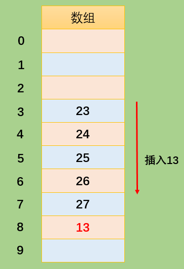

##### 4.2.2 二次探测(增大步长)

上文所说的线性探测存在的问题：

- 如果之前的数据是连续插入的，那么新插入的一个数据可能需要探测很长的距离；

  二次探测是在线性探测的基础上进行了优化：

- 线性探测：我们可以看成是步长为 1 的探测，比如从下表值 x 开始，那么线性探测就是按照下标值：x+1、x+2、x+3 等依次探测；

- 二次探测：对步长进行了优化，比如从下标值 x 开始探测：x+1^2^、x+2^2^、x+3^3^ 。这样一次性探测比较长的距离，避免了数据聚集带来的影响。

- 二次探测存在的问题：

  当插入数据分布性较大的一组数据时，比如：13-163-63-3-213，这种情况会造成步长不一的一种聚集（虽然这种情况出现的概率较线性探测的聚集要小），同样会影响性能。

##### 4.2.3 再哈希法

在开放地址法中寻找空白单元格的最好的解决方式为再哈希化。

- 二次探测的步长是固定的：1，4，9，16 依次类推。
- 现在需要一种方法：产生一种依赖关键字(数据)的探测序列，而不是每个关键字探测步长都一样。
- 这样，不同的关键字即使映射到相同的数组下标，也可以使用不同的探测序列。
- ==再哈希法的做法==为：把关键字用另一个哈希函数，再做一次哈希化，用这次哈希化的结果作为该关键字的步长。

第二次哈希化需要满足以下两点：

- ==和第一个哈希函数不同==，不然哈希化后的结果仍是原来位置；
- 不能输出为 0，否则每次探测都是原地踏步的死循环；

优秀的哈希函数：

- stepSize = constant - （key % constant）；
- 其中 constant 是质数，且小于数组的容量；
- 例如：stepSize = 5 - （key % 5），满足需求，并且结果不可能为 0；

哈希化的效率

哈希表中执行插入和搜索操作效率是非常高的。

- 如果没有发生冲突，那么效率就会更高；
- 如果发生冲突，存取时间就依赖后来的探测长度；
- 平均探测长度以及平均存取时间，取决于填装因子，随着填装因子变大，探测长度会越来越长。

#### 4.3 装填因子

- 装填因子表示当前哈希表中已经包含的数据项和整个哈希表长度的比值；
- 装填因子 = 总数据项 / 哈希表长度；
- 开放地址法的装填因子最大为 1，因为只有空白的单元才能放入元素；
- 链地址法的装填因子可以大于 1，因为只要愿意，拉链法可以无限延伸下去；

#### 4.4 不同探测方式性能的比较

- 线性探测

  可以看到，随着装填因子的增大，平均探测长度呈==指数形式增长，性能较差==。实际情况中，最好的装填因子取决于存储效率和速度之间的平衡，随着装填因子变小，存储效率下降，而速度上升。

  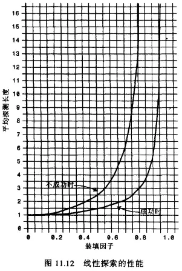

- 二次探测和再哈希化的性能

  二次探测和再哈希法性能相当，它们的性能比线性探测略好。由下图可知，随着装填因子的变大，平均探测长度呈指数形式增长，需要探测的次数也呈==指数形式增长，性能不高==。

  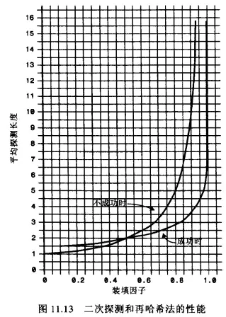

- 链地址法的性能

  可以看到随着装填因子的增加，平均探测长度呈==线性增长，较为平缓==。在开发中使用链地址法较多，比如 Java 中的 HashMap 中使用的就是链地址法。

  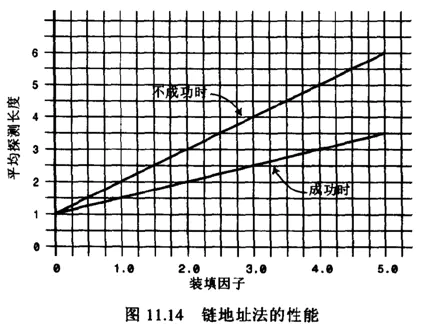

### 5 哈希函数

哈希表的优势在于它的速度，所以哈希函数不能采用消耗性能较高的复杂算法。提高速度的一个方法是在哈希函数中==尽量减少乘法和除法==。

性能高的哈希函数应具备以下两个优点：

- 快速的计算；
- ==均匀的分布==；

#### 5.1 快速计算

> 参看上述认识哈希化哈希函数的处理方法就是幂的连乘表达的

霍纳法则：在中国霍纳法则也叫做秦久韶算法，具体算法为：


求多项式的值时，首先计算最内层括号内一次多项式的值，然后由内向外逐层计算一次多项式的值。这种算法把求 n 次多项式 f(x)的值就转化为求 n 个一次多项式的值。

- 变换之前：
  - 乘法次数：n(n+1)/2 次；( n+1+n+.....+1  = (n+1)*n/2+1 次)
  - 加法次数：n 次；
- 变换之后：
  - 乘法次数：n 次；
  - 加法次数：n 次；

如果使用大 O 表示时间复杂度的话，直接从变换前的 O(N^2)降到了 O(N)。

####  5.2 均匀分布

在设计哈希表时，我们已经有办法处理映射到相同下标值的情况：链地址法或者开放地址法。但是，为了提高效率，最好的情况还是让数据在哈希表中均匀分布。因此，我们需要在使用常量的地方，尽量使用质数（？？？）。比如：哈希表的长度、N 次幂的底数等。

Java 中的 HashMap 采用的是链地址法，哈希化采用的是公式为：index = HashCode(key) & (Length-1) 即将数据化为二进制进行与运算，而不是取余运算。这样计算机直接运算二进制数据，效率更高。但是 JavaScript 在进行较大数据的与运算时会出现问题，所以我们使用 JavaScript 实现哈希化时采用取余运算。

### 6 封装哈希表

#### 6.1 哈希表常见操作 

- `put(key, value)` 插入或修改操作。
- `get(key)` 获取哈希表中特定位置的元素。
- `remove(key)` 删除哈希表中特定位置的元素。
- `isEmpty()` 如果哈希表中不包含任何元素，返回 `trun`，如果哈希表长度大于 0 则返回 `false`。
- `size()` 返回哈希表包含的元素个数。
- `resize(value)` 对哈希表进行扩容操作。

#### 6.2 哈希函数的简单实现

首先使用霍纳法则计算 hashCode 的值，通过取余操作实现哈希化，此处先简单地指定数组的大小。

> 参照上述快速算法改变之后写的哈希函数。
>
> 自己写的话limit和PRIME去一个数吧，应该没啥区别，charCodeAt也不加了吧。

```javascript
hashFn(string, limit = 7) {

  // 自己采用的一个质数（无强制要求，质数即可）
  const PRIME = 31;

  // 1、定义存储 hashCode 的变量
  let hashCode = 0;

  // 2、使用霍纳法则（秦九韶算法），计算 hashCode 的值
  for (let item of string) {
    hashCode = PRIME * hashCode + item.charCodeAt();
  }

  // 3、对 hashCode 取余，并返回
  return hashCode % limit;
}
```

哈希函数测试

```javascript
console.log(hashFn("123")); //--> 5
console.log(hashFn("abc")); //--> 6
```

#### 6.3 哈希表的实现

##### 6.3.1 创建哈希表类

封装的哈希表的数据结构模型：

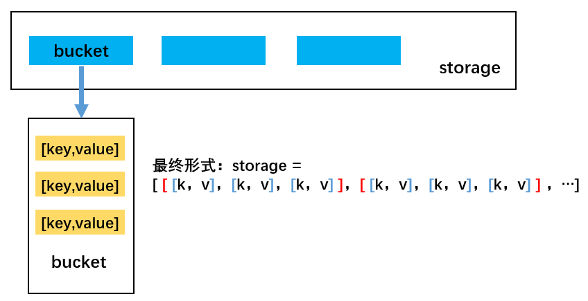

首先创建哈希表类 HashTable，并添加必要的属性和上面实现的哈希函数，再进行其他方法的实现。

```javascript
class HashTable {
  constructor() {
    this.storage = []; // 哈希表存储数据的变量
    this.count = 0; // 当前存放的元素个数
    this.limit = 7; // 哈希表长度（初始设为质数 7）
  }
}
```

##### 6.3.2 put(key,value)

哈希表的插入和修改操作是同一个函数：因为，当使用者传入一个 `[key, value]` 时，如果原来不存在该 key，那么就是插入操作，如果原来已经存在该 key，那么就是修改操作。

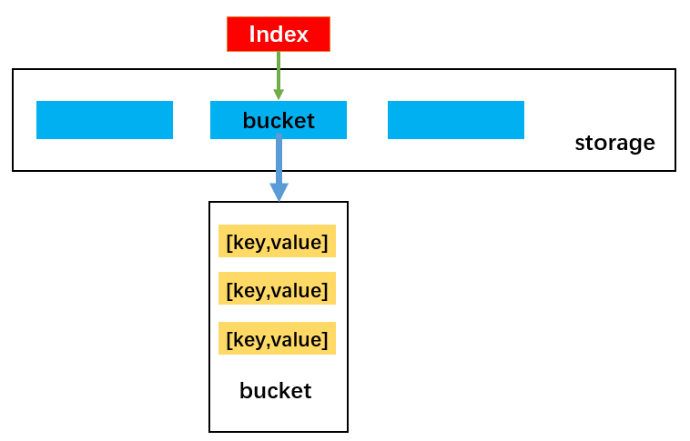

实现思路：

- 首先，根据 key 获取索引值 index，目的为将数据插入到 storage 的对应位置；
- 然后，根据索引值取出 bucket，如果 bucket 不存在，先创建 bucket，随后放置在该索引值的位置；
- 接着，判断''数据链"上是新增还是修改原来的值。如果已经有值了，就修改该值；如果没有，就新增。

代码实现

- 为什么是[key , value]格式，而不是{key: value}格式

- 为什么put(key,value)方法中新增数据没有条件判断呢？不应该是i == bucket.length时，没有相同的key，再增加数据吗？

```javascript
// put(key, value) 往哈希表里添加数据
put(key, value) {

  // 1、根据 key 获取要映射到 storage 里面的 index（通过哈希函数获取）
  const index = hashFn(key, this.limit);

  // 2、根据 index 取出对应的 bucket
  let bucket = this.storage[index];

  // 3、判断是否存在 bucket
  if (bucket === undefined) {
    bucket = [];  // 不存在则创建
    this.storage[index] = bucket;
  }

  // 4、判断是插入数据操作还是修改数据操作
  let i = 0;
  for (i = 0; i < bucket.length; i++) {
    let tuple = bucket[i]; // tuple 的格式：[key, value]
    if (tuple[0] === key) { // 如果 key 相等，则修改数据
      tuple[1] = value;
      return; // 修改完 tuple 里数据，return 终止不再往下执行。
    }
  }

  // 5、bucket 新增数据
  if(i == bucket.length){
     bucket.push([key, value]); // bucket 存储元组 tuple，格式为 [key, value]
  	 this.count++;
  }
  
  // 判断哈希表是否要扩容，若装填因子 > 0.75，则扩容
  if (this.count / this.limit > this.loadFactor) {
    this.resize(this.getPrime(this.limit * 2));
  }

}
```

##### 6.3.3 get(key)

实现思路：

- 首先，根据 key 通过哈希函数获取它在 `storage` 中对应的索引值 `index`。
- 然后，根据索引值获取对应的 `bucket`。
- 接着，判断获取到的 `bucket` 是否为 `null`，如果为 `null`，直接返回 `null`。
- 随后，线性遍历 `bucket` 中每一个 `key` 是否等于传入的 `key`。如果等于，直接返回对应的 `value`。
- 最后，遍历完 `bucket` 后，仍然没有找到对应的 `key`，直接 `return null` 即可。

代码实现

```javascript
// 根据 get(key) 获取 value
get(key) {

  const index = hashFn(key, this.limit);
  const bucket = this.storage[index];

  if (bucket === undefined) {
    return null;
  }

  for (const tuple of bucket) {
    if (tuple[0] === key) {
      return tuple[1];
    }
  }
  return null;
}
```

##### 6.3.4 remove(key)

实现思路：

- 首先，根据 key 通过哈希函数获取它在 `storage` 中对应的索引值 `index`。
- 然后，根据索引值获取对应的 `bucket`。
- 接着，判断获取到的 `bucket` 是否为 `null`，如果为 `null`，直接返回 `null`。
- 随后，线性查找 `bucket`，寻找对应的数据，并且删除。
- 最后，依然没有找到，返回 `null`。


```javascript
// remove(key) 删除指定 key 的数据
remove(key) {

  const index = hashFn(key, this.limit);
  const bucket = this.storage[index];

  if (bucket === undefined) {
    return null;
  }

  // 遍历 bucket，找到对应位置的 tuple，将其删除
  for (let i = 0, len = bucket.length; i < len; i++) {
    const tuple = bucket[i];
    if (tuple[0] === key) {
      bucket.splice(i, 1); // 删除对应位置的数组项
      this.count--;

      // 根据装填因子的大小，判断是否要进行哈希表压缩
      // 哈希表长度大于原长度，并且装填因子显示数据量大于某一个值，则压缩容量
      if (this.limit > 7 && this.count / this.limit < this.minLoadFactor) {
        this.resize(this.getPrime(Math.floor(this.limit / 2)));
      }

      return tuple;
    }

  }

}
```

##### 6.3.5 isEmpty()

```javascript
isEmpty() {
  return this.count === 0;
}
```

##### 6.3.6 size()

```javascript
size() {
  return this.count;
}
```

### 7 哈希表的扩容与压缩

为什么需要扩容？

- 前面我们在哈希表中使用的是长度为 7 的数组，由于使用的是链地址法，装填因子(loadFactor)可以大于 1，所以这个哈希表可以无限制地插入新数据。
- 但是，随着数据量的增多，storage 中每一个 `index` 对应的 `bucket` 数组（链表）就会越来越长，==这就会造成哈希表效率的降低==。

什么情况下需要扩容？

- 常见的情况是 `loadFactor > 0.75` 的时候进行扩容。

如何进行扩容？

- 简单的扩容可以直接扩大两倍（关于质数，之后讨论）。
- 扩容之后所有的数据项都要进行同步修改。

实现思路：

- 首先，定义一个变量，比如 oldStorage 指向原来的 `storage`。
- 然后，创建一个新的容量更大的数组，让 `this.storage` 指向它。
- 最后，将 oldStorage 中的每一个 bucket 中的每一个数据取出来依次添加到 `this.storage` 指向的新数组中。

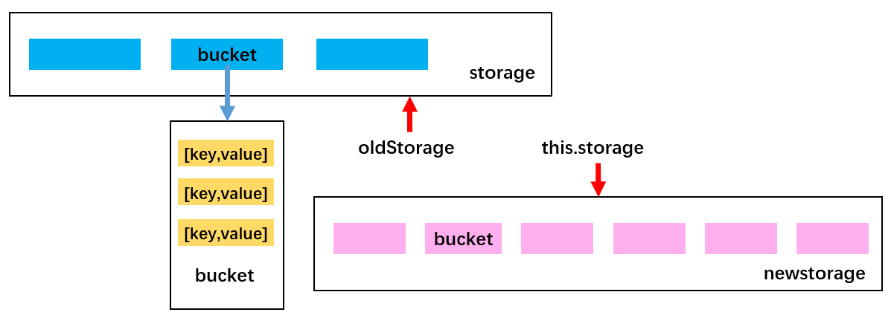

#### 7.1 resize() 的实现

装填因子 = 哈希表中数据 / 哈希表长度，即 `loadFactor = count / HashTable.length`。

resize 方法，既可以实现哈希表的扩容，也可以实现哈希表容量的压缩。

```javascript
// 重新调整哈希表大小，扩容或压缩
resize(newLimit) {

  // 1、保存旧的 storage 数组内容
  const oldStorage = this.storage;

  // 2、重置所有属性
  this.storage = [];
  this.count = 0;
  this.limit = newLimit;

  // 3、遍历 oldStorage，取出所有数据，重新 put 到 this.storage
  for (const bucket of oldStorage) {
    if (bucket) {
      for (const b of bucket) {
        this.put(b[0], b[1]);
      }
    }

  }
}
```

- 通常情况下当装填因子 `laodFactor > 0.75` 时，对哈希表进行扩容。在哈希表中的添加方法（push 方法）中添加如下代码，判断是否需要调用扩容函数进行扩容。

  ```javascript
  // 判断哈希表是否要扩容，若装填因子 > 0.75，则扩容
  if (this.count / this.limit > this.loadFactor) {
    this.resize(this.getPrime(this.limit * 2));
  }
  ```

- 当装填因子 `laodFactor < 0.25` 时，对哈希表容量进行压缩。在哈希表中的删除方法（remove 方法）中添加如下代码，判断是否需要调用扩容函数进行压缩。

  ```javascript
  // 根据装填因子的大小，判断是否要进行哈希表压缩
  if (this.limit > 7 && this.count / this.limit < this.minLoadFactor) {
    this.resize(this.getPrime(Math.floor(this.limit / 2)));
  }
  ```

#### 7.2 选择质数作为哈希表容量

##### 7.2.1 质数判断

- 方法一：针对质数的特点：只能被 1 和 number 整除，不能被 2 ~ (number-1)整除。遍历 2 ~ (num-1) 。

这种方法虽然能实现质数的判断，但是效率不高。

```javascript
function isPrime(number) {
  if (number <= 1) return false;
  for (let i = 2; i < number; i++) {
    if (number % i === 0) {
      return false;
    }
  }
  return true;
}
```

- 方法二：只需要遍历 2 ~ num 的平方根即可。该方法性能较好。

```javascript
function isPrime(number) {
  if (number <= 1 || number === 4) return false;
  const temp = Math.ceil(Math.sqrt(number));
  for (let i = 2; i < temp; i++) {
    if (number % i === 0) {
      return false;
    }
  }
  return true;
}
```

##### 7.2.2 实现扩容或压缩后的哈希表容量为质数

实现思路：

==2 倍==扩容或压缩之后，通过循环调用 `isPrime` 判断得到的容量是否为质数，不是则+1，直到是为止。比如原长度：7，2 倍扩容后长度为 14，14 不是质数，`14 + 1 = 15` 不是质数，`15 + 1 = 16` 不是质数，`16 + 1 = 17` 是质数，停止循环，由此得到质数 17。

- 第一步：首先需要为 HashTable 类添加判断质数的 `isPrime` 方法和获取质数的 `getPrime` 方法：

  ```javascript
  // getPrime(number) 根据传入的 number 获取最临近的质数
  getPrime(number) {
    while (!isPrime(number)) {
      number++;
    }
    return number;
  }
  ```

- 修改添加元素的 `put` 方法和删除元素的 `remove` 方法中关于数组扩容的相关操作：

  在 `put` 方法中添加如下代码：

  ```javascript
  // 判断哈希表是否要扩容，若装填因子 > 0.75，则扩容
  if (this.count / this.limit > this.loadFactor) {
    this.resize(this.getPrime(this.limit * 2));
  }
  ```

  在 `remove` 方法中添加如下代码：

  ```javascript
  // 根据装填因子的大小，判断是否要进行哈希表压缩
  if (this.limit > 7 && this.count / this.limit < this.minLoadFactor) {
    this.resize(this.getPrime(Math.floor(this.limit / 2)));
  }
  ```

### 8 哈希表完整实现

```javascript
class HashTable {
  constructor() {
    this.storage = []; // 哈希表存储数据的变量
    this.count = 0; // 当前存放的元素个数
    this.limit = 7; // 哈希表长度（初始设为质数 7）

    // 装填因子(已有个数/总个数)
    this.loadFactor = 0.75;
    this.minLoadFactor = 0.25;
  }

  // getPrime(number) 根据传入的 number 获取最临近的质数
  getPrime(number) {
    while (!isPrime(number)) {
      number++;
    }
    return number;
  }

  // put(key, value) 往哈希表里添加数据
  put(key, value) {
    // 1、根据 key 获取要映射到 storage 里面的 index（通过哈希函数获取）
    const index = hashFn(key, this.limit);

    // 2、根据 index 取出对应的 bucket
    let bucket = this.storage[index];

    // 3、判断是否存在 bucket
    if (bucket === undefined) {
      bucket = []; // 不存在则创建
      this.storage[index] = bucket;
    }

    // 4、判断是插入数据操作还是修改数据操作
    for (let i = 0; i < bucket.length; i++) {
      let tuple = bucket[i]; // tuple 的格式：[key, value]
      if (tuple[0] === key) {
        // 如果 key 相等，则修改数据
        tuple[1] = value;
        return; // 修改完 tuple 里数据，return 终止，不再往下执行。
      }
    }

    // 5、bucket 新增数据
    bucket.push([key, value]); // bucket 存储元组 tuple，格式为 [key, value]
    this.count++;

    // 判断哈希表是否要扩容，若装填因子 > 0.75，则扩容
    if (this.count / this.limit > this.loadFactor) {
      this.resize(this.getPrime(this.limit * 2));
    }
  }

  // 根据 get(key) 获取 value
  get(key) {
    const index = hashFn(key, this.limit);
    const bucket = this.storage[index];

    if (bucket === undefined) {
      return null;
    }

    for (const tuple of bucket) {
      if (tuple[0] === key) {
        return tuple[1];
      }
    }
    return null;
  }

  // remove(key) 删除指定 key 的数据
  remove(key) {
    const index = hashFn(key, this.limit);
    const bucket = this.storage[index];

    if (bucket === undefined) {
      return null;
    }

    // 遍历 bucket，找到对应位置的 tuple，将其删除
    for (let i = 0, len = bucket.length; i < len; i++) {
      const tuple = bucket[i];
      if (tuple[0] === key) {
        bucket.splice(i, 1); // 删除对应位置的数组项
        this.count--;

        // 根据装填因子的大小，判断是否要进行哈希表压缩
        if (this.limit > 7 && this.count / this.limit < this.minLoadFactor) {
          this.resize(this.getPrime(Math.floor(this.limit / 2)));
        }

        return tuple;
      }
    }
  }

  isEmpty() {
    return this.count === 0;
  }

  size() {
    return this.count;
  }

  // 重新调整哈希表大小，扩容或压缩
  resize(newLimit) {
    // 1、保存旧的 storage 数组内容
    const oldStorage = this.storage;

    // 2、重置所有属性
    this.storage = [];
    this.count = 0;
    this.limit = newLimit;

    // 3、遍历 oldStorage，取出所有数据，重新 put 到 this.storage
    for (const bucket of oldStorage) {
      if (bucket) {
        for (const b of bucket) {
          this.put(b[0], b[1]);
        }
      }
    }
  }
}
```

## 十一 树

### 1 树的特点：

- 树一般都有一个根，连接着根的是树干；
- 树干会发生分叉，形成许多树枝，树枝会继续分化成更小的树枝；
- 树枝的最后是叶子；

现实生活中很多结构都是树的抽象，模拟的树结构相当于旋转 `180°` 的树。


### 2 树结构优点

树结构对比于数组/链表/哈希表有哪些优势呢？

数组：

- 优点：可以通过下标值访问，效率高；
- 缺点：查找数据时需要先对数据进行排序，生成有序数组，才能提高查找效率；==并且在插入和删除元素时，需要大量的位移操作==；

链表：

- 优点：数据的插入和删除操作效率都很高；
- 缺点：查找效率低，需要从头开始依次查找，直到找到目标数据为止；当需要在链表中间位置插入或删除数据时，插入或删除的效率都不高。

哈希表：

- 优点：哈希表的插入/查询/删除效率都非常高；
- 缺点：空间利用率不高，底层使用的数组中很多单元没有被利用；并且哈希表中的元素是无序的，不能按照固定顺序遍历哈希表中的元素；而且不能快速找出哈希表中最大值或最小值这些特殊值。

树结构：

- 优点：树结构综合了上述三种结构的优点，同时也弥补了它们存在的缺点（虽然效率不一定都比它们高），比如树结构中数据都是有序的，查找效率高；空间利用率高；==并且可以快速获取最大值和最小值等==。

总的来说：每种数据结构都有自己特定的应用场景。

树结构：

- 树（Tree）：由 n（n ≥ 0）个节点构成的有限集合。当 n = 0 时，称为空树。
- 对于任意一棵非空树（n > 0），它具备以下性质：
  - 数中有一个称为根（Root）的特殊节点，用 **r** 表示；
  - 其余节点可分为 m（m > 0）个互不相交的有限集合 T1，T2，…，Tm，其中每个集合本身又是一棵树，称为原来树的子树（SubTree）。

### 3 树的常用术语：


- 节点的度（Degree）：节点的子树个数，比如节点 B 的度为 2；
- 树的度：树的所有节点中最大的度数，如上图树的度为 2；
- 叶节点（Leaf）：度为 0 的节点（也称为叶子节点），如上图的 H，I 等；
- 父节点（Parent）：度不为 0 的节点称为父节点，如上图节点 B 是节点 D 和 E 的父节点；
- 子节点（Child）：若 B 是 D 的父节点，那么 D 就是 B 的子节点；
- 兄弟节点（Sibling）：具有同一父节点的各节点彼此是兄弟节点，比如上图的 B 和 C，D 和 E 互为兄弟节点；
- 路径和路径长度：路径指的是一个节点到另一节点的通道，路径所包含边的个数称为路径长度，比如 A->H 的路径长度为 3；
- 节点的层次（Level）：规定根节点在 1 层，其他任一节点的层数是其父节点的层数加 1。如 B 和 C 节点的层次为 2；
- 树的深度（Depth）：树种所有节点中的最大层次是这棵树的深度，如上图树的深度为 4；

### 4 树结构的表示方式

#### 4.1 最普通的表示方法：


如图，树结构的组成方式类似于链表，都是由一个个节点连接构成。不过，根据每个父节点子节点数量的不同，每一个父节点需要的引用数量也不同。比如节点 A 需要 3 个引用，分别指向子节点 B，C，D；B 节点需要 2 个引用，分别指向子节点 E 和 F；K 节点由于没有子节点，所以不需要引用。

这种方法缺点在于我们无法确定某一结点的引用数。(什么意思❓)

#### 4.2 儿子-兄弟表示法：

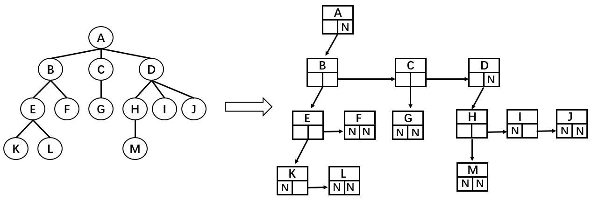

这种表示方法可以完整地记录每个节点的数据，比如：

```javascript
//节点A
Node{
  //存储数据
  this.data = data
  //统一只记录左边的子节点
  this.leftChild = B
  //统一只记录右边的第一个兄弟节点
  this.rightSibling = null
}

//节点B
Node{
  this.data = data
  this.leftChild = E
  this.rightSibling = C
}

//节点F
Node{
  this.data = data
  this.leftChild = null
  this.rightSibling = null
}
```

这种表示法的优点在于每一个节点中引用的数量都是确定的。

#### 4.3 儿子-兄弟表示法旋转

以下为儿子-兄弟表示法组成的树结构：

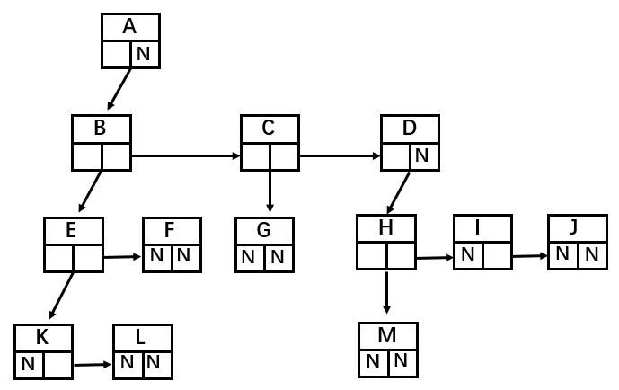

将其顺时针旋转 45° 之后：


这样就成为了一棵二叉树，由此我们可以得出结论：任何树都可以通过二叉树进行模拟。但是这样父节点不是变了吗？其实，父节点的设置只是为了方便指向子节点，在代码实现中谁是父节点并没有关系，只要能正确找到对应节点即可。

##  十二 二叉树

如果树中的每一个节点最多只能由两个子节点，这样的树就称为二叉树；

### 1 二叉树的组成

- 二叉树可以为空，也就是没有节点；
- 若二叉树不为空，则它由根节点和称为其左子树 TL 和右子树 TR 的两个不相交的二叉树组成；

### 2 二叉树的五种形态

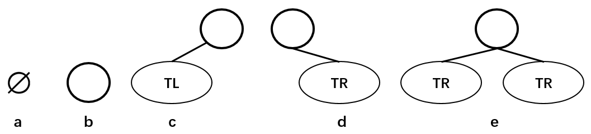

上图分别表示：空的二叉树、只有一个节点的二叉树、只有左子树 TL 的二叉树、只有右子树 TR 的二叉树和有左右两个子树的二叉树。

### 3 二叉树的特性

- 一个二叉树的第 i 层的最大节点树为：2^(i-1)^，i >= 1；
- 深度为 k 的二叉树的最大节点总数为：2^k^ - 1 ，k >= 1；
- 对任何非空二叉树，若 n~~0~~ 表示叶子节点的个数，n~~2~~表示度为 2 的非叶子节点个数，那么两者满足关系：n~~0~~ = n~~2~~ + 1；如下图所示：H，E，I，J，G 为叶子节点，总数为 5；A，B，C，F 为度为 2 的非叶子节点，总数为 4；满足 n~~0~~ = n~~2~~ + 1 的规律。


### 4 特殊的二叉树

#### 4.1 完美二叉树

完美二叉树（Perfect Binary Tree）也成为满二叉树（Full Binary Tree），在二叉树中，除了最下一层的叶子节点外，每层节点都有 2 个子节点，这就构成了完美二叉树。

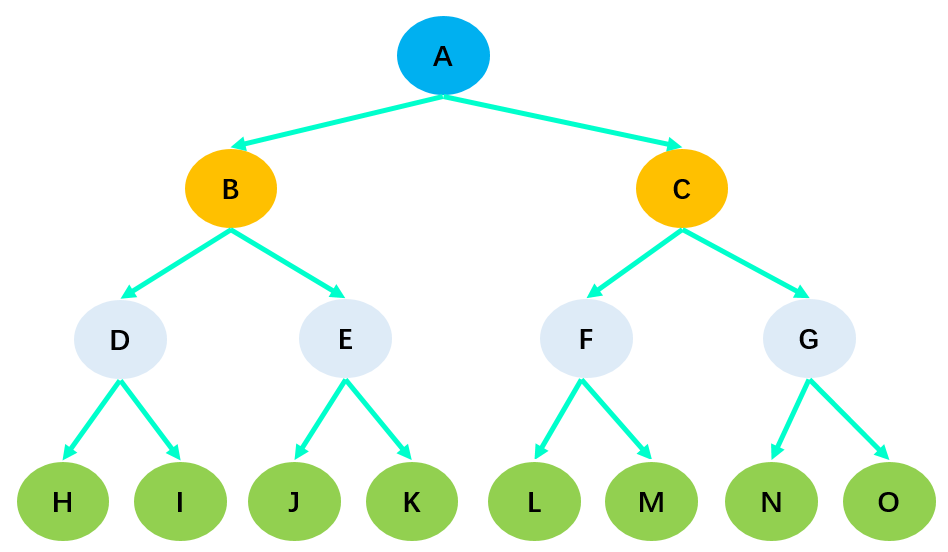

#### 4.2 完全二叉树

完全二叉树（Complete Binary Tree）:

- 除了二叉树最后一层外，其他各层的节点数都达到了最大值；
- 并且，最后一层的叶子节点从左向右是连续存在，只缺失右侧若干叶子节点；
- 完美二叉树是特殊的完全二叉树；


==在上图中，由于 H 缺失了右子节点，所以它不是完全二叉树==。

### 5 二叉树的数据存储

常见的二叉树存储方式为数组和链表：

#### 5.1 使用数组

- 完全二叉树：按从上到下，从左到右的方式存储数据。

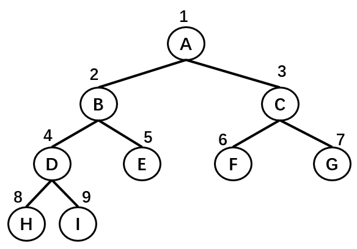

| 节点 | A    | B    | C    | D    | E    | F    | G    | H    | I    |
| ---- | ---- | ---- | ---- | ---- | ---- | ---- | ---- | ---- | ---- |
| 序号 | 1    | 2    | 3    | 4    | 5    | 6    | 7    | 8    | 9    |

使用数组存储时，取数据的时候也十分方便：左子节点的序号等于父节点序号 * 2，右子节点的序号等于父节点序号 *2 + 1 。

- 非完全二叉树：非完全二叉树需要转换成完全二叉树才能按照上面的方案存储，这样会浪费很大的存储空间。

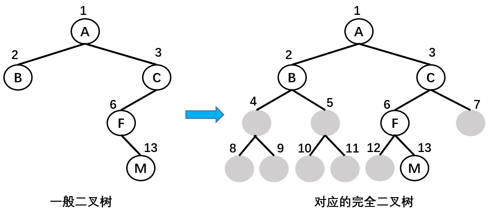

| 节点 | A    | B    | C    | ^    | ^    | F    | ^    | ^    | ^    | ^    | ^    | ^    | M    |
| ---- | ---- | ---- | ---- | ---- | ---- | ---- | ---- | ---- | ---- | ---- | ---- | ---- | ---- |
| 序号 | 1    | 2    | 3    | 4    | 5    | 6    | 7    | 8    | 9    | 10   | 11   | 12   | 13   |

#### 5.2 使用链表

二叉树最常见的存储方式为链表：每一个节点封装成一个 Node，Node 中包含存储的数据、左节点的引用和右节点的引用。


## 十三 二叉搜索树

### 1 二叉搜索树

二叉搜索树（BST，Binary Search Tree），也称为二叉排序树和二叉查找树。

二叉搜索树是一棵二叉树，可以为空。

如果不为空，则满足以下性质：

- 条件 1：非空左子树的所有键值小于其根节点的键值。比如三中节点 6 的所有非空左子树的键值都小于 6；
- 条件 2：非空右子树的所有键值大于其根节点的键值；比如三中节点 6 的所有非空右子树的键值都大于 6；
- 条件 3：左、右子树本身也都是二叉搜索树；


如上图所示，树二和树三符合 3 个条件属于二叉树，树一不满足条件 3 所以不是二叉树。

总结：二叉搜索树的特点主要是==较小的值总是保存在左节点上，相对较大的值总是保存在右节点上==。这种特点使得二叉搜索树的查询效率非常高，这也就是二叉搜索树中“搜索”的来源。

#### 1.1 二叉搜索树应用举例

下面是一个二叉搜索树：


若想在其中查找数据 10，只需要查找 4 次，查找效率非常高。

- 第 1 次：将 10 与根节点 9 进行比较，由于 10 > 9，所以 10 下一步与根节点 9 的右子节点 13 比较；
- 第 2 次：由于 10 < 13，所以 10 下一步与父节点 13 的左子节点 11 比较；
- 第 3 次：由于 10 < 11，所以 10 下一步与父节点 11 的左子节点 10 比较；
- 第 4 次：由于 10 = 10，最终查找到数据 10 。


同样是 15 个数据，在排序好的数组中查询数据 10，需要查询 10 次：


其实：如果是排序好的数组，可以通过二分查找：第一次找 9，第二次找 13，第三次找 11…。我们发现如果把每次二分的数据拿出来以树的形式表示的话就是二叉搜索树。这就是数组二分法查找效率之所以高的原因。

(所以二分查找和二叉搜索树原理类似)

#### 1.2 二叉搜索树的封装

二叉搜索树有四个最基本的属性：指向节点的根（root），节点中的键（key）、左指针（right）、右指针（right）。


所以，二叉搜索树中除了定义 root 属性外，还应定义一个节点内部类，里面包含每个节点中的 left、right 和 key 三个属性。

```javascript
// 节点类
class Node {
  constructor(key) {
    this.key = key;
    this.left = null;
    this.right = null;
  }
}
```

##### 1.2.1 二叉搜索树的常见操作：

- `insert(key)` 向树中插入一个新的键。
- `search(key)` 在树中查找一个键，如果节点存在，则返回 true；如果不存在，则返回 `false`。
- `preOrderTraverse` 通过先序遍历方式遍历所有节点。
- `inOrderTraverse` 通过中序遍历方式遍历所有节点。
- `postOrderTraverse` 通过后序遍历方式遍历所有节点。
- `min` 返回树中最小的值/键。
- `max` 返回树中最大的值/键。
- `remove(key)` 从树中移除某个键。

##### 1.2.2 插入数据

实现思路：

- 首先根据传入的 key 创建节点对象。
- 然后判断根节点是否存在，不存在时通过：this.root = newNode，直接把新节点作为二叉搜索树的根节点。
- 若存在根节点则重新定义一个内部方法 `insertNode()` 用于查找插入点。

insert(key) 代码实现

```javascript
// insert(key) 插入数据
insert(key) {
  const newNode = new Node(key);

  if (this.root === null) {
    this.root = newNode;
  } else {
    this.insertNode(this.root, newNode);
  }

}
```

insertNode() 的实现思路:

- 当 newNode.key < node.key 向左查找:
  - 情况 1：当 node 无左子节点时，直接插入：
  - 情况 2：当 node 有左子节点时，递归调用 insertNode()，直到遇到无左子节点成功插入 newNode 后，不再符合该情况，也就不再调用 insertNode()，递归停止。
- 当 newNode.key >= node.key 向右查找，与向左查找类似：
  - 情况 1：当 node 无右子节点时，直接插入：
  - 情况 2：当 node 有右子节点时，依然递归调用 insertNode()，直到遇到传入 insertNode 方法 的 node 无右子节点成功插入 newNode 为止。

insertNode(root, node) 代码实现

```javascript
insertNode(root, node) {

  if (node.key < root.key) { // 往左边查找插入

    if (root.left === null) {
      root.left = node;
    } else {
      this.insertNode(root.left, node);
    }

  } else { // 往右边查找插入

    if (root.right === null) {
      root.right = node;
    } else {
      this.insertNode(root.right, node);
    }

  }

}
```

##### 1.2.3 遍历数据

这里所说的树的遍历不仅仅针对二叉搜索树，而是适用于所有的二叉树。由于树结构不是线性结构，所以遍历方式有多种选择，常见的三种二叉树遍历方式为：

- 先序遍历；
- 中序遍历；
- 后序遍历；

还有层序遍历，使用较少。

###### 1.2.3.1 先序遍历

