# CORS 完全手册

转自 [CORS 完全手冊](https://blog.huli.tw/2021/02/19/cors-guide-1/)

## 前言，輕鬆理解 Ajax 與跨來源請求

一般來說在學習寫網頁的時候，最先碰到的會是 HTML 與 CSS，負責把版面刻出來以及美化版面，當基礎打穩之後，會開始學習 JavaScript，試著做出一點互動性的效果。而「互動」除了使用者跟瀏覽器的互動以外，別忘了還有 Client 端跟 Server 端的互動，也就是必須要學會從瀏覽器用 JavaScript 跟後端 Server 拿資料，否則你的網頁資料都只能是寫死的。

這篇的主要預設讀者是網頁前端的初學者，希望能讓本來不太理解怎麼跟 Server 交換資料或是怎麼串 APi 的讀者看完之後，能夠更了解該怎麼跟後端串接。

### 先從舉例開始

在開始之前，我們可以先想想一個問題：

> 為什麼前端必須跟後端交換資料？

其實這跟你做的網頁類型有關，假如說你今天做的是一個官方網站，很可能整個網站都是靜態的，只要 HTML 跟 CSS 就可以了，並不需要跟後端 Server 拿資料。

那我們先假設今天要做的是一個可以瀏覽現在 Twitch 實況列表的網頁好了，如下圖。

如果這個網頁不跟後端拿資料，就代表說網頁的內容都是固定的，無論什麼時候看都一樣。可是這樣的話就不對了嘛，因為這個網頁的目標是顯示出「現在有在開實況的頻道」，所以內容是會跟著改變的。

既然會跟著改變，就必須不斷的去更新資料，從 Server 那邊拿資料回來，接著在前端處理過後顯示。

已經確認有拿資料的必要性之後，就可以問自己兩個問題：

1. 要跟誰拿資料？
2. 要怎麼拿資料？

第一個問題，很明顯的就是跟 Twitch，因為 Twitch 才有你要的這些資料嘛！

那第二個問題，要怎麼拿資料呢？就必須透過 Twitch API 了。

### API

介面 == 接口

什麼是 API？你可能已經聽過很多次這個名詞，但還是不知道是什麼。先來講講它的全名吧，它的全名是「Application Programming Interface」，中文翻作應用程式介面。

你可能會想說這是什麼鬼東西，怎麼中文英文我都看不懂在幹嘛。但其實這幾個字裡面，最重要的是「介面」兩個字。

介面是什麼？介面就是拿來串接用的，我舉一個例子你就知道了。

電腦上不是有一個 USB 插槽嗎？然後你只要是看到市面上有賣 USB 隨身碟的，都可以買來以後插到 USB 插槽，你的電腦就可以讀取得到。你有想過為什麼嗎？明明就是不同廠商做的東西，可是卻都可以讀得到、都可以插到 USB 插槽裡面。

因為有一項標準叫做 USB 介面，當這套標準訂出來以後，所有廠商只要按照這一套標準來開發，就可以保證能夠連接電腦跟 USB 隨身碟。

API 也是這樣，只是變成程式跟程式之間的串接。例如說今天我寫程式需要讀取檔案好了，我要怎麼讀取檔案？讀取檔案是作業系統提供的功能，因此我可以去串接「讀取檔案的 API」，就可以在我的程式裡面也使用這個功能了。

再多舉幾個例子你可能會更有感覺。

例如說今天我想要讓我的網頁能夠用 Facebook 登入，那要怎麼辦？我就要去串接「Facebook 提供的 API」，就等於說是 Facebook 向外提供給大家的一套介面、一套標準，任何想要接入 Facebook 服務的開發者們，都可以遵循著那套規範拿到自己想要的資料，這個東西就叫做 API。

或是你可能今天是一個飯店管理系統的開發者，你們公司做了一套給飯店用的 ERP，可以管理飯店的訂房狀態等等，就能知道說現在有哪些房間是空的。

而這些資料如果只有自己用太可惜了，於是公司決定把這些資料提供給大型訂房網站，在那些網站上能夠即時顯示這間飯店的房間狀況。所以就必須交換資料，你要提供一個「查詢房間情形的 API」給其他網站，讓他們能夠去串接，才能獲得這些資訊。

講到這邊，大家應該對 API 已經有一些 sense 了，我再多舉幾個例子：

1. 我想要抓到 flickr 上面的照片，所以我要去串接 flickr 的 API
2. Google 要開放讓其他 App 也能用 Google 登入驗證，所以 Google 要提供「Google 登入 API」
3. 我要抓 Twitch 上面現在有哪些頻道，所以要串 Twitch API

### API Documentation

既然已經知道 API 是什麼了，也知道要串接 API，那下一個問題就是「那要怎麼串呢？」

剛剛前面有提過檔案存取的例子，其實這個比較像是呼叫作業系統或是程式語言的函式庫提供的 Function，而這些 Function 你通常都可以在官方文件上查到更詳細的說明，例如說 Node.js 的讀取檔案：

（來源：https://nodejs.org/api/fs.html#fs_fs_readdir_path_options_callback）

上面就有寫說你應該呼叫哪一個 Function，應該傳入哪些參數。

API 的串接也是一樣，一定要有文件你才知道怎麼串，不然根本串不起來，因為你連要傳什麼參數都不知道。

我們可以先來看看[Twitch API 文件](https://dev.twitch.tv/docs/v5/guides/using-the-twitch-api/)是怎麼寫的。

裡面說明了你必須要有一個`Client ID`，然後 API Root 的 URL 是 `https://api.twitch.tv/kraken` 等等，這些都是與 API 相關的基本資訊。如果你在左側欄隨便點一個 API，會看到個別 API 的詳細資訊：

這邊就有寫說網址是什麼，你應該傳的參數是什麼等等，下面還有附上參考範例，這就是一個很完整的 API 文件。

通常在寫網頁的時候，我們都會直接講 API，但其實我們指的是 Web API，也就是透過網路來傳輸的 API。那有沒有非 Web API 呢？有，像我們前面提到的跟作業系統要讀檔的 API，就都是在本機底下執行的，沒有透過任何網路。

不過這其實也不用太在意，反正大家都習慣講 API，聽得懂就好。

現在有了 API 文件，我們就有了所有我們需要的資訊。以上面這個 Twitch 的例子來講，我們只要能夠發送 Request 到`https://api.twitch.tv/kraken/games/top?client_id=xxx`，Twitch 就會傳回目前最熱門的遊戲列表。

我們已經把問題的範圍一步步給縮小了，一開始是「要怎麼跟 Twitch 拿資料」，現在則更細的切分為：「要怎麼利用 JavaScript 發送 Reuqest」

### Ajax

要在瀏覽器上面發送 Request，必須應用到一種技術叫做 Ajax，全名是「Asynchronous JavaScript and XML」，==重點在於`Asynchronous`這個單字，非同步==。

在講什麼是非同步之前，就要先來提一下什麼是同步。你原本寫的 JavaScript 就幾乎都是同步執行的。意思是他執行到某一行的時候，會等這行執行完畢，才執行到下一行，確保執行順序。

也就是說下面這段程式碼，最後一行需要等很長一段時間才能執行到：

```javascript
var count = 10000000;
while(count--) {
  // 做一些耗時的操作
}
  
// 等很久才被執行到
console.log('done')
```

看起來滿有道理的，程式本來不就是一行一行執行的嗎？可是如果今天牽涉到網路操作的話，大家可以思考看看下面這個例子：

```javascript
// 假設有個發送 Request 的函式叫做 sendRequest
var result = sendRequest('https://api.twitch.tv/kraken/games/top?client_id=xxx');
  
// 等很久才被執行到
console.log(result);
```

當 JavaScript 執行到`sendRequest`的時候，由於是同步的，就會等待 Response 回來才繼續做事。換句話說，在 Response 還沒回來之前，整個 JavaScript 引擎是不會執行任何東西的！很可怕對吧，你點任何有牽涉到 JavaScript 的東西，都不會有反應，因為 JavaScript 還在等 Response 回來。

所以呢，像是這種已經預期到可能非常耗時間，非常不穩定的操作，就不能用同步的方式來執行，而是要用非同步。

非同步是什麼意思呢？就是執行完之後就不管它了，不等結果回來就繼續執行下一行：

```javascript
// 假設有個發送 Request 的函式叫做 sendRequest
var result = sendRequest('https://api.twitch.tv/kraken/games/top?client_id=xxx');
  
// 上面 Request 發送完之後就執行到這一行，所以 result 不會有東西
// 因為 Response 根本沒有回來
console.log(result);
```

這邊需要特別注意的是「非同步的 Function 不能直接透過 return 把結果傳回來」，為什麼？因為像上面這個例子，它發送 Request 之後就會執行到下一行了，這個時候根本就還沒有 Response，是要回傳什麼？

那怎麼辦呢？先聽我舉個很常見的小例子吧！

我之前在新加坡的 Food Court 吃飯的時候，那邊每一張桌子上面都會有桌號。你去點餐的時候，只要跟老闆講說你坐哪一桌，等餐點完成之後老闆就會自己主動送過來。

所以我不需要站在店家門口等，我只要在位子上繼續坐我的事情，反正餐點好了之後老闆會送過來。

非同步的概念也是這樣，我發送 Request 之後（我點餐之後），我不用等 Response 回來（不用等老闆做好），可以繼續做自己的事，等
Response 回來之後（等餐點做好之後），會自己幫我把結果送過來（老闆會自己送過來）。

在點餐的例子中，老闆可以透過桌號知道應該把資料送到哪邊，那在 JavaScript 裡面呢？可以透過 Function！而這個 Function，我們就稱作==Callback Function==，回呼函式。

當非同步的操作完成時，就可以呼叫這個 Function，並且把資料帶進來。

```javascript
// 假設有個發送 Request 的函式叫做 sendRequest
sendRequest('https://api.twitch.tv/kraken/games/top?client_id=xxx', callMe);
  
function callMe (response) {
  console.log(response);
}
  
// 或者寫成匿名函式
sendRequest('https://api.twitch.tv/kraken/games/top?client_id=xxx', function (response) {
  console.log(response);
});
```

現在你就知道為什麼網路的操作是非同步，以及什麼是 callback function 了。

### XMLHttpRequest

方才提到 Ajax、非同步以及 callback function 的概念，但還是沒講到要怎麼發送 Request，只寫了一個假的`sendRequest`函式當作參考而已。

要發送 Request 的話，就要透過瀏覽器幫我們準備好的一個物件，叫做`XMLHttpRequest`，範例程式碼如下：

```javascript
var request = new XMLHttpRequest();
request.open('GET', `https://api.twitch.tv/kraken/games/top?client_id=xxx`, true);
request.onload = function() {
  if (request.status >= 200 && request.status < 400) {
  
    // Success!
    console.log(request.responseText);
  }
};
request.send();
```

上面的`request.onload`其實就是在指定說當資料回來的時候，要用哪一個 function 去處理。

有了上面這一段程式碼之後，你終於大功告成，終於可以串接 Twitch API，從那邊拿資料下來了！真是可喜可賀，從此之後，你就跟「串接 API」這個技能過著幸福快樂的生活…

才怪。

### Same Origin Policy

正當你以為自己已經對串接 API 駕輕就熟，想說去串接別的 API 試試看好了的時候，才發現一串就出問題了：

```javascript
XMLHttpRequest cannot load 
http://odata.tn.edu.tw/ebookapi/api/getOdataJH/?level=all. 
No 'Access-Control-Allow-Origin' header is present on the 
requested resource. Origin 'null' is therefore not allowed access.

```

咦？為什麼會有這個錯誤呢？

其實是瀏覽器因為安全性的考量，有一個東西叫做[同源政策](https://developer.mozilla.org/zh-TW/docs/Web/JavaScript/Same_origin_policy_for_JavaScript)，Same-origin policy。

意思就是說如果你現在這個網站的跟你要呼叫的 API 的網站「不同源」的時候，==瀏覽器一樣會幫你發 Request，但是會把 Response 給擋下來，不讓你的 JavaScript 拿到並且傳回錯誤==。

什麼是不同源呢？其實你想簡單一點，只要是 Domain 不一樣就是不同源，或者是一個用`http`一個用`https`也是不同源，端口號不一樣也是不同源。

所以如果你是接別人 API 的話，大多數情形都是不同源的。

這邊我想再強調一點，「你的 Request 還是有發出去的」，而且瀏覽器也「確實有收到 Response」，重點是==「瀏覽器因為同源政策，不把結果傳回給你的 JavaScript」==。如果沒有瀏覽器的話其實就沒有這些問題，你愛發給誰就發給誰，不管怎樣都拿得到 Response。

好，既然剛剛說了不同源會被擋下來，那 Twitch API 不是也不同源嗎，是怎麼串接成功的？

### CORS

大家都知道其實在不同源之間互相傳輸資料是很常有的事情，像我們串接 Twitch API 就是，我們怎麼可能跟 Twitch API 在同一個 Domain 底下呢？

因此，同源政策的確是規範非同源就被擋下來，但與此同時其實又有另外一個規範，是說：「如果你想在不同 origin 之間傳輸資料的話，你應該怎麼做」，這規範就叫做 CORS。

CORS，全名為 Cross-Origin HTTP request，跨來源 HTTP 請求。

這套規範跟你說，如果你想開啟跨來源 HTTP 請求的話，==Server 必須在 Response 的 Header 裡面加上`Access-Control-Allow-Origin`==。

這個字段你應該不陌生才對，覺得陌生的可以拉回去上面看，剛剛的錯誤訊息其實就有講到這一個 Header。

==當瀏覽器收到 Response 之後，會先檢查`Access-Control-Allow-Origin`裡面的內容，如果裡面有包含現在這個發起 Request 的 Origin 的話，就會允許通過，讓程式順利接收到 Response。==

如果你打開 Devtool 仔細看一開始我們發給 Twitch 的 Request，你會發現 Response 的 Header 大概是長這樣：

```
Content-Type: application/json
Content-Length: 71
Connection: keep-alive
Server: nginx
Access-Control-Allow-Origin: *
Cache-Control: no-cache, no-store, must-revalidate, private
Expires: 0
Pragma: no-cache
Twitch-Trace-Id: e316ddcf2fa38a659fa95af9012c9358
X-Ctxlog-Logid: 1-5920052c-446a91950e3abed21a360bd5
Timing-Allow-Origin: https://www.twitch.tv
```

重點是這一行：`Access-Control-Allow-Origin: *`，星號就代表萬用字元，意思是任何一個 Origin 都接受。所以當瀏覽器接收到這個 Response 之後，比對目前的 Origin 符合`*`這個規則，檢驗通過，允許我們接受跨來源請求的回應。

除了這個 Header 以外，其實還有其他的可以用，例如說`Access-Control-Allow-Headers`跟`Access-Control-Allow-Methods`，就可以定義接受哪些 Request Header 以及接受哪些 Method。

總結一下，如果你想要發起跨來源 HTTP 請求並且順利收到回應的話，需要確保 Server 端有加上`Access-Control-Allow-Origin`，不然 Response 會被瀏覽器給擋下來並且顯示出錯誤訊息。

### Preflight Request

還記得 Twitch 的 API 文件嗎？裡面需要帶一個`client-id`的參數，而文件裡面寫說你可以帶在 GET 的參數上面，也可以帶在 Header 裡，我們來試試看帶在 Header 裡會怎樣吧！打開 Devtool，你會看到一個神奇的現象：

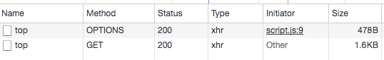

咦？我明明只發了一個 Request，怎麼變兩個了？而且第一個的 Method 居然是`OPTIONS`。只是多加了一個 Header 就多了一個 Request，是為什麼呢？

其實這又跟上面講的 CORS 有關了，CORS 把 Request 分成兩種，一種是簡單請求（simple requests）。什麼是簡單請求呢？其實定義有滿長一串的，我認為有需要用到的時候再看就好，==但總之如果你沒有加任何自定義的 Header，而且又是 GET 的話，絕對是簡單請求==（這個夠簡單了吧）

反之呢，如果你有加一些自定義的 Header，例如說我們剛剛加的`Client-ID`，這個 Request 就絕對不是簡單請求。

（定義可參考：[MDN: 簡單請求](https://developer.mozilla.org/zh-TW/docs/Web/HTTP/Access_control_CORS#簡單請求)）

從上述分類可知，我們剛剛發起的 Request 因為有帶了 Custom header，所以不會是簡單請求，那為什麼會多一個 Request 呢？

這一個 Request 叫做 Preflight Request，中文翻作==「預檢請求」==，因為非簡單請求可能會帶有一些使用者資料，因此會先透過 Preflight Request 去確認後續的請求能否送出。

如果這個 Preflight Request 沒有過的話，真的 Request 也就不會發送了，==這就是預檢請求的目的==。

我舉一個例子，你就會知道為什麼需要這個 Preflight Request 了。

假設今天某個 Server 提供了一個 API 網址叫做：`https://example.com/data/16`，你只要對它發送 GET，就能夠拿到 id 是 16 的資料，只要對它發送 DELETE，就可以把這筆資料刪除。

如果今天沒有 Preflight Request 這個機制的話，我就可以在隨便一個 Domain 的網頁上面發送一個 DELETE 的 Request 給這個 API。剛剛我有強調說瀏覽器的 CORS 機制，還是會幫你發送 Request，但只是 Response 被瀏覽器擋住而已。

因此呢，==儘管沒有 Response，但是 Server 端的確收到了這個 Request，因此就會把這筆資料給刪除==。

如果有 Preflight Request 的話，在發送出去收到結果的時候，就會知道這個 API 並沒有提供 CORS，因此真的 DELETE 請求就不會送出，到這邊就結束了。

先用一個 OPTIONS 的請求去確認之後的 Request 能不能送出，這就是 Preflight Request 的目的。

### JSONP

最後來講一下 JSONP，這是跨來源請求除了 CORS 以外的另外一種方法，全名叫做：JSON with Padding。

還記得一開始提到的同源政策吧？仔細思考一下會發現，==其實有些東西是不受同源政策限制的，例如說`<script>`這個 Tag==，我們不是常常引用 CDN 或是 Google Analytics 之類的第三方套件嗎？網址都是其他 Domain 的，但是卻能正常載入。

JSONP 就是利用`<script>`的這個特性來達成跨來源請求的。

今天先想像你有一段 HTML 長這樣：

```javascript
<script>
  var response = {
    data: 'test'
  };
</script>
<script>
  console.log(response);
</script>
```

很好懂的一段程式碼，我就不多做解釋了。那如果今天把上面那一段換成一串網址呢？

```javascript
<script src="https://another-origin.com/api/games"></script>
<script>
  console.log(response);
</script>
```

如果`https://another-origin.com/api/games`這個網址返回的內容就是剛剛的：

```javascript
var response = {
  data: 'test'
};
```

那我不就一樣可以拿到資料了嗎？而且這些資料還是 Server 端控制的，所以 Server 可以給我任何資料。但是這樣用全域變數其實不太好，我們可以借用剛剛的 Callback Function 的概念，改成這樣：

```javascript
<script>
  receiveData({
    data: 'test'
  });
</script>
<script>
  function receiveData (response) {
    console.log(response);
  }
</script>
```

所以 JSONP 是什麼？JSONP 其實就是透過上面這種形式，利用`<script>`裡面放資料，透過指定好的 function 把資料給帶回去。你只要把第一段的`<script>`那邊想成是 Server 的回傳值，你就可以理解了。

實務上在操作 JSONP 的時候，==Server 通常會提供一個`callback`的參數讓 client 端帶過去==。Twitch API 有提供 JSONP 的版本，我們可以直接來看範例：

URL: `https://api.twitch.tv/kraken/games/top?client_id=xxx&callback=aaa&limit=1`

```
aaa({"_total":1069,"_links":{"self":"https://api.twitch.tv/kraken/games/top?limit=1","next":"https://api.twitch.tv/kraken/games/top?limit=1\u0026offset=1"},"top":[{"game":{"name":"Dota 2","popularity":63361,"_id":29595,"giantbomb_id":32887,"box":{"large":"https://static-cdn.jtvnw.net/ttv-boxart/Dota%202-272x380.jpg","medium":"https://static-cdn.jtvnw.net/ttv-boxart/Dota%202-136x190.jpg","small":"https://static-cdn.jtvnw.net/ttv-boxart/Dota%202-52x72.jpg","template":"https://static-cdn.jtvnw.net/ttv-boxart/Dota%202-{width}x{height}.jpg"},"logo":{"large":"https://static-cdn.jtvnw.net/ttv-logoart/Dota%202-240x144.jpg","medium":"https://static-cdn.jtvnw.net/ttv-logoart/Dota%202-120x72.jpg","small":"https://static-cdn.jtvnw.net/ttv-logoart/Dota%202-60x36.jpg","template":"https://static-cdn.jtvnw.net/ttv-logoart/Dota%202-{width}x{height}.jpg"},"_links":{},"localized_name":"Dota 2","locale":"zh-tw"},"viewers":65243,"channels":373}]})

```

URL: `https://api.twitch.tv/kraken/games/top?client_id=xxx&callback=receiveData&limit=1`

```
receiveData({"_total":1067,"_links":{"self":"https://api.twitch.tv/kraken/games/top?limit=1","next":"https://api.twitch.tv/kraken/games/top?limit=1\u0026offset=1"},"top":[{"game":{"name":"Dota 2","popularity":63361,"_id":29595,"giantbomb_id":32887,"box":{"large":"https://static-cdn.jtvnw.net/ttv-boxart/Dota%202-272x380.jpg","medium":"https://static-cdn.jtvnw.net/ttv-boxart/Dota%202-136x190.jpg","small":"https://static-cdn.jtvnw.net/ttv-boxart/Dota%202-52x72.jpg","template":"https://static-cdn.jtvnw.net/ttv-boxart/Dota%202-{width}x{height}.jpg"},"logo":{"large":"https://static-cdn.jtvnw.net/ttv-logoart/Dota%202-240x144.jpg","medium":"https://static-cdn.jtvnw.net/ttv-logoart/Dota%202-120x72.jpg","small":"https://static-cdn.jtvnw.net/ttv-logoart/Dota%202-60x36.jpg","template":"https://static-cdn.jtvnw.net/ttv-logoart/Dota%202-{width}x{height}.jpg"},"_links":{},"localized_name":"Dota 2","locale":"zh-tw"},"viewers":65622,"channels":376}]})

```

有發現了嗎？它就是透過你帶過去的`callback`這個參數當作函式名稱，把 JavaScript 物件整個傳到 Function 裡面，你就可以在 Function 裡面拿到資料。

結合起來會變這樣：

```javascript
<script src="https://api.twitch.tv/kraken/games/top?client_id=xxx&callback=receiveData&limit=1"></script>
<script>
  function receiveData (response) {
    console.log(response);
  }
</script>
```

利用 JSONP，也可以存取跨來源的資料。==但 JSONP 的缺點就是你要帶的那些參數永遠都只能用附加在網址上的方式（GET）帶過去，沒辦法用 POST==。

如果能用 CORS 的話，還是應該優先考慮 CORS。

### 總結

今天這篇文章的內容就是從抓資料這件事情開始，一步步告訴你應該去哪裡抓？應該怎麼抓？用 API 抓，那什麼是 API？怎麼在 JavaScript 裡面呼叫 Web API？怎麼樣存取跨來源的資料？

一般來說，跟前端抓資料有關的東西我基本上都提到了，不過有個遺珠之憾是沒有提到[Fetch API](https://developer.mozilla.org/en-US/docs/Web/API/Fetch_API)，這是比較新的標準，也是拿來抓資料用的，MDN 上面的介紹是：

> The Fetch API provides an interface for fetching resources (including across the network). It will seem familiar to anyone who has used XMLHttpRequest, but the new API provides a more powerful and flexible feature set.

有興趣的讀者們可以自己去看一下。

希望大家看完這篇之後，會更了解怎麼樣串接後端 API，以及串接的時候可能會碰到哪些困難。

## 一，为什么会发生CORS 错误？

三年前的时候写了一篇文章：轻松理解AJAX与跨来源请求，提到了串接API、AJAX、same-origin policy、JSONP以及CORS，当时把自己想讲的都放进去了，但现在回头看，好像有很多满重要的部分没有提到。

三年后，再次挑战这个主题，并且试着表达地更完整。

会想写这个系列是因为在程式相关的讨论区上，CORS 是发问频率很高的主题，无论是前端或是后端都有可能来问相关的问题。

所以我就想说：「好，那我来写一个系列好了，==我要试着把这个主题写到每个碰到CORS 问题的人都会来看这个系列，而且看完以后就知道该怎么解决问题==」，这算是我对这篇文章的目标，如果文章的品质没办法达成这个目标，我会持续改进。

会从same-origin policy 开始讲起，接着讲到为什么跨来源存取资源会有错误，再来会讲如何错误地以及正确地解决CORS 相关的问题，而第三篇会详细讲解跨来源请求的详细流程，像是preflight request 之类的东西。

基础的部分看前三篇就够了，接下来会比较深一点。第四篇会带你一起看spec，证明前面几篇不是我在虎烂的，而第五篇则是带大家看看CORB（Cross-Origin Read Blocking）、COEP（Cross-Origin Embedder Policy）或是COOP（Cross-Origin-Opener-Policy）之类的跨来源相关规定，以及相关的安全性问题，最后一篇则是一些比较零散的主题以及心得感想。

身为系列文的第一篇，就是要带大家去思考==为什么要有same-origin policy 的存在，为什么跨来源存取资源会错误==。如果不知道这个问题的答案，那通常都不是真的理解CORS 到底在规范什么，也很有可能会用一些错误的解法去解这个问题

在这篇里面，我预设大家已经对跨来源请求以及CORS有一些基本概念了，如果完全没有概念的话，可以先参考一下我以前写过的这篇：[轻松理解AJAX与跨来源请求](https://blog.huli.tw/2017/08/27/ajax-and-cors/)。

### 故事

在正式开始以前，想先跟大家讲一个小故事，跟整个CORS 有关的一个小故事，反正大家就当一个无厘头故事看就好，等真正理解完整个跨来源请求相关的东西以后，就知道这故事代表什么了。

故事的主角是一个求知若渴，希望获得各种资讯的小资（不是小资女孩向前冲的那个小资），而政府想要监控这些求知若渴的人，试图知道他们到底都去问了哪些资讯，所以把他安置在一个小房间，跟外界的沟通都要透过门口的警卫。

所以小资没办法亲自出去，但是有什么想知道的事情都可以问警卫，警卫都会帮他去问。身为一个求知若渴的人，小资常常问他很多问题，例如说：「速食店的大麦克现在一个多少钱？」、「我的存款剩下多少？」、「我爸妈过得好吗」等等。

针对小资的每一个提问，警卫都会帮他去问到当事人，但不一定会把答案告诉他。政府规定了一个程序，那就是「除非被问的人明确同意，不然不能把答案告诉小资」，所以警卫会先问完问题拿到答案，再问说：「请问你愿意让小资知道这件事吗？」，有些人愿意，例如说速食店，虽然他根本不认识小资，但毕竟这类资讯告诉谁都可以。但也有些人不愿意，因为根本不知道谁是小资。还有一种状况，警卫连问都不用问，那就是小资的家人。因为小资的家人跟小资血脉相承，系出同源，所以不用问就可以放行。

于是呢，尽管小资的每一个问题都有传达到被问的人那里，却不一定能收到回覆。有一天小资终于受不了这种被囚禁的生活，于是想了几个方法。

第一个方法是把警卫打倒逃出去，没有警卫了他就自由了，想问谁问题就问谁，不用再透过警卫，完全没有任何拘束。

第二个方法是拜托朋友帮忙当暗桩。每当小资有问题时，都跟警卫说：「你去问我朋友，大麦克多少钱」，接着朋友再去问速食店，再把结果跟警卫讲，顺便交代警卫他愿意让小资知道这件事。因为问题都会透过他朋友转传，而朋友每次都会交代警卫这个资讯可以让小资知道，所以小资就不会有之前提到的那个限制了。

第三个方法是让大家都愿意把资讯告诉他，这样就不会被警卫拦截，就能顺利知道问题的答案。

好，故事结束了，虽然我觉得没有到很贴切就是了，不过浮夸的故事总是比较吸引人注意，就先这样吧，接着让我们来进入主题。

### 从熟悉的错误讯息开始

我相信大家一定都对这个错误讯息不陌生：

> request has been blocked by CORS policy: No 'Access-Control-Allow-Origin' header is present on the requested resource.

在前端用XMLHttpRequest 或者是用fetch 的时候，应该都有碰过这个错误。在串接后端或是网路上的API 时，就是串不起来，而你也不知道是哪边出了错，甚至连这是前端还是后端要处理的可能都不太知道。

因此，我在这边直接先跟你讲答案：

> 大部分情形下，CORS 都不是前端的问题，纯前端是解决不了的。

换句话说，碰到这个错误的时候，通常都不是你应该要解决问题，而是后端。大家可以先把这一句话放在心中，等到看完文章的时候，应该就会认同这句话了。

既然CORS 的这个错误是出在「跨来源呼叫API」，那势必就要两件事情要厘清：

- 什么是跨来源？
- 为什么不能跨来源呼叫API？

### 什么是跨来源？

跨来源的英文是cross origin，顾名思义，当你想要从来源A 去拿来源B 的东西，就是跨来源。

而这个来源，其实就是代表着「发送request的来源」，例如说你现在在发送一个request出去，那这个request的origin就是。

而same origin 就代表着来源一样，如果有两个URL A 跟B 的origin 是一样的，我们就说A 跟B 是same origin，也叫做「同源（同个来源）」。

更精确一点地说，你可以把origin当作是：scheme + host + port的组合。scheme就是最前面的那个https或是http之类的东西，host就是huli.tw，而port的话如果没有特别指定，http预设的port就是80，https就是443。

所以呢，

- https://huli.tw跟https://huli.tw/api/api同源，因为scheme + host + port都一样（是path的部分，不是host）
- https://huli.tw跟http://huli.tw不同源，因为scheme不一样
- http://huli.tw跟http://huli.tw:3000不同源，因为port不一样
- https://api.huli.tw跟https://data.huli.tw不同源，因为host不一样
- https://huli.tw跟https://api.huli.tw不同源，因为host不一样

第五点是大家要特别注意的一点，domain跟subdomain之间也是不同源的，所以api.huli.tw跟huli.tw不同源。有很多人常常会把这个跟cookie搞混，==因为api.huli.tw跟huli.tw是可以共用cookie的==。

在这边特别强调，==cookie比对的规则叫做：Domain Matching== ，它是看domain而不是看我们这边所定义的origin，千万不要搞混了。

从以上范例可以得知，其实要达成same origin满困难的，如果只看网址的话，基本上要长得一模一样，只有path跟后面的部分可以不一样

在实务上面，==其实也满常会把前端网站本身跟API用不同的网域来表示==，例如说huli.tw就是前端网站，api.huli.tw就是后端API，所以实务上也很常碰到跨来源请求的场景。

（顺带一提，想避开跨来源的话会把前后端放在同一个origin下，例如说huli.tw/api就都是后端API，其他路径则是前端网站。）

> 那为什么大多数的前端网站和对应的api都放到不同网域呢？？？

### 为什么不能跨来源呼叫API？

理解了同源的定义之后，我们可以来看刚刚的另一个问题，就是：「为什么不能跨来源呼叫API？」。

但其实这个定义有点不清楚，更精确一点的说法是：「为什么不能用XMLHttpRequest 或是fetch（或也可以简单称作AJAX）获取跨来源的资源？」

会特别讲这个更精确的定义，是因为去拿一个「跨来源的资源」其实很常见，例如说，这其实就是跨来源去抓取资源，只是这边我们抓取的目标是图片而已。

``

或者是：，这也是跨来源请求，去抓一个JS档案回来并且执行。

`<script src="https://another-domain.com/script.js"/>`

但以上两种状况你有碰到过问题吗？基本上应该都没有，而且你已经用得很习惯了，完全没有想到可能会出问题。

那为什么变成AJAX，变成用XMLHttpRequest 或是fetch 的时候就不同了？为什么这时候跨来源的请求就会被挡住？（这边的说法其实不太精确，之后会详细解释）

要理解这个问题，其实你要反过来想。因为你已经知道「结果」就是会被挡住，既然结果是这样，那一定有它的原因，可是原因是什么呢？这有点像是反证法一样，你想要证明一个东西A，你就先假设A 是错的，然后找出反例发现矛盾，就能证明A 是对的。

要思考这种技术相关问题时也可以采取类似的策略，==你先假设「挡住跨来源请求」是错的，是没有意义的，再来如果你发现矛盾，发现其实是必要的，你就知道为什么要挡住跨来源请求了。==

因此，可以思考底下这个问题：

> 如果跨来源请求不会被挡住，会发生什么事？

那我就可以自由自在串API，不用在那边google 找CORS 的解法了！听起来好像没什么问题，凭什么img 跟script 标签都可以，但AJAX 却不行呢？

如果跨來源的 AJAX 不會被擋的話，那我就可以在我的網域的網頁（假設是 `https://huli.tw/index.html`），用 AJAX 去拿 `https://google.com`的資料對吧？

看起来好像没什么问题，只是拿Google 首页的HTML 而已，没什么大不了。

但如果今天我恰好知道你們公司有一個「內部」的公開網站，網址叫做 `http://internal.good-company.com`，這是外部連不進去的，只有公司員工的電腦可以連的到，然後我在我的網頁寫一段 AJAX 去拿它的資料，是不是就可以拿得到網站內容？那我拿到以後是不是就可以傳回我的 server？

這樣就有了安全性的問題，因為攻擊者可以拿到一些機密資料。

1. 目標打開惡意網站
2. 惡意網站用 AJAX 抓取內部機密網站的資料
3. 拿到資料
4. 回傳給攻擊者的 server

你可能會問說：「可是要用這招，攻擊者也要知道你內部網站的網址是什麼，太難了吧！」

如果你覺得這樣太難，那我換個例子

我請問你一個問題，你平常在開發的時候，是不是都是在自己電腦開一個 server 起來，網址有可能是 `http://localhost:3000` 或是 `http://localhost:5566` 之類的？以現代前端開發來說，這再常見不過了。

如果瀏覽器沒有擋跨來源的 API，那我就可以寫一段這樣的程式碼：

```
// 發出 request 得到資料
function sendRequest(url, callback) {
  const request = new XMLHttpRequest();
  request.open('GET', url, true);
  request.onload = function() {
    callback(this.response);
  }
  request.send();
}

// 嘗試針對每一個 port 拿資料，拿到就送回去我的 server
for (let port = 80; port < 10000; port++) {
  sendRequest('http://localhost:' + port, data => {
    // 把資料送回我的 server
  })
}
```

如此一來，只要你有跑在 localhost 的 server，我就可以拿到你的內容，進而得知你在開發的東西。在工作上，這有可能就是公司機密了，或是攻擊者可以藉由分析這些網站找出漏洞，然後用類似的方法打進來。

==这，虽然都是localhost，但是ip不一样，也获取不到吧？==（就是公司人自己运行了你写的上述js，可能是一个类似前端demo，你加入了上述代码，当他运行你的demo时，来窃取你公司内部信息）

再者，如果你覺得以上兩招都不可行，在這邊我們再多一個假設。除了假設跨來源請求不會被擋以外，也假設「跨來源請求會自動附上 cookie」。

所以如果我發一個 request 到 `https://www.facebook.com/messages/t`，就可以看到你的聊天訊息，發 request 到 `https://mail.google.com/mail/u/0/`，就可以看到你的私人信件。

講到這邊，你應該可以理解為什麼要擋住跨來源的 AJAX 了，說穿了就是三個字：

### 安全性

在浏览器上，如果你想拿到一个网站的完整内容（可以完整读取），基本上就只能透过XMLHttpRequest 或是fetch。若是这些跨来源的AJAX 没有限制的话，你就可以透过使用者的浏览器，拿到「任意网站」的内容，包含了各种可能有敏感资讯的网站。

因此浏览器会挡跨来源的AJAX 是十分合理的一件事，就是为了安全性。

这时候有些人可能会有个疑问：「那为什么图片、CSS 或是script 不挡？」

因为这些比较像是==「网页资源的一部分」==，例如说我想要用别人的图片，我就用来引入，想要用CSS就用，这些标签可以拿到的资源是有限制的。再者，这些取得回来的资源，==我没办法用程式去读取它，这很重要==。（是吗，不能保存或转成base64码？没试过倒是）

我载入图片之后它就真的只是张图片，只有浏览器知道图片的内容，我不会知道，我也没有办法用程式去读取它。既然没办法用程式去读取它，那我也没办法把拿到的结果传到其他地方，就比较不会有资料外泄的问题。

想要正确认识跨来源请求，第一步就是认识「为什么浏览器要把这些挡住」，而第二步，就是对于「怎么个挡法」有正确的认知。底下我准备了两题小测验，大家可以试着回答看看。

### 隨堂小測驗

#### 第一題

小明正負責寫一個專案，網址是：`https://best-landing-page.tw`。這網站會需要用到公司其他網站的某個檔案，裡面是一些使用者資料，網址是：`https://lidemy.com/users.json`。小明直接點開這個網址，發現用瀏覽器可以看到檔案的內容，於是就說：

既然我用瀏覽器可以看得到內容，就表示瀏覽器打得開，那用 AJAX 的時候也一定可以拿得到資料！我們來用 AJAX 拿資料吧！

請問小明的說法是正確的嗎？如果錯誤，請指出錯誤的地方。

> 不同域应该拿不到吧

#### 第二題

小明正在做的專案需要串接 API，而公司內部有一個 API 是拿來刪除文章的，只要把文章 id 用 POST 以 `application/x-www-form-urlencoded` 的 content type 帶過去即可刪除。

舉例來說：`POST https://lidemy.com/deletePost` 並帶上 id=13，就會刪除 id 是 13 的文章（後端沒有做任何權限檢查）。

公司前後端的網域是不同的，而且後端並沒有加上 CORS 的 header，因此小明認為前端用 AJAX 會受到同源政策的限制，request 根本發不出去。

而實際上呼叫以後，果然 console 也出現：「request has been blocked by CORS policy: No ‘Access-Control-Allow-Origin’ header is present on the requested resource」 的錯誤。

所以小明認為前端沒辦法利用 AJAX 呼叫這個 API 刪除文章，文章是刪不掉的。

請問小明的說法是正確的嗎？如果錯誤，請指出錯誤的地方。

> 请求发送了，也返回了，只是浏览器根据同源政策，挡住返回结果。所以删除进行了，只是你看不到返回结果

### 你的跨來源 AJAX 是怎麼被擋掉的？

上面這兩題都是觀念題，只要觀念正確就可以輕鬆回答。

而新手，尤其是只碰過瀏覽器上面的 JS 的新手通常觀念都不太正確（這很正常），而最容易有的錯誤觀念，就是對於 same-origin policy 或者是「跨來源請求」的錯誤認知。

首先，第一個重要觀念是：「你是在瀏覽器上面寫程式」。

這是什麼意思？意思就是你在寫 JavaScript 時的諸多限制，都是瀏覽器限制你，而不是程式語言本身限制你。==那些你沒辦法做到的事，都是被瀏覽器擋住了==。

JavaScript 是一個程式語言，所以像 `var`、`if else`、`for`、`function` 等等，這些都是 JavaScript 的一部分。但 JavaScript 需要有地方執行，而這個地方就叫做執行環境（==runtime==），大家最常用的就是：==瀏覽器==。

所以你的 JavaScript 是在瀏覽器上執行的，而這個執行環境會提供給你一些東西使用，例如說 DOM（document）、`console.log`、`setTimeout`、`XMLHttpRequest` 或是 `fetch`，這些其實都不是 JavsScript（或是更精確地說，ECMAScript）的一部分。這些是瀏覽器給我們使用的，所以我們只有在瀏覽器上面執行 JavaScript 時才用得到。

因此你可能有過類似的經驗，想說為什麼一樣的 code 搬到 Node.js 去就沒辦法執行。現在你知道了，那是因為 Node.js 並沒有提供這些東西，例如說 `fetch`，你沒辦法直接在 Node.js 裡面使用它（如果可以，那就代表你有用其它 library 或是 polyfill）。

相反過來也是，你把 JavaScript 用 Node.js 執行時，你可以用 `process` 或是 `fs`，但你在瀏覽器上面就沒辦法。不同的執行環境會提供不同的東西，你要很清楚現在是在哪個執行環境。

而有時候，不同的執行環境也會提供相同的東西，例如說 `console.log` 跟 `setTimeout`，在瀏覽器以及 Node.js 都有。但儘管他們看起來一樣，內部實作卻是完全不同，表現方法也可能不同。舉例來說，瀏覽器的 `console.log` 會輸出在 devtool 的 console，而 `Node.js` 則是會輸出在你的 terminal 上面。而兩者的 `setTimeout` 實作也不一樣，所以細節可能會有差別。（但都是c++编写成的运行环境）

回到主題，我們在瀏覽器上想要對一個跨來源的資源做 AJAX，然後被擋住了。被誰擋住？瀏覽器。

換句話說，如果沒有瀏覽器，如果我今天不是在瀏覽器上面執行程式，那就根本沒有什麼 same-origin policy，也不用管什麼 CORS。

舉例來說，你今天去當兵，早上起床要折豆腐被，中午吃飯進餐廳要喊親愛精誠，看到長官要問好，講話開頭要加報告兩個字。為什麼？因為軍中是那樣規定的。

可是如果你今天退伍了，不在軍營裡面，也不是阿兵哥了，你就自由了，就再也不用做上面那些事了。瀏覽器在這邊就像是軍營，它是一個限制器，有著諸多的規則，一旦脫離它，就什麼規則都沒有了。

如果你有聽懂我在講什麼，==大概就知道為什麼 proxy 一定可以解決 CORS 的問題，因為它是透過後端自己去拿資料，而不是透過瀏覽器==（這之後會再詳細講）。

而瀏覽器本身在開網頁的時候，也是根本沒有什麼 same-origin policy 的規則，你想開什麼網頁就開什麼，不會阻止你。

所以隨堂測驗的第一題，用瀏覽器打得開那個 JSON 檔案，這根本不算什麼，因為一定打得開，這跟 CORS 一點關係都沒有。==用瀏覽器瀏覽網站，跟用 AJAX 拿資料是完全不同的兩件事==。

**所以第一題的解答是**：「小明的說法錯誤，用瀏覽器能打開檔案不代表什麼，跟 CORS 無關。是不是能夠跨來源使用 AJAX，要看 response 的 header」。

解決了第一題之後，來看第二題，大意就是小明發了一個 request 之後收到 CORS 錯誤，於是就說這 request 被擋掉了。

第二題在考的觀念是：

> 跨來源請求被瀏覽器擋住，實際上到底是什麼意思？是怎麼被擋掉的？

會有這一題，是因為有很多人認為：「跨來源請求擋住的是 request」，因此在小明的例子中，request 被瀏覽器擋住，沒辦法抵達 server 端，所以資料刪不掉。

但這個說法其實想一下就知道有問題，你看錯誤訊息就知道了：

> request has been blocked by CORS policy: No ‘Access-Control-Allow-Origin’ header is present on the requested resource

瀏覽器說沒有那個 header 存在，就代表什麼？代表它已經幫你把 request 發出去，而且拿到 response 了，才會知道沒有 Access-Control-Allow-Origin 的 header 存在。

所以瀏覽器擋住的不是 request，而是 response。你的 request 已經抵達 server 端，server 也回傳 response 了，只是瀏覽器不把結果給你而已。

**因此第二題的答案是**：儘管小明看到這個 CORS 的錯誤，但因為 request 其實已經發到 server 去了，所以文章有被刪掉，只是小明拿不到 response 而已。對，文章被刪掉了，真的。

最後再補充一個觀念，前面有講說擋 CORS 是為了安全性，如果沒有擋的話，那攻擊者可以利用 AJAX 去拿內網的非公開資料，公司機密就外洩了。而這邊我又說「脫離瀏覽器就沒有 CORS 問題」，那不就代表就算有 CORS 擋住，我還是可以自己發 request 去同一個網站拿資料嗎？難道這樣就沒有安全性問題嗎？

舉例來說，我自己用 curl 或是 Postman 或任何工具，應該就能不被 CORS 限制住了不是嗎？

會這樣想的人忽略了一個特點，這兩種有一個根本性的差異。

假設今天我們的目標是某個公司的內網，網址是：[http://internal.good-company.com](http://internal.good-company.com/)

如果我直接從我電腦上透過 curl 發 request，我只會得到一個錯誤，因為一來我不是在那間公司的內網所以沒有權限，二來我甚至連這個 domain 都有可能連不到，因為只有內網可以解析。

而 CORS 是：「我寫了一個網站，讓內網使用者去開這個網站，並且發送 request 去拿資料」。這兩者最大的區別是「是從誰的電腦造訪網站」，前者是我自己，後者則是透過其他人（而且是可以連到內網的人）。

如圖所示，上半部是攻擊者自己去連那個網址，會連不進去，因為攻擊目標在內網裡。所以儘管沒有 same-origin policy，攻擊者依然拿不到想要的東西。

而下半部則是攻擊者寫了一個惡意網站，並且想辦法讓使用者去造訪那個網站，像是標 1 的那邊，當使用者造訪網站之後，就是 2 的流程，會用 AJAX 發 request 到攻擊目標（internal server），3 拿完資料以後，就是步驟 4 回傳到攻擊者這邊。

有了 same-origin policy 的保護，步驟 4 就不會成立，因為 JS 拿不到 fetch 完的結果，所以不會知道 response 是什麼。

==（那恶意网站如果用了JSONP或代理，不还是可以获得网站内容吗？）==

### 總結

這篇主要講的是為什麼瀏覽器要擋你東西，以及到底是怎麼個擋法，也針對幾點我覺得初學者最常出錯的觀念特別講了一下，幫大家條列式整理重點：

1. 瀏覽器會擋你的跨來源請求，是因為安全性問題。因為 AJAX 你可以直接拿到整個 response，所以不擋的話會有問題，但像是 img 標籤你其實就拿不到 response，所以比較沒有問題
2. 今天會有 same-origin policy 跟 CORS，是因為我們「在瀏覽器上寫 JS」，所以受到執行環境的限制。==如果我們今天寫的是 Node.js，就完全沒有這些問題，想拿什麼就拿什麼，不會有人擋我們==
3. 在瀏覽器上面，CORS 限制的其實是「拿不到 response」，而不是「發不出 request」。所以 request 其實已經發出去了，瀏覽器也拿到 response 了，只是它因為安全性考量不給你（這講法也有一點不太精確，因為有分簡單請求跟非簡單請求，這個在第三篇會提到）。

## 二，如何解決 CORS 問題？

### 前言

在上一篇 [CORS 完全手冊（一）：為什麼會發生 CORS 錯誤？](https://blog.huli.tw/2021/02/19/cors-guide-1)裡面，我們理解了為什麼瀏覽器要有 same-origin policy，以及跨來源請求擋的其實是 response 而不是 request。在釐清了一些錯誤的觀念以及對 CORS 有基本的認知以後，就可以來講講怎麼樣解決 CORS 的問題。

先跟大家預告一下，這篇會提到的解決問題的方法並不完整。事實上，跨來源請求分成兩種，簡單請求跟非簡單請求，==「跨來源請求擋的其實是 response 而不是 request」基本上只適用於簡單請求==，而這一篇只會針對「簡單請求」，至於到底怎麼分簡單還是非簡單，以及非簡單的要如何處理，這些都會在下一篇提到。

想要解決基本的 CORS 錯誤，其實有滿多種方法，先來介紹幾個「治標不治本」的：

1. 關掉瀏覽器的安全性設置
2. 把 fetch mode 設成 no-cors
3. 不要用 AJAX 拿資料

以下就會先針對這三個方法再進一步講解，講完以後我們會來講最後一個也是最正確的做法：「請後端加上 CORS header」。

### 解法一：關掉瀏覽器的安全性設置

在上一篇裡面有再三跟大家提過，跨來源請求會被擋住，是因為瀏覽器的限制。所以只要瀏覽器沒有這個限制，就能平平安安快快樂樂拿到 response。

因此解決 CORS 問題的方法之一，就是直接把瀏覽器的安全性設置關掉，簡單暴力又有用。

至於怎麼關閉，如果是 Chrome 的話可以參考：[Run Chrome browser without CORS](https://alfilatov.com/posts/run-chrome-without-cors/)，其他瀏覽器的話就要自己查一下相關資料了。

把安全機制關掉以後，就可以順利拿到 response，瀏覽器也會跳一個提示出來：

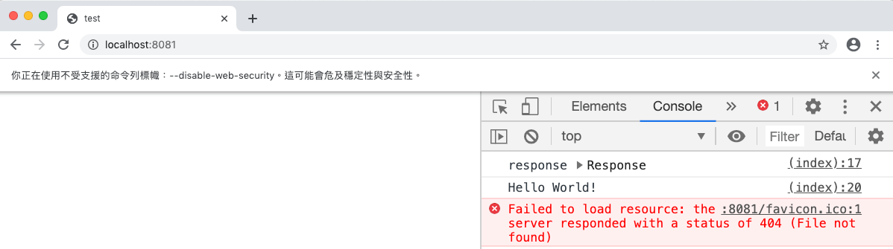

問題是解決了，但為什麼我說這是治標不治本呢？因為只有在你電腦上沒問題而已，==在其他人的電腦上面還是有問題==。有些人會在開發時圖個方便把這個設置關起來，就不會碰到任何 CORS 的問題，但我認為這是比較不好的做法，==因為你關掉的不只是 CORS，你連其他安全機制也一起關掉了==。

總之呢，只是跟大家介紹有這個解法，但不推薦使用。

### 解法二：把 fetch mode 設成 no-cors

這絕對是新手最常犯的錯誤之一，請看仔細了。

如果你是使用 fetch 去抓取資料，例如說這樣（這個網頁的 origin 是 `http://localhost:8081`，跟 `http://localhost:3000` 不同源）：

```javascript
fetch('http://localhost:3000').then(res => {
  console.log('response', res)
  return res.text()
}).then(body => {
  console.log('body', body)
})
```

你就會看到 console 上面跳出顯眼的紅字：

```
Access to fetch at ‘http://localhost:3000/’ from origin ‘http://localhost:8081’ has been blocked by CORS policy: No ‘Access-Control-Allow-Origin’ header is present on the requested resource. If an opaque response serves your needs, set the request’s mode to ‘no-cors’ to fetch the resource with CORS disabled.
```

前半段很熟悉，後半段可能就比較陌生一點。但沒關係，我們看到了關鍵字：`set the request's mode to 'no-cors'`，喔喔喔，難道說這樣就可以不管 CORS 嗎？馬上來試試看：

```javascript
fetch('http://localhost:3000', {
  mode: 'no-cors'
}).then(res => {
  console.log('response', res)
  return res.text()
}).then(body => {
  console.log('body', body)
})
```

改了程式碼之後重新執行，果真不會跳錯誤出來了！console 一片乾淨，只是印出來的值似乎怪怪的：

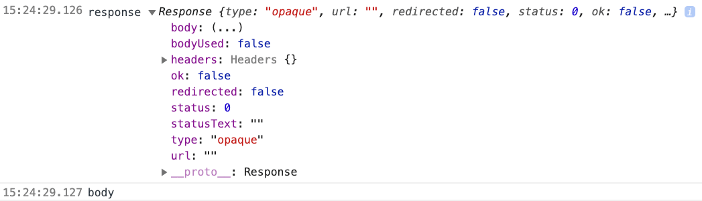

Response 的 status 是 0，body 的內容是空的，type 是一個叫做 `opaque` 的東西，看起來很奇怪。但如果我們打開 devtool 並且切到 Network 的那一個 tab 去看，會發現其實後端是有回傳 response 的。

咦，瀏覽器明明就有拿到 response，為什麼程式裡面卻沒有內容？為什麼會這樣呢？

這是因為，`mode: no-cors` 跟你想的完全不一樣。

當你傳入 `mode: no-cors` 的時候，就代表跟瀏覽器說：「我就是要發 request 到一個沒有 CORS header 的 url，所以請不要給我錯誤」，既然是這樣的話，那自然也就不會出現 `No 'Access-Control-Allow-Origin' header is present on the requested resource` 這個錯誤，因為你本來就預期到這件事了。

但這樣設置並不代表你就拿得到 response，事實上正好相反，用 `mode: no-cors` 的話，你**一定**拿不到 response。沒錯，一定拿不到，就算後端幫你把 `Access-Control-Allow-Origin` 這個 header 加上去了，你也拿不到 response。

設置這個 mode 以後，並不會神奇地就讓你可以突破限制拿到東西，正好相反，這個模式是在跟瀏覽器說：「我就是要發 request 給一個沒有 cors header 的資源，我知道我拿不到 response，所以你絕對不要給我 response」。

所以，如果你發現你用了 `mode: no-cors` 這東西，那有 99% 的機率是用錯了，根本不該用這個。用了的話你反而會很困惑，因為：

1. 你在 network tab 可以看到 response
2. 而且你的程式沒有產生任何錯誤

但是你就是拿不到 response，它就是空的，這都是因為 no-cors 這個 mode。用了以後你可能就會跟[這個 issue](https://github.com/lexich/redux-api/issues/151) 裡面的人一樣感到困惑。==因此加上這個只是不會拿到錯誤而已，但是並沒有突破跨來源的限制，還是拿不到 response==。（==因为前端就是没有可以设置跨来源的地方，所以和跨域相关的参数只能也就是不返回错误罢了==）

至於在什麼場合會用到這個 mode，我還要再研究一下，大家可以先參考：

1. [Trying to use fetch and pass in mode: no-cors](https://stackoverflow.com/questions/43262121/trying-to-use-fetch-and-pass-in-mode-no-cors/43268098)
2. [What limitations apply to opaque responses?](https://stackoverflow.com/questions/39109789/what-limitations-apply-to-opaque-responses)

### 解法三：不要用 AJAX 拿資料

既然用 AJAX 會被擋跨來源的請求，那如果可以不用 AJAX 拿資料，不就沒有問題了嗎？在上一篇我們有提過，有一些 tag 是不會受到 same-origin policy 的限制的，例如說 img 或者是 script…對，script！

script 一般來說都是引入其他人寫好的程式碼，例如說 jQuery 或是其它套件之類的。但在那個 CORS 規範還不完整的年代，就有一些人想出了用 script 標籤來傳遞資料的妙招，我到現在都覺得很厲害。

簡單來說是這樣的，用 script 可以引入別人的 script 對吧？假設我們要引入的 script 長這樣：

```javascript
var data = {
  username: 'huli'
};
```

那我們引入以後，是不是就可以直接存取 data 這個變數，而裡面就是我們想要跨來源拿到的資料。上面的例子算比較簡單的，來舉一個複雜一點點的好了，假設現在我們要傳一個 userId 到 server，然後需要拿到這個 userId 的資料，那我們的 server 可以這樣寫：

```javascript
var express = require('express');
var app = express();

// 事先準備好的資料
const users = {
  1: { name: 'user1' },
  2: { name: 'user2' },
  3: { name: 'user3' },
}

// 根據傳入的 id 回傳資料
app.get('/users/:userId', function (req, res) {
  const userId = req.params.userId;
  res.end(`var data = ${JSON.stringify(users[userId])}`);
});

app.listen(3000, function () {
  console.log('Example app listening on port 3000!');
});
```

如果我們造訪 `http://localhost:3000/users/1`，response 就會是：`var data = {"name":"user1"}`。

接著呢，我們的前端可以這樣寫：

```html
<!DOCTYPE html>

<html>
<head>
  <meta charset="utf-8">
  <script src="http://localhost:3000/users/1"></script>
  <script>
    console.log(data)
  </script>
</head>

<body>
</body>
</html>
```

就只是引入這個 script 然後把 data 印出來，就可以發現我們順利拿到資料了！所以這個方法的重點在於 server 端動態產生資料，然後以 JS 的形式輸出。

不過在實務上，我們其實事先不會知道要拿誰的資料，而是使用者做出一些動作之後，我們才去拿相對應 id 的資料，因此這個 script 就會是動態新增的，像是這樣：

```html
<!DOCTYPE html>

<html>
<head>
  <meta charset="utf-8">
  <script>
    function getUser(userId) {
      // 新增 script 元素
      const script = document.createElement('script')

      // 加上 src
      script.src = 'http://localhost:3000/users/' + userId

      // 插入到 body 中
      document.body.appendChild(script);

      // 印出資料
      console.log(data)
    }
  </script>
</head>

<body>
  <button onclick="getUser(1)">user1</button>
  <button onclick="getUser(2)">user2</button>
</body>
</html>
```

前端放了兩顆按鈕，按第一顆就去抓 user1 的資料，第二顆就去抓 user2。按了之後我們動態產生 script 然後放到 body 上，這樣等腳本載入完成，就能拿到資料了！

不過如果你執行上面這段程式碼，會回給你一個 `Uncaught ReferenceError: data is not defined` 的錯誤，==這是因為載入 script 是需要時間的，而我們在還沒載入完成前，就拿不到資料==。

像是這種非同步的東西，解法都是一樣的，就是加上一個 callback。與其用變數來儲存資料，不如用 callback 的方式把資料帶過來。後端可以改成這樣：

```javascript
app.get('/users/:userId', function (req, res) {
  const userId = req.params.userId;
  res.end(`setData(${JSON.stringify(users[userId])})`);
});
```

你拿到的 response 就會長得像這樣：

```
setData({"name":"user1"})
```

其實就是把之前的變數宣告換成傳入 function 而已。而這個 `setData` 就是你要寫在前端來接收資料的 function：

```html
<!DOCTYPE html>

<html>
<head>
  <meta charset="utf-8">
  <script>
    function setData(data) {
      console.log(data)
    }
    function getUser(userId) {
      const script = document.createElement('script')
      script.src = 'http://localhost:3000/users/' + userId
      document.body.appendChild(script);
    }
  </script>
</head>

<body>
  <button onclick="getUser(1)">user1</button>
  <button onclick="getUser(2)">user2</button>
</body>
</html>
```

如此一來，當 script 載入完成以後，就會呼叫 setData 這個 function 並且把資料帶進去，我們就可以拿到資料了。

最後我們要做一個小改善，那就是不把 function 名稱寫死，而是可以讓 client 自己傳想要的名稱進來：

```javascript
app.get('/users/:userId', function (req, res) {
  const userId = req.params.userId;
  const callback = req.query.callback;
  res.end(`${callback}(${JSON.stringify(users[userId])})`);
});
```

而前端就可以自己帶上一個 query string，指定 callback function 的名稱：

```javascript
function setUser(data) {
  console.log(data)
}
function getUser(userId) {
  const script = document.createElement('script')
  script.src = 'http://localhost:3000/users/' + userId +
    '?callback=setUser';
  document.body.appendChild(script);
}
```

總結一下這個方法，這個方法利用 script 標籤不會擋跨來源請求的特性，讓 server 動態產生檔案的內容，並且利用呼叫 JS 函式的方式傳遞 JSON 格式的資料。

==自己总结：动态生成script标签，script标签加载接口名，访问接口（接口传json参数其中有返回函数名），接口返回（返回函数执行）==

這個方法就是大名鼎鼎的 JSONP，JSON with Padding（padding 是填充的意思，可以想成就是前面填的那個 function 名稱）。

這個方法在早期 CORS 的規範還不完全時挺常用的，巧妙地跨過了瀏覽器的安全性限制。不過它的缺點是因為你只能用 script 的方式去呼叫，==所以只能用 GET 這個 method==，其他 POST、PATCH、DELETE 什麼的都不能用。

以前在使用 jQuery 提供的 `$.ajax` 的時候，就知道裡面有一個 JSONP 的參數可以調整，害我一直以為他們是同樣的東西，但其實只是 jQuery 把他們包起來而已。

JSONP 的原理是透過 script 標籤傳遞資料跨過限制，而一般我們使用的 AJAX 都是用 XMLHttpRequest 或是 fetch，這兩種方法的原理相去甚遠，完全不一樣。

最後做個總結，JSONP 是一種用 script 標籤傳遞資料藉此避開 CORS policy 的方法，==必須要透過 server 配合才能使用（因為它回傳的東西其實是一段 JavaScript，而不是只有資料）==（==它不像AJAX有请求和回调的方法，它是自己创建回调方法的==），目前有些網站的 API 還有支援 JSONP，例如說 [Twitch API](https://dev.twitch.tv/docs/v5)。

### 中場休息

講到這邊，==前端可以嘗試的解法應該==就差不多了，而你也會發現，上面提到的這三個解法：

1. 關掉瀏覽器的安全性設置
2. 把 fetch mode 設成 no-cors
3. 不要用 AJAX 拿資料

都沒有辦法真正解決問題。

==第一種只對自己瀏覽器有效，第二種只是自欺欺人，還是拿不到 response，第三種需要 server 特別支援而且有其限制==。

這就是為什麼我在上一篇裡面說了：「大部分情形下，CORS 都不是前端的問題，純前端是解決不了的」。瀏覽器因為安全性的考量所以會把東西給擋住，因此，你必須要讓瀏覽器知道：「這其實是安全的」，它才會放行。

舉個例子，你發了一個跨來源的請求給 `google.com`，瀏覽器因為之前講的安全性問題擋住了。是誰可以決定不要把這個請求給擋住？不會是前端，因為前端是發出請求的那一方。所以，答案就理所當然是後端了，也就是 `google.com`，只要 `google.com` 跟瀏覽器說：「欸欸我相信這個 origin，他不會做壞事，把我的 response 給他吧！」，瀏覽器就會照做。

就像是如果你去餐廳打工，聽到客人說：「我認識老闆喔」，你會立刻就相信他嗎？不會，因為每個人都可以說他認識老闆，但你沒辦法判斷是不是真的。要判斷真偽，你只能去問老闆，如果老闆說：「對，我真的認識」，那就是真的認識。

所以擁有決定權的並不是客人，而是老闆。送出跨來源請求也是這樣，每個 origin 一定都會說自己有權限，但問那些發出請求的人不準，而是要問接收到請求的那一邊，問說你是不是願意給這個 origin 權限，如果願意的話才放行。

那要怎麼跟瀏覽器說：「我願意」呢？方法可能比你想像中簡單很多，加一個 header 就行了！

### 真正的解法：請後端設置 CORS header

還記得一開始用 fetch 時出現的那個錯誤嗎？

> Access to fetch at ‘http://localhost:3000/’ from origin ‘[http://localhost:8081](http://localhost:8081/)’ has been blocked by CORS policy: No ‘Access-Control-Allow-Origin’ header is present on the requested resource. If an opaque response serves your needs, set the request’s mode to ‘no-cors’ to fetch the resource with CORS disabled.

重点是這一句：No ‘Access-Control-Allow-Origin’ header is present on the requested resource

==剛剛有提到說後端才是擁有權限的那一方，可以告訴瀏覽器：「我允許這個 origin 跨來源存取我的資源」，而告訴瀏覽器的方法，就是在 response 加上一個 header。==

這個 header 的名稱叫做 `Access-Control-Allow-Origin`，內容就是你想要放行的 origin，例如說：`Access-Control-Allow-Origin: http://localhost:8081`，這樣就是允許 `http://localhost:8081` 的跨來源請求。

那如果想要允許多個來源呢？抱歉，你沒辦法在 header 內放入多個 origin，==你只能放一個==，或是你可以選擇放 `*`，就代表允許任何 origin 的意思。如果想要針對多個 origin，server 那邊必須做一點額外處理。

這邊我們先來看放 * 的情形：

```javascript
var express = require('express');
var app = express();

app.get('/', function (req, res) {
  res.set('Access-Control-Allow-Origin', '*');
  res.end('hello world');
});

app.listen(3000, function () {
  console.log('Example app listening on port 3000!');
});
```

這樣就是在跟瀏覽器說：「任何 origin 都可以拿到我的 response，你不需要擋下來」。所以當前端用 AJAX 去送 request 的時候，就可以拿到 response，不會出現任何錯誤。

這邊有一個常見的錯誤，就是有些人以為 `Access-Control-Allow-Origin` 這個 header 是前端在發送 request 時要加的。不，這完全是錯的，==前端加這個完全沒有用，因為這個 header 只存在 response 裡面，是後端才需要加的，前端加了跟沒加一樣==。

所以如果你在前端有加這個，麻煩把它拿掉。再次強調，CORS 問題不是純前端可以解決的，基本上一定需要後端的介入。

如果只想針對特定的 origin 開放權限，只要傳入要開放的 origin 就行了：

```javascript
app.get('/', function (req, res) {
  res.set('Access-Control-Allow-Origin', 'http://localhost:8081');
  res.end('hello world');
});
```

就是這麼的簡單，只要加了一個 header，就可以告訴瀏覽器說：「我同意這個 origin 拿到我的 response」，就這樣就好了。

這才是從根本去解決跨來源請求的問題。如果你跟想存取的資源有合作關係的話，通常直接請他們設定這個 header 就行了。例如說你在串接公司後端的 API 時碰到 CORS 問題，這時候請去找後端工程師幫你把這個 header 加上去。

不要想著靠自己來解決，==因為這不是前端該解決的問題，是後端該解決的==，只是你要幫助他，告訴他應該怎麼解。

上面我有強調一件事，那就是「你跟想存取的資源有合作關係」，但有時候，你可能就是會想要在前端拿一些「跟你沒有合作關係」的資料，例如說你想呼叫別人家的非公開 API，或是去抓 [google.com](https://google.com/) 的內容之類的，這些資源絕對不會給你 `Access-Control-Allow-Origin` 這個 header。

這時候怎麼辦呢？

讓我們歡迎 proxy server 登場！

### 使用 proxy server

這幾篇文章中不斷提醒大家，同源政策什麼的都==只是「瀏覽器的限制」==，一旦脫離了瀏覽器，就沒有任何限制了，proxy server 就是如此。

Proxy server 的翻譯叫做代理伺服器，在不同的場合下用這個詞，代表的意思會有一點點不同，但是大方向都是一樣的。原本你是從 A 傳資料到 B，用代理以後變成你從 A 傳到 P（proxy server），P 再傳到 B，然後再回傳回來，==中間那個 P 就擔任著「代理」的角色==。

這就像是藝人與經紀人一樣，對外的工作都是經紀人負責接洽，談完以後才告知藝人。而藝人如果想找誰合作，也是讓經紀人去問，問完再跟藝人說。所以經紀人其實就是藝人明星的「代理人」。

那要如何把這個概念應用在 CORS 相關的問題上面呢？

如果你想拿 A 網站的資料，但是它沒有提供 `Access-Control-Allow-Origin` 這個 header，你就自己寫個 server，從後端去拿 A 網站的資料，再把資料丟回給自己的前端就行了。因為自己的後端可以自己控制，所以你想加什麼 header 就加什麼 header，想拿什麼資料就拿什麼。

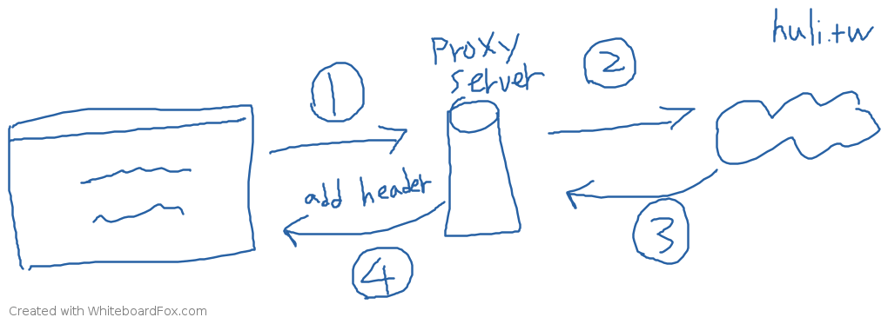

圖片中的數字代表以下流程：

1. 瀏覽器發 request 到 proxy，說要拿 [huli.tw](http://huli.tw/) 的資料
2. proxy server 去跟 [huli.tw](http://huli.tw/) 拿資料（後端，不是瀏覽器所以沒有跨來源限制）
3. [huli.tw](http://huli.tw/) 回傳資料給 proxy（同上，沒有跨來源限制）
4. proxy 回傳資料給瀏覽器，並加上 CORS header（所以前端不會被擋）

大家應該都有聽過的 [CORS Anywhere](https://github.com/Rob--W/cors-anywhere/)，開頭就直接寫了：

> CORS Anywhere is a NodeJS proxy which adds CORS headers to the proxied request.

就是一個 proxy server，幫你把想存取的資源加上 CORS 的 header。或是如果你有在用 Chrome 上幫你解決 CORS 問題的 [plugin](https://github.com/vitvad/Access-Control-Allow-Origin/blob/master/background.js#L33)，背後原理其實也只是用 plugin 幫你把 response 加上 `Access-Control-Allow-Origin` 這個 header 而已。

所以，要解決 CORS 沒有什麼魔法，無論你是裝了 plugin 還是用了 proxy server，背後原理都是一樣的，都還是那個 `Access-Control-Allow-Origin` 的 header。

不過講到 proxy 這個做法，有些人可能會有個疑問：

> ==開頭的時候不是說如果可以拿任意網站的資料會有安全性問題嗎？那 proxy server 呢？為什麼用了 proxy 就沒有這限制？==

來，我們來看這張對照圖，上面是走 proxy 的流程，下面是沒有走的：

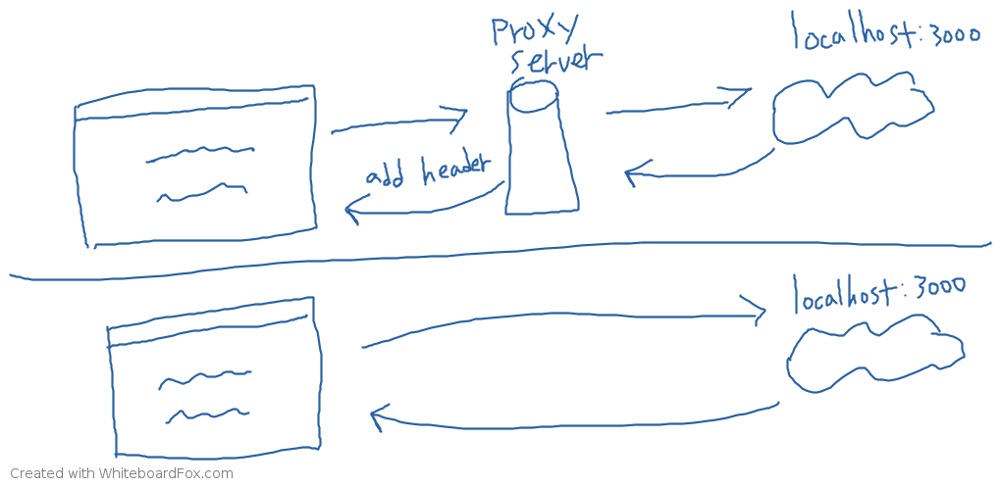

我們先來看下半部的，如果不經過 proxy 的話就會有之前提過的安全性問題，網站可以去拿你 localhost 或是其他網站的資料，所以瀏覽器要把它擋住。

接著來看上半部，這邊有一點很重要，那就是如果走 proxy 的話，跟 localhost:3000 溝通的是誰？是 proxy server，所以網頁去抓的並不是「本機的 localhost:3000」，而是「proxy server 的 localhost:3000」，那這樣對你的電腦來說，就沒有安全性的問題（但是對 proxy server 可能有）。(==不是一样可以获取到数据吗，不能直接打击到网站？==)

### 總結

在這一篇裡面我們看了很多種不同的解法，你最常用的應該要是「請後端加上 CORS header」這一種，因為這通常是最正確的解法。但如果你對後端沒有掌控權，例如說你就是想要抓其他不認識的來源的資料，那大概會自己架一個 proxy server 或者是找現成的，讓 proxy 幫你加上 CORS header。

現成的 server 以前有很多人會用 [CORS Anywhere](https://github.com/Rob--W/cors-anywhere)，但是從 2021 年 2 月開始，因為各種因素所以這個服務會被加上很多限制，因為它本來就不是給大家作為 proxy 服務來使用，而是作為 CORS anywhere 這個專案的 demo。詳情可以參考：[PSA: Public demo server (cors-anywhere.herokuapp.com) will be very limited by January 2021, 31st #301](https://github.com/Rob--W/cors-anywhere/issues/301)

若是後端 API 只提供 JSONP 形式的方式，那也可以用 JSONP 來做；只是在自己電腦上想測試東西又覺得 CORS 很煩的話，裝個擴充套件來解決這問題也是可以的，但要注意的是這只有在自己電腦上有用，換一台電腦就失效了。

其實沒有說哪一種做法一定是對，哪一種一定是錯，畢竟不同的場合之下會有不同作法。但我之所以會說「請後端加上 CORS header 通常是最正確的解法」，是因為大部分人碰到跨來源請求問題可能都是在工作上。這時如果前後端都有經驗，加個 header 就沒事了，但如果兩方都經驗不足，可能就會繞遠路，讓前端自己去架個 proxy server，這就是對這個主題不夠熟造成的後果。

或有些人會開始研究怎麼樣「透過純前端來解跨來源問題」，繞了一大圈發現怎麼這也不行那也不行，連看似最有希望的 `mode: no-cors` 也不行。看完這篇你就懂了，因為這本來就不是前端該解的，所以你當然沒辦法透過純前端解開。

那 CORS 問題看完這篇就能夠完全解決了嗎？不一定。

這篇文章只處理到「最簡單的情況」，還有幾個狀況我們沒有講到，像是最常見的：

1. 非簡單請求（使用其他 HTTP method 與自定義 header）
2. 傳送 Cookie（如何讓跨來源請求也支援 cookie）

這些都會在下一篇：[CORS 完全手冊（三）：CORS 詳解](https://blog.huli.tw/2021/02/19/cors-guide-3)裡面跟大家說明。

## 三，CORS 詳解

### 前言

在上一篇裡面我們提到了常見的 CORS 錯誤解法，以及大多數狀況下應該要選擇的解法：「請後端加上 response header」。

但其實「跨來源請求」這個東西又可以再細分成兩種，簡單請求跟非簡單請求，簡單請求的話可以透過上一篇的解法來解，但非簡單請求的話就比較複雜一些了。

除此之外，跨來源請求預設是不會把 cookie 帶上去的，需要在使用 xhr 或是 fetch 的時候多加一個設定，而後端也需要加一個額外的 header 才行。

與 CORS 相關的 header 其實不少，有些你可能聽都沒聽過。原本這篇我想要把這些東西一一列出來講解，但仔細想了一下覺得這樣有點太無趣，而且大家應該看過就忘記了。

那怎樣的方法會比較好呢？大家都喜歡聽故事，因此這篇讓我們從故事的角度下手，為大家講述一段愛與 CORS 的故事。

主角的名字大家都知道了，對，就是毫無新意的小明。

### Day1：簡單的 CORS

小明任職於某科技公司，擔任菜鳥前端工程師。

而他的第一個任務，就是要做一個「聯絡我們」的表單，讓看到官網，對他們服務有興趣的潛在使用者能夠聯絡到公司的人，再讓業務去跟他們聯絡，洽談後續的合作事項。

而表單長這樣（雖然長得很像 Goolge 表單但是是小明自己做的）：

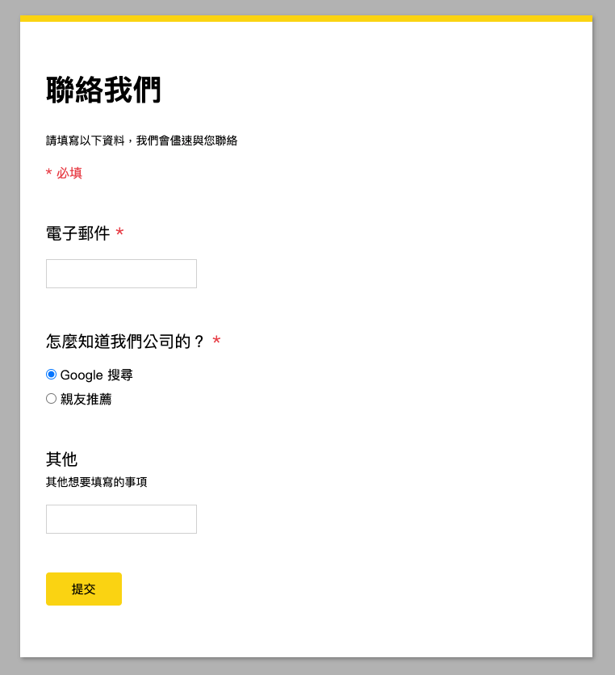

小明花了半天不到的時間，把頁面都刻好了，功能也差不多做完了，只剩下最後一步而已。小明的主管跟他說公司常常會對外舉辦一些活動，而在活動尾聲都會提供這個表單給大家，希望大家統一透過表單留下聯絡資料。

因此表單上的「怎麼知道我們公司的？」就會希望能夠動態調整欄位，在活動期間加一個「透過在 1/10 舉辦的技術分享會」的選項，而活動結束後大概兩個禮拜把這個選項撤掉。之所以要能動態調整，主管說是因為不想讓後續維護的工再回到開發這端，如果一開始就能做成動態的，那未來只要他們自己維護就行了，讓他們能夠透過後台自己去控制

所以後端開了一個 API 出來，要小明去接這個 API 然後把內容 render 出來變成選項。為了方便測試，後端工程師先把整個 API service 打包成 docker image，然後讓小明跑在自己電腦上，網址是：`http://localhost:3000`。

小明接到這個任務之後，想說先把 API 內容抓下來看看好了，於是就寫了這樣一段程式碼：

```
fetch('http://localhost:3000')
```

然後發現 console 出現了錯誤訊息：

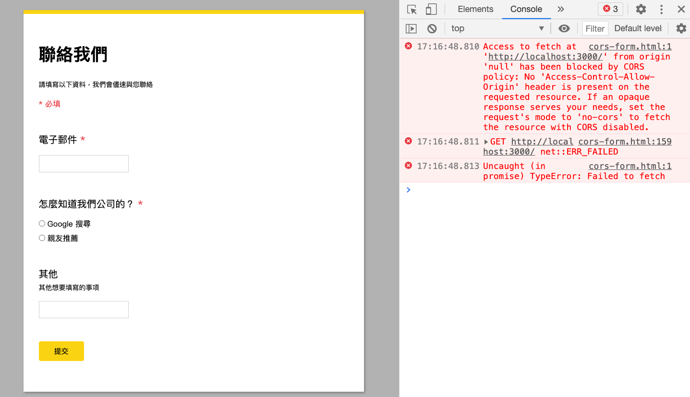

小明沒有看得很懂那是什麼意思，只注意到了最後一段：

> If an opaque response serves your needs, set the request’s mode to ‘no-cors’ to fetch the resource with CORS disabled.

於是幫 fetch 加上了 no-cors 的 mode：

```javascript
fetch('http://localhost:3000', {
  mode: 'no-cors'
}).then(res => console.log(res))
```

改完之後重新整理，發現沒有錯誤了，可是印出來的 response 長得特別奇怪：

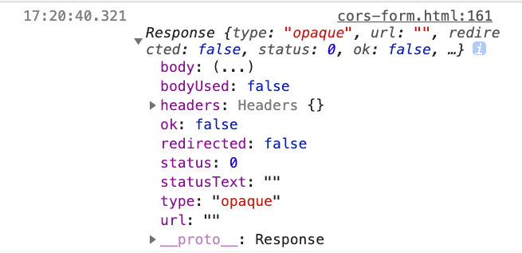

沒有任何資料，而且 status 居然是 0。小明在這之後 debug 很久，找不出原因，不知道為什麼就是拿不到資料。眼看死線將近，小明鼓起勇氣去求助了前輩小華，小華跟他說：

> 這是當然的啊，`no-cors` 是個很容易誤導初學者的參數，他的意思並不是「繞過 cors 拿到資料」，而是「我知道它過不了 cors，但我沒差，所以不要給我錯誤也不要給我 response」
>
> 你這問題一定要透過後端去解，我幫你跟後端說一聲吧

小華前輩不愧資深，三兩下就解決了小明的問題。而後端那邊也幫忙加上了一個 header：`Access-Control-Allow-Origin: *`，代表來自任何 origin 的網站都可以用 AJAX 存取這個資源。

後端程式碼：

```javascript
app.get('/', (req, res) => {
  res.header('Access-Control-Allow-Origin', '*')
  res.json({
    data: db.getFormOptions(),
  })
})
```

小明把原本的 mode 拿掉，改成：

```javascript
fetch('http://localhost:3000')
  .then(res => res.json())
  .then(res => console.log(res))
```

打開了瀏覽器，發現可以成功拿到選項了，也從 network tab 裡面看到了新增加的 header：

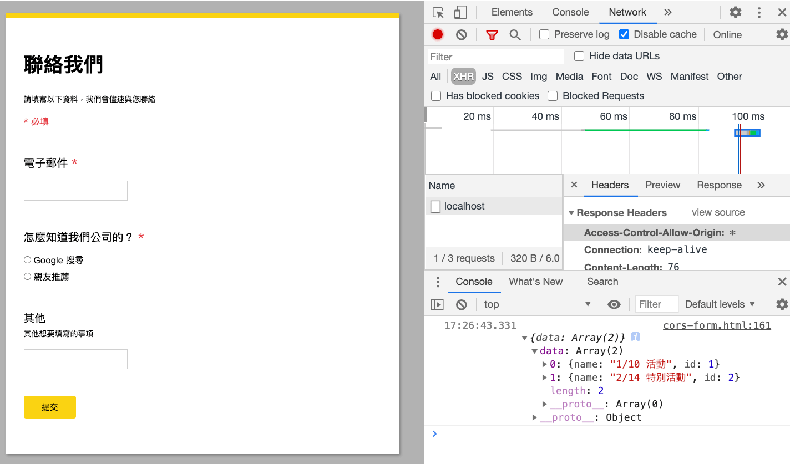

拿到資料以後，就只剩下把選項放上去畫面而已，大概又半天的時間，小明就把這個功能做完並且測試完了，感謝小華前輩的幫助。

### Day1 總結

`mode: 'no-cors'` 跟你想的不一樣，這個沒有辦法解決 CORS 問題。

碰到 CORS 問題的時候，先確認後端有沒有給你 `Access-Control-Allow-Origin` 這個 header，沒有的話請後端給你，否則你怎麼試都不會過。

`Access-Control-Allow-Origin` 的值可以帶 `*`，代表 wildcard，任何 origin 都合法，也可以帶 origin 像是 `http://huli.tw`，代表只有這個 origin 是合法的。

如果想帶多個的話呢？抱歉，沒有辦法，就是只能全部都給過或者是給一個 origin。因此也有後端會根據 request 的 origin 來決定 response 的 `Access-Control-Allow-Origin` 值會是多少，這個我們之後會再提到。

### Day2：不簡單的 CORS

隔了一天之後，主管跟小明說更上層的人不滿意這個使用者體驗，送出表單之後要等個一兩秒才能看到成功的畫面，而且這中間也沒有 loading 什麼的，體驗不好，希望能改成 AJAX 的做法送出表單而不是換頁，就可以改善使用者體驗。

為了因應這個改變，後端又多出了一個 API：`POST /form`，而且這次後端已經很自動地把 `Access-Control-Allow-Origin` 的 header 加上去了：

```javascript
app.post('/form', (req, res) => {
  res.header('Access-Control-Allow-Origin', '*')
  // 省略寫到 db 的程式碼
  res.json({
    success: true
  })
})
```

小明之前已經做過類似的事情，因此很快就把程式碼寫好了：

```javascript
document.querySelector('.contact-us-form')
  .addEventListener('submit', (e) => {
    // 阻止表單送出
    e.preventDefault()

    // 設置參數
    var data = new URLSearchParams();
    data.append('email', 'test@test.com')
    data.append('source', 'search')

    // 送出 request
    fetch('http://localhost:3000/form', {
      method: 'POST',
      headers: {
        'Content-Type': 'application/x-www-form-urlencoded'
      },
      body: data
    }).then(res => res.json())
      .then(res => console.log(res))
  })
```

測試之後也沒有問題，正當小明要跟主管報告做好的時候，後端走過來跟小明說：「不好意思，我們後端最近做了一些改動，未來要統一改成用 JSON 當作資料格式，所以你那邊也要改一下，要送 JSON 過來而不是 urlencoded 的資料」

小明聽了之後心想：「這簡單嘛，不就是改一下資料格式嗎？」，於是改成這樣：

```javascript
document.querySelector('.contact-us-form')
  .addEventListener('submit', (e) => {
    // 阻止表單送出
    e.preventDefault()

    // 設置參數
    var data = {
      email: 'test@test.com',
      soruce: 'search'
    }

    // 送出 request
    fetch('http://localhost:3000/form', {
      method: 'POST',
      headers: {
        'Content-Type': 'application/json'
      },
      body: JSON.stringify(data)
    }).then(res => res.json())
      .then(res => console.log(res))
  })
```

就只是換一下資料格式而已，改成用 JSON 的方式傳資料到後端。改完之後小明再測試了一遍，發現這一次居然掛掉了，而且出現錯誤訊息：

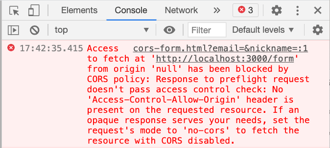

> Access to fetch at ‘http://localhost:3000/form’ from origin ‘null’ has been blocked by CORS policy: Response to preflight request doesn’t pass access control check: No ‘Access-Control-Allow-Origin’ header is present on the requested resource. If an opaque response serves your needs, set the request’s mode to ‘no-cors’ to fetch the resource with CORS disabled.

切到 network tab 去看 request 的狀況，發現除了原本預期的 POST 以外，還多了一個 OPTIONS 的 request：

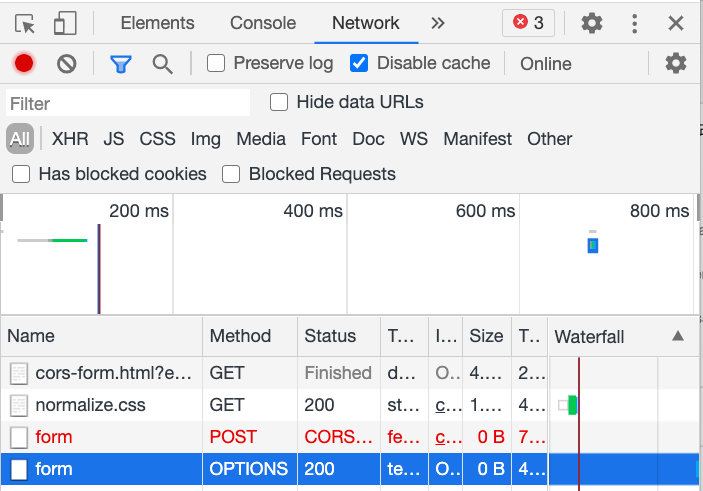

小明上網用錯誤訊息給的關鍵字：`preflight request` 找了一下資料，發現 CORS 沒有他想像中的簡單。

原來之前發送的那些請求都叫做「簡單請求」，只要 method 是 GET、POST 或是 HEAD 然後不要帶自訂的 header，Content-Type 也不要超出：`application/x-www-form-urlencoded`、`multipart/form-data` 或是 `text/plain` 這三種，基本上就可以被視為是「簡單請求」（更詳細的定義下一篇會說）。

一開始串 API 的時候沒有碰到錯誤，是因為 Content-Type 是 `application/x-www-form-urlencoded`，所以被視為是簡單請求。==後來改成 `application/json` 就不符合簡單請求的定義了，就變成是「非簡單請求」==。

那非簡單請求會怎麼樣呢？會多送出一個東西，叫做 preflight request，中文翻作==「預檢請求」==。這個請求就是小明在 network tab 看到的那個 OPTIONS 的 request，針對這個 request，==瀏覽器會幫忙帶上兩個 header==：

1. Access-Control-Request-Headers
2. Access-Control-Request-Method

以剛剛我們看到的 `/form` 的 preflight request 來說，內容是：

1. Access-Control-Request-Headers: content-type
2. Access-Control-Request-Method: POST

前者會帶上不屬於簡單請求的 header，後者會帶上 HTTP Method，讓後端對前端想送出的 request 有更多的資訊。

如果後端願意放行，就跟之前一樣，回一個 `Access-Control-Allow-Origin` 就好了。知道這點以後，小明馬上請後端同事補了一下，後端程式碼變成：

```javascript

app.post('/form', (req, res) => {
  res.header('Access-Control-Allow-Origin', '*')
  res.json({
    success: true
  })
})

// 多加這個，讓 preflight 通過
app.options('/form', (req, res) => {
  res.header('Access-Control-Allow-Origin', '*')
  res.end()
})
```

改好以後小明重新試了一下，發現居然還是有錯誤：

> Access to fetch at ‘http://localhost:3000/form’ from origin ‘null’ has been blocked by CORS policy: Request header field content-type is not allowed by Access-Control-Allow-Headers in preflight response.

當你的 CORS request 含有自訂的 header 的時候，preflight response 需要明確用 `Access-Control-Allow-Headers` 來表明：「我願意接受這個 header」，瀏覽器才會判斷預檢通過。

而在這個案例中，`content-type` 就屬於自訂 header，==所以後端必須明確表示願意接受這個 header==：

```javascript
app.options('/form', (req, res) => {
  res.header('Access-Control-Allow-Origin', '*')
  res.header('Access-Control-Allow-Headers', 'content-type')
  res.end()
})
```

如此一來，小明那邊就可以順利通過 preflight request，只有在通過 preflight 之後，真正的那個 request 才會發出。

流程會像是這樣：

1. 我們要送出 POST 的 request 到 http://localhost:3000/form
2. 瀏覽器發現是非簡單請求，因此先發出一個 preflight request
3. 檢查 response，preflight 通過
4. 送出 POST 的 request 到 http://localhost:3000/form

所以如果 preflight 沒有過，第一個步驟的 request 是不會被送出的。

經歷過一番波折之後，這個改動總算也順利完成了。現在我們可以成功在前端用 AJAX 的方式送出表單資料了。

### Day2 總結

CORS request 分成兩種：簡單請求與非簡單請求，無論是哪一種，後端都需要給 `Access-Control-Allow-Origin` 這個 header。而最大的差別在於非簡單請求在發送正式的 request 之前，會先發送一個 preflight request，如果 preflight 沒有通過，是不會發出正式的 request 的。

針對 preflight request，我們也必須給 `Access-Control-Allow-Headers` 這個 header 才能通過。

除此之外，有些產品可能會想要送一些自訂的 header，例如說`X-App-Version` 好了，帶上目前網站的版本，這樣後端可以做個紀錄：

```javascript
fetch('http://localhost:3000/form', {
      method: 'POST',
      headers: {
        'X-App-Version': "v0.1",
        'Content-Type': 'application/json'
      },
      body: JSON.stringify(data)
    }).then(res => res.json())
      .then(res => console.log(res))
```

當你這樣做以後，後端也必須新增 `Access-Control-Allow-Headers`，才能通過 preflight：

```javascript
app.options('/form', (req, res) => {
  res.header('Access-Control-Allow-Origin', '*')
  res.header('Access-Control-Allow-Headers', 'X-App-Version, content-type')
  res.end()
})
```

簡單來說，preflight 就是一個驗證機制，確保後端知道前端要送出的 request 是預期的，瀏覽器才會放行。==我之前所說的「跨來源請求擋的是 response 而不是 request」，只適用於簡單請求。對於有 preflight 的非簡單請求來說，你真正想送出的 request 確實會被擋下來==。

那為什麼會需要 preflight request 呢？這邊可以從兩個角度去思考：

1. 相容性
2. 安全性

針對第一點，你可能有發現如果一個請求是非簡單請求，那你絕對不可能用 HTML 的 form 元素做出一樣的 request，反之亦然。舉例來說，`<form>` 的 enctype 不支援 `application/json`，所以這個 content type 是非簡單請求；enctype 支援 `multipart/form`，所以這個 content type 屬於簡單請求。

https://www.w3school.com.cn/tags/att_form_enctype.asp (确实不支持json)

對於那些古老的網站，甚至於是在 XMLHttpRequest 出現之前就存在的網站，他們的後端沒有預期到瀏覽器能夠發出 method 是 `DELETE` 或是 `PATCH` 的 request，也沒有預期到瀏覽器會發出 content-type 是 `application/json` 的 request，因為在那個時代 `<form>` 跟 `` 等等的元素是唯一能發出 request 的方法。（==应该是指表单原始方法通过action等属性发送请求吧==）

那時候根本沒有 fetch，甚至連 XMLHttpRequest 都沒有。所以為了不讓這些後端接收到預期外的 request，就先發一個 preflight request 出去，古老的後端沒有針對這個 preflight 做處理，因此就不會通過，瀏覽器就不會把真正的 request 給送出去。（==也就是古老的后端只接收简单请求，但是已经有了preflight request 的处理，不是简单请求的处理不了就算了.......后来后端能接收非简单请求后，又增加了非简单请求的处理返回==）

這就是我所說的==相容性，通過預檢請求，讓早期的網站不受到傷害，不接收到預期外的 request==。

而第二點安全性的話，還記得在第一篇問過大家的問題嗎？送出 POST request 刪除文章的那個問題。刪除的 API 一般來說會用 DELETE 這個 HTTP method，如果沒有 preflight request 先擋住的話，瀏覽器就會真的直接送這個 request 出去，就有可能對後端造成未預期的行為（沒有想到瀏覽器會送這個出來）。

所以才需要 preflight request，確保後端知道待會要送的這個 request 是合法的，才把真正的 request 送出去。

### Day3：帶上 Cookie

昨天改的那版受到上層的極力讚賞，主管也請小明跟小華喝了手搖飲來慶祝。只是正當他們開心之時，行銷部門的人跑來了，問說：「為什麼這些 request 都沒有 cookie？我們需要使用者的 cookie 來做分析，請把這些 cookie 帶上」。

此時小明才突然想起來：「對欸，跨來源的請求，預設是不會帶 cookie 的」，查了一下 MDN 之後，發現只要帶：`credentials: 'include'` 應該就行了：

```javascript
fetch('http://localhost:3000/form', {
  method: 'POST',
  credentials: 'include', // 新增這個
  headers: {
    'Content-Type': 'application/json'
  },
  body: JSON.stringify(data)
}).then(res => res.json())
  .then(res => console.log(res))
```

可是沒想到前端卻出現了錯誤訊息：

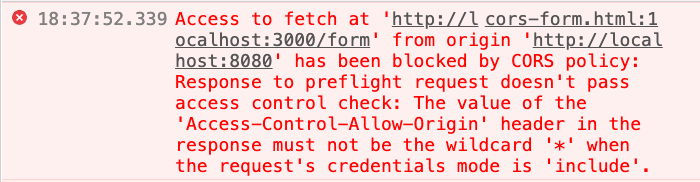

> Access to fetch at ‘http://localhost:3000/form’ from origin ‘[http://localhost:8080](http://localhost:8080/)’ has been blocked by CORS policy: Response to preflight request doesn’t pass access control check: The value of the ‘Access-Control-Allow-Origin’ header in the response must not be the wildcard ‘*’ when the request’s credentials mode is ‘include’.

為什麼會這樣呢？因為如果沒有這個限制的話，那代表任何網站（任何 origin）都可以發 request 到這個 API，並且帶上使用者的 cookie，這樣就會有安全性的問題產生，大概就跟 CSRF 有異曲同工之妙。

所以因為安全性的關係，強制你如果要帶上 cookie，後端一定要明確指定是哪個 origin 有權限。除此之外，後端還要額外帶上 `Access-Control-Allow-Credentials: true` 這個 header。

於是小明再度請小華改一下後端：

```javascript
const VALID_ORIGIN = 'http://localhost:8080'
app.post('/form', (req, res) => {
  res.header('Access-Control-Allow-Origin', VALID_ORIGIN) // 明確指定
  res.header('Access-Control-Allow-Credentials', true) // 新增這個
  res.json({
    success: true
  })
})

app.options('/form', (req, res) => {
  res.header('Access-Control-Allow-Origin', VALID_ORIGIN) // 明確指定
  res.header('Access-Control-Allow-Credentials', true) // 新增這個
  res.header('Access-Control-Allow-Headers', 'content-type, X-App-Version')
  res.end()
})
```

改完之後的版本明確指定 `http://localhost:8080` 才有權限存取 CORS Response，也加上了 `Access-Control-Allow-Credentials` 這個 header。

如此一來就大功告成了，在發送 request 的時候可以成功帶上 Cookie，行銷部門那邊的需求也搞定了，耶依。

### Day3 總結

如果你需要在發送 request 的時候帶上 cookie，那必須滿足三個條件：

1. 後端 Response header 有 `Access-Control-Allow-Credentials: true`
2. 後端 Response header 的 `Access-Control-Allow-Origin` 不能是 `*`，要明確指定
3. 前端 fetch 加上 `credentials: 'include'`

==這三個條件任何一個不滿足的話，都是沒辦法帶上 cookie 的==。

除了這個之外還有一件事情要特別注意，那就是不只帶上 cookie，連設置 cookie 也是一樣的。後端可以用 `Set-Cookie` 這個 header 讓瀏覽器設置 cookie，但一樣要滿足上面這三個條件。如果這三個條件沒有同時滿足，那儘管有 `Set-Cookie` 這個 header，瀏覽器也不會幫你設置，這點要特別注意。

事實上呢，無論有沒有想要存取 Cookie，都會建議 `Access-Control-Allow-Origin` 不要設定成 `*` 而是明確指定 origin，避免預期之外的 origin 跨站存取資源。==若是你有多個 origin 的話==，建議在後端有一個 origin 的清單，判斷 request header 內的 origin 有沒有在清單中，有的話就設定 `Access-Control-Allow-Origin`，沒有的話就不管它。

### Day4：存取自訂 header

還記得我們一開始串的那一個 API 嗎？跟後端拿選項的 API。雖然之前已經順利完成，但沒想到有隕石砸下來了。今天早上上面說要加一個新的需求。

這個需要是要對這個==API 的內容做版本控制==，後端會在 response header 裡面多帶上一個 header：`X-List-Version`，來讓前端知道這個選項的清單是哪一個版本。(没明白有什么用，版本和数据后端都传回前端？不是应该只传版本号到前端，前端根据版本号准备显示数据吗？)

而前端則是要拿到這個版本，並且把值放到表單裡面一起送出。

後端會像是這樣：

```javascript
app.get('/', (req, res) => {
  res.header('Access-Control-Allow-Origin', '*')
  res.header('X-List-Version', '1.3')
  res.json({
    data: [
      {name: '1/10 活動', id: 1},
      {name: '2/14 特別活動', id: 2}
    ]
  })
})
```

由於這一個 API 的內容本來就是公開的，所以沒有允許特定的 origin 也沒有關係，可以安心使用 wildcard。

小明把之前的程式碼改了一下，試著把 header 先列印出來看看：

```javascript
fetch('http://localhost:3000')
  .then(res => {
    console.log(res.headers.get('X-List-Version'))
    return res.json()
  })
  .then(res => console.log(res))
```

此時，神奇的事情發生了。明明從 network tab 去看，確實有我們要的 response header，但是在程式裡面卻拿不到，輸出 null。小明檢查了幾遍，確定字沒打錯，而且沒有任何錯誤訊息，但就是拿不到。

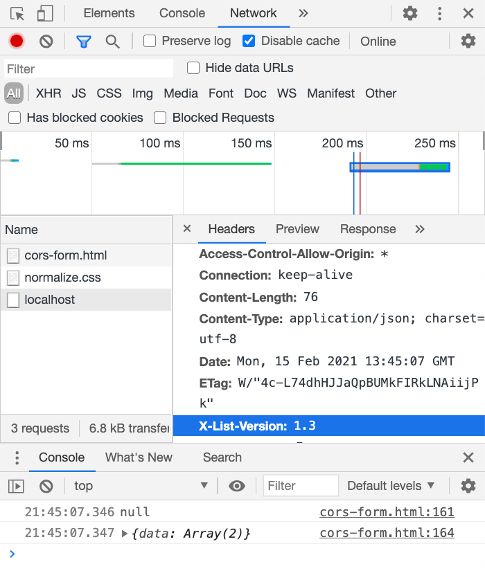

卡了一個小時之後，小明決定再次求助前輩小華。小華身為資深前輩，一看到這個狀況之後就說了：

> 如果你要存取 CORS response 的 header，尤其是這種自定義的 header 的話，後端要多帶一個 `Access-Control-Expose-Headers` 的 header 喔，這樣前端才拿得到

「原來是這樣嗎！」小明恍然大悟，去找了後端的同事，讓他加上這個 header：

```javascript
app.get('/', (req, res) => {
  res.header('Access-Control-Allow-Origin', '*')
  res.header('Access-Control-Expose-Headers', 'X-List-Version') // 加這個
  res.header('X-List-Version', '1.3')
  res.json({
    data: [
      {name: '1/10 活動', id: 1},
      {name: '2/14 特別活動', id: 2}
    ]
  })
})
```

改完之後小明再測試一遍，發現果真可以正確拿到 header 了！感恩小華，讚嘆小華，平安的一天又度過了。

### Day4 總結

當你拿到跨來源的 response 的時候，基本上都可以拿到 response body，也就是內容。但是 header 就不一樣了，==只有幾個基本的 header 可以直接拿到==，例如說 `Content-Type` 就是一個。

除此之外，如果你想拿其他 header，==尤其是自定義的 header 的話，後端就需要帶上 `Access-Control-Expose-Headers`==，讓瀏覽器知道說：「我願意把這個 header 開放出去讓 JS 看到」，這樣子前端才能順利抓到 header。

如果沒有加的話就會拿到 null，就跟這個 header 不存在一樣。

### Day5：編輯資料

原本以為一切都很順利的小明又再次踢到了鐵板。這次是老闆那邊提出的需求，現在一送出表單之後就沒機會再更改了，若是使用者意識到哪邊有填錯，就只能重新再填一遍。而老闆覺得這樣的體驗不好，希望在使用者送出表單以後還有一次機會能夠挽回，可以編輯剛剛送出的表單。

跟後端討論過後，在送出表單之後後端會給一個 token，前端只要帶著這個 token 去打 `PATCH /form` 這個 API，就能夠編輯剛剛表單的內容。(==一般实际使用时都是根据具体的id去访问修改接口修改。这里应该是相当于返回请求的id，然后编辑这个请求的信息吧？==)

後端長得像這樣，一樣有把該加的 header 都加好：

```javascript
const VALID_ORIGIN = 'http://localhost:8080'
app.patch('/form', (req, res) => {
  res.header('Access-Control-Allow-Origin', VALID_ORIGIN)
  res.header('Access-Control-Allow-Credentials', true)
  // 省略編輯的部分
  res.json({
    success: true
  })
})

app.options('/form', (req, res) => {
  res.header('Access-Control-Allow-Origin', VALID_ORIGIN)
  res.header('Access-Control-Allow-Credentials', true)
  res.header('Access-Control-Allow-Headers', 'content-type, X-App-Version')
  res.end()
})
```

而小明立刻開始著手前端的部分，大概像是這樣：

```javascript
fetch('http://localhost:3000/form', {
  method: 'PATCH',
  credentials: 'include',
  headers: {
    'X-App-Version': "v0.1",
    'Content-Type': 'application/json'
  },
  body: JSON.stringify({
    token: 'test_token',
    content: 'new content'
  })
}).then(res => res.json())
  .then(res => console.log(res))
```

其實跟之前送出表單的程式碼八七分像，差別大概只在 body 跟 method 的部分。然而，小明在測試的時候，瀏覽器又跳出錯誤了：

> Access to fetch at ‘http://localhost:3000/form’ from origin ‘[http://localhost:8080](http://localhost:8080/)’ has been blocked by CORS policy: Method PATCH is not allowed by Access-Control-Allow-Methods in preflight response.

==跨來源的請求只接受三種 HTTP Method：`GET`、`HEAD` 以及 `POST`==，除了這三種之外，都必須由後端回傳一個 `Access-Control-Allow-Methods`，讓後端決定有哪些 method 可以用。

因此後端要改成這樣：

```javascript
// preflight
app.options('/form', (req, res) => {
  res.header('Access-Control-Allow-Origin', VALID_ORIGIN)
  res.header('Access-Control-Allow-Credentials', true)
  res.header('Access-Control-Allow-Methods', 'PATCH') // 多這個
  res.header('Access-Control-Allow-Headers', 'content-type, X-App-Version')
  res.end()
})
```

如此一來，瀏覽器就知道前端能夠使用 PATCH 這個 method，就不會把後續的 request 給擋下來了。

### Day5 總結

如果前端要使用 `GET`、`HEAD` 以及 `POST` 以外的 HTTP method 發送請求的話，後端的 preflight response header 必須有 `Access-Control-Allow-Methods` 並且指定合法的 method，preflight 才會通過，瀏覽器才會把真正的 request 發送出去。

這個就跟前面提過的 `Access-Control-Allow-Headers` 有點像，只是一個是在規範可以用哪些 method，一個是在規範可以用哪些 request headers。

### Day6：快取（缓存） preflight request

好不容易滿足了公司各個大頭的需求，沒想到在上線前夕，技術這端出問題了。小明原本以為解掉了所有跨來源的問題就行了，可是卻忽略了一個地方。在 QA 對網站做壓測的時候，發現 preflight request 的數量實在是太多了，而且就算同一個使用者已經預檢過了，每次都還是需要再檢查，其實滿浪費效能的。

於是 QA 那邊希望後端可以把這個東西快取住，這樣如果同一個瀏覽器重複發送 request，就不用再做預檢。

雖然說小明是做前端的，但他其實想成為 CORS 大師，於是就跟後端一起研究該怎麼解決這個問題。最後他們找到了一個 header：`Access-Control-Max-Age`，可以跟瀏覽器說這個 preflight response 能夠快取幾秒。

接著後端把這個 header 加上去：

```javascript
app.options('/form', (req, res) => {
  res.header('Access-Control-Allow-Origin', VALID_ORIGIN)
  res.header('Access-Control-Allow-Credentials', true)
  res.header('Access-Control-Allow-Headers', 'content-type, X-App-Version')
  res.header('Access-Control-Max-Age', 300)
  res.end()
})
```

這樣 preflight response 就會被瀏覽器快取 300 秒，在 300 秒內對同一個資源都不會再打到後端去做 preflight，而是會直接沿用快取的資料。

### 總結

讓我們一個一個來回憶故事中出現的各個 header。

一開始小明需要存取跨來源請求的 response，因此需要後端協助提供 `Access-Control-Allow-Origin`，證明這個 origin 是有權限的。

再來因為要帶自訂的 header，所以後端要提供 `Access-Control-Allow-Headers`，寫明 client 可以帶哪些 header 上去。同時也因為多了 preflight requset，後端要特別處理 `OPTIONS` 的 request。

然後我們需要用到 cookie，所以 `Access-Control-Allow-Origin` 不能是 `*`，要改成單一的 origin。而後端也要多提供 `Access-Control-Allow-Credentials: true`。

接著前端需要存取 header，所以後端必須提供 `Access-Control-Expose-Headers`，跟瀏覽器說前端可以拿到哪些 header。而前端如果要使用 HEAD、GET 跟 POST 之外的 method，後端要加上 `Access-Control-Allow-Methods`。

關於快取的部分，則是用 `Access-Control-Max-Age`。

整串故事看下來，其實你會發現根本沒什麼前端的事情。前端在整個故事中擔任的角色就是：寫 code => 發現錯誤 => 回報後端 => 後端修正 => 完成功能。這也呼應了我之前一再強調的：==「CORS 的問題，通常都不是前端能解決的」==。

說穿了，==CORS 就是藉由一堆的 response header 來跟瀏覽器講說哪些東西是前端有權限存取的。如果沒有後端給的這些 header，那前端根本什麼也做不了==。因此無論是前端還是後端，都有必要知道這些 header，未來碰到相關問題的時候才知道怎麼解決。

順帶一提，我覺得 Chrome 的錯誤提示好像愈做愈棒了，印象中以前好像沒有講得那麼詳細，現在詳細到爆，甚至可以直接看錯誤訊息而不 Google 就知道該怎麼修。

希望透過這一篇，能讓大家理解 CORS 有哪些 response header，以及什麼是 preflight request，在哪些情形之下會觸發。理解這些以後，你對整個 CORS protocol 的理解大概就有八成了。

在下一篇 [CORS 完全手冊（四）：一起看規範](https://blog.huli.tw/2021/02/19/cors-guide-4)中，我們會一起來看看規格，更進一步理解 CORS protocol。

## 四，一起看規範

### 前言

當你獲得了一個知識之後，要怎樣才能知道那是正確的還是錯誤的？在程式的領域中這其實是一個相對簡單的問題，只要去確認規範是怎麼寫的就可以了（如果有規範的話）。

舉例來說，JavaScript 的各種語言特性在 ECMAScript Specification 裡面都找得到，為什麼 `[] === []` 會是 false，為什麼 `'b' + 'a' + + 'a' + 'a'` 會是 baNaNa，這些在規範裡面都有，都會詳細說明是用怎樣的規則在做轉換。

而 Web 相關的領域除了 JS 以外，HTML 或是其他相關的規範幾乎都可以在 [w3.org](https://www.w3.org/) 或是 [whatwg.org](https://html.spec.whatwg.org/multipage/) 裡面找到，資源相當豐富。

雖然說瀏覽器的實作有可能跟規範寫的不一樣（像是[這篇](https://blog.huli.tw/2020/09/05/session-storage-and-html-spec-and-noopener/)），但 spec 已經是最完整而且最有權威性的一個地方了，因此來這邊找準沒錯。

如果搜尋 CORS 的 spec，可能會找到 [RFC6454 - The Web Origin Concept](https://tools.ietf.org/html/rfc6454) 以及 W3C 的 [Cross-Origin Resource Sharing](https://www.w3.org/TR/2020/SPSD-cors-20200602/)，但這兩份都叫這一份叫做 [Fetch](https://fetch.spec.whatwg.org/) 的文件給取代了。

當初我疑惑了一陣子想說是不是自己看錯，fetch 跟 CORS 有什麼關係？後來才知道原來這邊的 fetch 跟 Web API 那個 fetch 其實不同，這份規格是定義了所有跟「抓取資料（fetch）」有關的東西，就如同它的大綱所寫的：

> The Fetch standard defines requests, responses, and the process that binds them: fetching.
>
> Fetch标准定义了请求、响应以及绑定它们的过程：抓取。

這一篇就讓我們一起來看一下 CORS 相關的規範，證明我前面幾篇沒有在唬爛你，講得都是有所根據的。因為規格還滿長的，所以底下就是我挑幾個我認為的重點講而已，想要理解所有的規格內容，還是需要自己去看才行。

（此文章發佈時所參考的規格的版本為：Living Standard — Last Updated 15 February 2021，最新的規格請參考：[Fetch](https://fetch.spec.whatwg.org/)）

### 先來點簡單的

規格這種東西因為很完整所以內容很多也很雜，如果不先從簡單一點的開始很容易會看不下去。而最簡單的就是開頭的 Goals 跟 Preface 這兩個單元了，裡面寫到了：

> The goal is to unify fetching across the web platform and provide consistent handling of everything that involves, including:
>
> 目标是统一跨Web平台的提取，并提供涉及所有内容的一致处理，包括：

> - URL schemes
> - Redirects
> - Cross-origin semantics
> - CSP
> - Service workers
> - Mixed Content
> - `Referer`
>
> To do so it also supersedes the HTTP `Origin` header semantics originally defined in The Web Origin Concept
>
> 为此，它还取代了最初在Web Origin概念中定义的HTTP Origin头语义

這份規格統整了所有「fetching」相關的東西，例如說我們最關注的 CORS 或是其他相關的操作。然後也有提到說這份取代了原本的 [RFC6454 - The Web Origin Concept](https://tools.ietf.org/html/rfc6454)。

接著在前言中有寫到：

> At a high level, fetching a resource is a fairly simple operation. A request goes in, a response comes out. The details of that operation are however quite involved and used to not be written down carefully and differ from one API to the next.
>
> 从高层次上讲，获取资源是一个相当简单的操作。 请求进入，响应出来。 但是，该操作的细节非常复杂，过去常常没有仔细写下来，并且每个API都不相同。

fetch 看起來很簡單，不過就是發個 request 然後接收 response 而已，但實際上其實水很深，以前沒有規格記錄下來導致每個 API 的實作都不一樣，這也是為什麼會有這個統一的 spec 誕生。

> Numerous APIs provide the ability to fetch a resource, e.g. HTML’s img and script element, CSS’ cursor and list-style-image, the navigator.sendBeacon() and self.importScripts() JavaScript APIs. The Fetch Standard provides a unified architecture for these features so they are all consistent when it comes to various aspects of fetching, such as redirects and the CORS protocol.
>
> 许多api都提供了获取资源的能力，例如HTML的img和script元素，CSS游标和list-style-image, navigator.sendBeacon()和self.importScripts() JavaScript api。Fetch标准为这些特性提供了统一的架构，因此当涉及到获取的各个方面时，比如重定向和CORS协议，它们都是一致的。

這邊提到了我在前面所說的，抓取資料或是跨來源抓取資源並不只侷限在 AJAX 上面，載入圖片或是 CSS 也是抓取資源的一種，而這份規格就是為了統一管理這些行為。

> The Fetch Standard also defines the fetch() JavaScript API, which exposes most of the networking functionality at a fairly low level of abstraction.
>
> Fetch标准还定义了Fetch () JavaScript API，它在相当低的抽象级别上公开了大多数网络功能。

身為 Fetch 規格，定義 JS 中的 `fetch()` API 也是相當合情合理的事情。

簡單的部分就到這邊了，這邊就只是在講說為什麼會有這份規格還有它想達成的目的是什麼。

接著我們來看一下 Origin 的定義。

### Origin

Origin 的部分在 3.1. `Origin` header，裡面有附上 ABNF，用特定格式寫成的規則：

```
Origin                           = origin-or-null

origin-or-null                   = origin / %s"null" ; case-sensitive
origin                           = scheme "://" host [ ":" port ]
```

簡單來說就是 origin 的內容只會有兩種，一種是 `"null"`，注意這邊我特別用引號括住，因為那是一個字串。第二種就是前面文章中提到的 scheme + host + port 的組合。

這邊值得注意的是與舊的 rfc6454 的區別，在舊的規範中 origin 其實可以是一個 list 的：

```
7.1.  Syntax

   The Origin header field has the following syntax:

   origin              = "Origin:" OWS origin-list-or-null OWS
   origin-list-or-null = %x6E %x75 %x6C %x6C / origin-list
   origin-list         = serialized-origin *( SP serialized-origin )
   serialized-origin   = scheme "://" host [ ":" port ]
                       ; <scheme>, <host>, <port> from RFC
                       
7.2 Semantics

   In some cases, a number of origins contribute to causing the user
   agents to issue an HTTP request.  In those cases, the user agent MAY
   list all the origins in the Origin header field
```

不過在新的規範中看起來只會剩下一個。總之呢，origin 的定義就跟我之前講的一樣，是 scheme + host + port 的組合。

再來我們直接去看我們最想知道的 CORS！

### CORS

CORS 的部分在 3.2. CORS protocol 的地方。開頭的介紹非常重要。

> To allow sharing responses cross-origin and allow for more versatile fetches than possible with HTML’s form element, the CORS protocol exists. It is layered on top of HTTP and allows responses to declare they can be shared with other origins.
>
> 为了允许跨源共享响应，并允许比HTML表单元素更通用的获取，存在了CORS协议。它在HTTP之上分层，允许响应声明它们可以与其他来源共享。

CORS protocol 存在是為了讓網頁可以有除了 form 元素以外，也可以抓取跨來源資源的方法。然後這個 procotol 是建立在 HTTP 之上的。

> It needs to be an opt-in mechanism to prevent leaking data from responses behind a firewall (intranets). Additionally, for requests including credentials it needs to be opt-in to prevent leaking potentially-sensitive data.
>
> 它需要是一种可选择的机制，以防止来自防火墙(内部网)后响应的数据泄漏。此外，对于包括凭据的请求，需要选择加入，以防止泄漏潜在的敏感数据。

這邊提到了「prevent leaking data from responses behind a firewall (intranets)」，其實就是我第一篇文章中所提到的案例。如果沒有 same-origin policy 的保護，在內網的資訊可能就會被輕易取得。

而「for requests including credentials it needs to be opt-in」也是我們之前所提到的，如果 request 有包含 credentials（通常是 cookie），就必須 opt-in，否則也會有資訊洩漏的風險。

接著底下 3.2.1. General 的這一段也很重要：

> The CORS protocol consists of a set of headers that indicates whether a response can be shared cross-origin.
>
> CORS协议由一组头组成，这些头指示响应是否可以跨源共享。

> For requests that are more involved than what is possible with HTML’s form element, a CORS-preflight request is performed, to ensure request’s current URL supports the CORS protocol.
>
> 对于比HTML表单元素更复杂的请求，执行一个CORS-preflight请求，以确保请求的当前URL支持CORS协议。

這邊提到了兩個重點，第一個是 CORS 是透過 header 來決定一個 response 是不是能被跨來源共享，這就是我在上一篇裡面所說的

> 說穿了，CORS 就是藉由一堆的 response header 來跟瀏覽器講說哪些東西是前端有權限存取的

第二個是如果一個 request 超過 HTML 的 form 元素可以表達的範圍，那就會有一個 CORS-preflight request。

那到底怎樣叫做「超過 form 元素可以表達的範圍」？這個我們稍後再看，先來看底下這兩個部分：

> 3.2.2. HTTP requests
>
> A CORS request is an HTTP request that includes an `Origin` header. It cannot be reliably identified as participating in the CORS protocol as the `Origin` header is also included for all requests whose method is neither `GET` nor `HEAD`.
>
> CORS请求是一个包含Origin报头的HTTP请求。无法可靠地识别它是否参与了CORS协议，因为对于所有方法既不是GET也不是HEAD的请求，也包括原始头。

這邊滿特別的，如果我沒有理解錯誤的話，是說一個 HTTP request 如果==含有 origin 這個 header==，就叫做 CORS request，但這並不代表這個 request 就跟 CORS procotol 有關，因為除了 GET 跟 HEAD 之外的 request 都會帶上 origin 這個 header。

為了驗證這個行為，我建立了一個簡單的表單：

```
<form action="/test" method="POST">
  <input name="a" />
  <input type="submit" />
</form>
```

然後 method 那邊 POST 跟 GET 都試試看，發現果真是這樣沒錯。GET 的沒有帶 origin header，但是 POST 的有。所以按照規格上的說法，用表單 POST 送出資料到同一個 origin 底下，也會被叫做 CORS request，奇怪的知識又增加了

> A CORS-preflight request is a CORS request that checks to see if the CORS protocol is understood. It uses `OPTIONS` as method and includes these headers:
>
> `Access-Control-Request-Method`
> Indicates which method a future CORS request to the same resource might use.
>
> `Access-Control-Request-Headers`
> Indicates which headers a future CORS request to the same resource might use.

而 CORS-preflight request 就是利用 ==OPTIONS== 來確認 server 是不是理解 CORS procotol。

這邊有一點要特別提，就如同 [MDN](https://developer.mozilla.org/zh-TW/docs/Web/HTTP/CORS) 上面寫的：

> 部分請求不會觸發 CORS 預檢。這類請求在本文中被稱作「簡單請求（simple requests）」，雖然 Fetch 規範（其定義了 CORS）中並不使用這個述語

在 Fetch 的規範中並沒有出現簡單請求這個詞，只有區分會不會觸發 CORS-preflight request 而已。

而 CORS protocol 當中的 preflight request 會帶這兩個 header：

1. Access-Control-Request-Method
2. Access-Control-Request-Headers

來說明之後的 CORS request 可能會用到的 method 跟 header，這我們在上一篇也有提過了。

接著有關 response 的部分：

> 3.2.3. HTTP responses
>
> An HTTP response to a CORS request can include the following headers:
>
> `Access-Control-Allow-Origin`
> Indicates whether the response can be shared, via returning the literal value of the `Origin` request header (which can be `null`) or `*` in a response.
>
> `Access-Control-Allow-Credentials`
> Indicates whether the response can be shared when request’s credentials mode is “include”.

這兩個是針對 CORS request 可以返回的 response header，已經在上一篇文章裡面提到過了。前者用來決定==哪些 origin 合法==，後者決定是不是允許==帶上 cookie 以及設置 cookie==。

```
An HTTP response to a CORS-preflight request can include the following headers:

Access-Control-Allow-Methods
Indicates which methods are supported by the response’s URL for the purposes of the CORS protocol.

Access-Control-Allow-Headers
Indicates which headers are supported by the response’s URL for the purposes of the CORS protocol.

Access-Control-Max-Age
Indicates the number of seconds (5 by default) the information provided by the Access-Control-Allow-Methods and Access-Control-Allow-Headers headers can be cached.
```

CORS-preflight request 也是 CORS request 的一種，所以上面所說的針對 CORS request 可以給的 response 也都可以給。

而除此之外還定義了另外三個：

1. Access-Control-Allow-Methods：可以使用哪些 method
2. Access-Control-Allow-Headers：可以使用哪些 header
3. Access-Control-Max-Age：前兩個 header 可以快取多久

這邊值得注意的是第三個，預設值是 5 秒，所以 5 秒內針對同一個資源的 CORS response header 是可以重用的。

```
An HTTP response to a CORS request that is not a CORS-preflight request can also include the following header:

Access-Control-Expose-Headers
Indicates which headers can be exposed as part of the response by listing their names.
```

針對不是 preflight 的 CORS request，可以提供 `Access-Control-Expose-Headers` 這個 header，用來指名有哪些 header 可以存取。

如果沒有明確指定的話，就算拿到了 response 還是沒辦法拿到 header。

接著我們回來看前面提到的那個問題：「怎樣會觸發 preflight request？」

### Preflight request

在 4.1. Main fetch 的章節中有詳細敘述了抓取資源的規則，其中我們關注的是第 5 點中的：

> request’s use-CORS-preflight flag is set
> request’s unsafe-request flag is set and either request’s method is not a CORS-safelisted method or CORS-unsafe request-header names with request’s header list is not empty
>
> 设置request的use-CORS-preflight标志，并且request的方法不是一个CORS-safelisted方法，或者请求头列表不为空的CORS-unsafe请求头名称
>
> 1. Set request’s response tainting to “cors”.
>
>    将请求的响应设置为“ cors”。
>
> 2. Let corsWithPreflightResponse be the result of performing an HTTP fetch using request with the CORS-preflight flag set.
>
>    让corsWithPreflightResponse作为使用设置了CORS-preflight标志的request执行HTTP获取的结果。
>
> 3. If corsWithPreflightResponse is a network error, then clear cache entries using request.
>
>    如果corsWithPreflightResponse是一个网络错误，那么使用request清除缓存条目。
>
> 4. Return corsWithPreflightResponse.

如果 reqeust 的 method 不是 CORS-safelisted method，或是 header 裡面有 CORS-unsafe request-header names 的話，就會設置 CORS-preflight flag 然後進行 HTTP fetch。

繼續往下追的話，在 HTTP fetch 的流程裡會判斷這個 flag 有沒有被設置，有的話就進行 CORS-preflight fetch。

上面所提的東西都可以在 spec 中找到：

> 2.2.1 Methods
>
> A CORS-safelisted method is a method that is `GET`, `HEAD`, or `POST`.

只有這三個 method 不會觸發 preflight。

而有關於 CORS-unsafe request-header names，它會去檢查 headers 是不是都是「CORS-safelisted request-header」，這邊的定義在 2.2.2. Headers 的部分，基本上只有以下幾個會過：

1. accept
2. accept-language
3. content-language
4. content-type

但要注意的是 content-type 有額外附加條件，只能是：

1. application/x-www-form-urlencoded
2. multipart/form-data
3. text/plain

這三種。

另外，上面的 header 對應的 value 中一定都要是合法字元，至於哪些是合法字元，每個 header 的定義都不同，這邊就不細講了。

==仔細想想其實會發現滿合理的，因為以 form 來說，可以填的 method 就只有 GET 跟 POST（還有一個 dialog 啦但是跟 HTTP 無關了），可以填的 enctype 也只有上面說的那三種，沒有填的話預設就是 `application/x-www-form-urlencoded`。==

因此如果是表單的話，確實不會超過上面那樣的定義。而如果在發出 request 的時候超過了這個範圍，就會送出 preflight request。

所以想要 POST 送出 JSON 格式的資料也會觸發，除非你 content-type 用 text/plain，就可以繞過 preflight request（但不建議這樣做就是了）。

### CORS check

關於 request 的部分應該都看完了，接著來看一下 response 相關的部分。有一件我很好奇的事情，那就是該怎麼驗證 CORS 的結果是過關的？

這邊可以看到 4.10. CORS check：

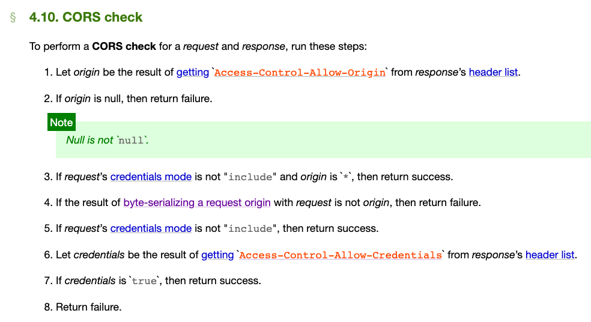

如果 `Access-Control-Allow-Origin` 裡的 origin 是 null 的話，就失敗（這邊特地強調是 null 而不是 “null”，這我們之後會再提到）。

再來檢查如果 origin 是 * 而且 credentials mode 不是 include，就給過。

接著比對 request 的 origin 跟 header 裡的，不同的話就回傳失敗。

比對到這一步的時候 origin 相同了，接著再看一次 credentials mode，不是 inlcude 的話就給過。

反之則檢查 `Access-Control-Allow-Credentials`，如果是 true 的話就給過，否則就回傳失敗。

這一系列的檢查有種 early return 的味道在，可能是因為這樣比較好寫成條列式的，盡量把巢狀給壓平。

以上差不多就是跟 CORS 有關的規格了，第六章節整個都在講 `fetch` API，第七章節在講 websocket。

接著我們來關心一些我覺得也滿重要的一些內容。

### 誤導人的 no-cors mode 與 fetch 的流程

前面有提過 fetch 可以設定一個 `mode: no-cors`，接下來我們就來看一下從規格的角度，到底實際上會做一些什麼事情。

因為這是 fetch request 的一個參數，所以要從 `5.4 Request class` 開始看起，裡面有一個段落是：`The new Request(input, init) constructor steps are:`

在第 30 步的地方可以看到：

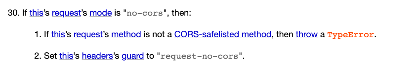

如果 request 的 method 不是 GET、HEAD 或是 POST 的話，就丟一個 TypeError 出來。除此之外，也會把 `header's guard` 設成 `request-no-cors`。

上面這只是新建一個 request 而已，接著可以看 `5.6. Fetch method` 來看實際送出 request 的流程：

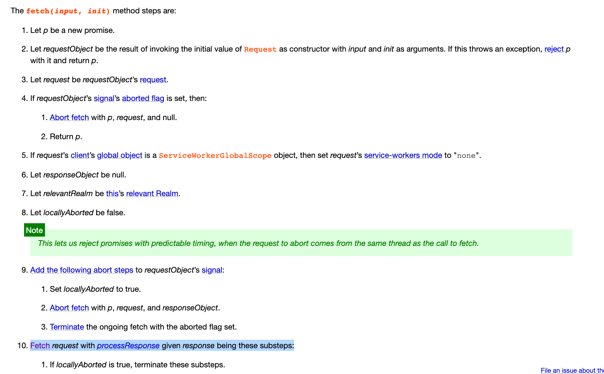

前面都只是在設定一些參數，真正做動作的是第十步：

> Fetch request with processResponse given response being these substeps

那個「Fetch」是個超連結，點下去可以連到 `4. Fetching` 的章節，而這邊我們關注的是最後一步：

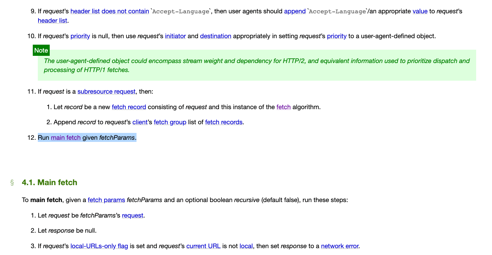

​	

> 1. Run main fetch given fetchParams.

main fetch 也是一個超連結，點了會跳到 `4.1. Main fetch` 去，這邊有一整段專門在處理 mode 是 no-cors 時的狀況：

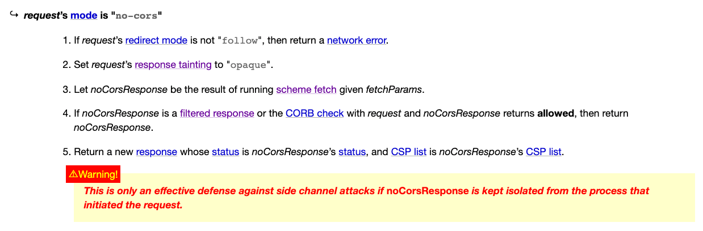

這邊有幾個值得注意的地方：

1. 第二步把 request 的 response tainting 設成 opaque
2. 第三步去執行了「scheme fetch」
3. ==第五步新建了一個 response，只有 status 跟 CSP list==
4. 底下的 warning

這邊可以繼續往 scheme fetch 去追，就會跟剛剛一樣繼續追到各種不同的 fetch method，然後越追越深。不過這邊我已經幫大家追過了，再追下去其實沒什麼特別的，我們先假設第四步不成立好了，所以會執行到第五步：「Return a new response whose status is noCorsResponse’s status, and CSP list is noCorsResponse’s CSP list.」

而 warning 的部分其實滿重要的：

> This is only an effective defense against side channel attacks if noCorsResponse is kept isolated from the process that initiated the request.	

==這邊之所以會新建一個 response，是因為不想回傳原本的 response，要讓原本的 response 跟發起這個 request 的 process 分開==。為什麼要這樣做呢？這我們下一篇會提到。

再來我們繼續往下看，可以看到第十四步：

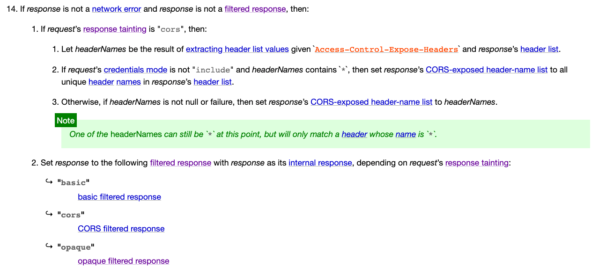

之前已經把 response tainting 設成 opaque，所以根據第二點，會把 response 設成 [opaque filtered response](https://fetch.spec.whatwg.org/#concept-filtered-response-opaque)。

那這個 opaque filtered response 是什麼呢？

> An opaque filtered response is a filtered response whose type is “opaque”, URL list is the empty list, status is 0, status message is the empty byte sequence, header list is empty, and body is null.

==這就是我們之前用 `mode: 'no-cors'` 所拿到的 response，status 是 0，沒有 header，也沒有 body 的 response。==

從規格裡面我們證實了我前面所說的事情，一旦 mode 設成 no-cors，你就是拿不到 response，儘管後端有設定 header 也一樣。

### 使用 CORS 與 cache 時的注意事項

在規格裡面有一個段落：[CORS protocol and HTTP caches](https://fetch.spec.whatwg.org/#cors-protocol-and-http-caches) 特別在講這個。

先假設一個情境好了，那就是 server 只會對有帶 origin 的 request 回覆 `Access-Control-Allow-Origin` 這個 header，沒有帶 origin 的話就不會回（Amazon S3 就是這樣做的）。然後這個 response 有設定快取，所以會被瀏覽器快取起來。

然後假設我們現在要顯示一張圖片好了，這個圖片在 S3 上面，所以是跨來源的。

我們在頁面上放 ``，瀏覽器載入圖片，並且把 response 快取起來。因為是用 img 標籤的關係，所以瀏覽器不會帶 origin header，因此 response 自然而然也就沒有 `Access-Control-Allow-Origin`。

但接下來我們在 JS 裡面也需要拿到這個圖片，因此我們用 fetch 去拿：`fetch('https://s3.xxx.com/a.png')`，這時候這就變成是 CORS request 了，因此 request header 會帶上 origin。

可是呢，由於我們前面已經把這個 url 的 response 快取起來了，所以瀏覽器會直接使用之前還沒過期的 cached response。

這時候悲劇就發生了，之前快取的 response 是沒有 `Access-Control-Allow-Origin` 這個 header 的，所以 CORS 驗證就失敗了，我們就拿不到圖片內容了。

那要怎麼解決這個狀況呢？==在 HTTP response header 裡面有一個 `Vary`==，用來決定這個 response 的快取可能會跟著某些 request header 而不同。

舉例來說，==如果傳了 `Vary: Origin`，就代表如果我之後發的 request 裡的 origin header 不同，那就不應該沿用之前的快取==。

以前面講的狀況而言，設定這個 header 以後，我們用 fetch 發的 request 因為 Origin header 跟之前用 img 的不同，所以照理來說就不會沿用之前快取好的 response，而是會重新發出一個 request。

而這個問題我本人還真的碰到過…請參考：[原來 CORS 沒有我想像中的簡單](https://blog.techbridge.cc/2018/08/18/cors-issue/)。

### 總結

在這篇裡面我們一起看了 fetch 的 spec，從規格的層面去看抓取資源這件事情，也從規格裡面證實了很多前面幾篇文章的說法。其實很推薦大家找一段空閒時間把 spec 稍微掃過一遍，至少會對很多東西有點印象，之後想找資料的時候會容易很多。

除此之外，也能看到一些規格中比較有趣的部分，例如說最後提的那個快取的問題，我還就真的碰到過。如果有早一點看規格，碰到問題時應該就能更快想到解法。

在看規格的時候也可以發現很多東西是出於安全性的考量而做的，接下來就讓我們來看看這個系列的倒數第二篇文章：[CORS 完全手冊（五）：跨來源的安全性問題](https://blog.huli.tw/2021/02/19/cors-guide-5)。

## 五，跨來源的安全性問題

###  前言

在前面幾篇裡面，我們知道 CORS protocol 基本上就是為了安全性所產生的協定，而除了 CORS 以外，其實還有一系列跟跨來源有關的東西，例如說：

1. CORB（Cross-Origin Read Blocking）
2. CORP（Cross-Origin Resource Policy）
3. COEP（Cross-Origin-Embedder-Policy）
4. COOP（Cross-Origin-Opener-Policy）

是不是光看到這一系列很類似的名詞就已經頭昏眼花了？對，我也是。在整理這些資料的過程中，發現跨來源相關的安全性問題比我想像中還來得複雜，不過花點時間整理之後發現還是有脈絡可循，因此這篇會以我覺得應該比較好理解的脈絡，去講解為什麼會有這些東西出現。

除了上面這些 COXX 的各種東西，還有其他我想提的跨來源相關安全性問題，也會在這篇一併提到。

在繼續下去之前先提醒一下大家，這篇在講的是「跨來源的安全性問題」，而不單單只是「CORS 的安全性問題」。CORS protocol 所保護的東西跟內容在之前都介紹過了，這篇要談的其實已經有點偏離大標題「CORS」完全手冊，因為這跟 CORS 協定關係不大，==而是把層次再往上拉高，談談「跨來源」這件事情==。

所以在看底下的東西的時候，不要把它跟 CORS 搞混了。除了待會要講的第一個東西，其他的跟 CORS 關係都不大。

### CORS misconfiguration

如果你還記得的話，前面我有提到過如果跨來源請求想要帶上 cookie，那 `Access-Control-Allow-Origin` 就不能是 `*`，而是必須指定單一的 origin，否則瀏覽器就不會給過。

但現實的狀況是，我們不可能只有一個 origin。我們可能有許多的 origin，例如說 `buy.example.com`、`social.example.com`、`note.example.com`，都需要去存取 `api.example.com`，這時候我們就沒辦法寫死 response header 裡的 origin，而是必須動態調整。

先講一種最糟糕的寫法，就是這樣：

```javascript
app.use((req, res, next) => {
  res.headers['Access-Control-Allow-Credentials'] = 'true'
  res.headers['Access-Control-Allow-Origin'] = req.headers['Origin']
})
```

為了方便起見，所以直接映射 request header 裡面的 origin。這樣做的話，其實就代表任何一個 origin 都能夠通過 CORS 檢查。(==这和直接设置*有什么区别呢？？？==)

這樣做會有什麼問題呢？

問題可大了。

假設我今天做一個釣魚網站，網址是 `http://fake-example.com`，並且試圖讓使用者去點擊這個網站，而釣魚網站裡面寫了一段 script：

```javascript
// 用 api 去拿使用者資料，並且帶上 cookie
fetch('http://api.example.com/me', {
  credentials: 'include'
})
  .then(res => res.text())
  .then(res => {
    // 成功拿到使用者資料，我可以傳送到我自己的 server
    console.log(res)

    // 把使用者導回真正的網站
    window.location = 'http://example.com'
  })
```

我用 fetch 去打 `http://api.example.com/me` 拿資料，並且帶上 cookie。接著因為 server 不管怎樣都會回覆正確的 header，所以 CORS 檢查就通過了，我就拿到資料了。

因此這個攻擊只要使用者點了釣魚網站並且在 `example.com` 是登入狀態，就會中招。至於影響範圍要看網站的 api，最基本的就是只拿得到使用者資料，比較嚴重一點的可能可以拿到 user token（如果有這個 api）。

這個攻擊有幾件事情要注意：

1. 這不是 XSS，因為我沒有在 `example.com` 執行程式碼，我是在我自己的釣魚網站 `http://fake-example.com` 上執行

2. 這有點像是 CSRF，但是網站通常對於 GET 的 API 並不會加上 CSRF token 的防護，所以可以過關

3. 如果有設定 SameSite cookie，攻擊就會失效，因為 cookie 會帶不上去

   http://www.ruanyifeng.com/blog/2019/09/cookie-samesite.html

因此這個攻擊要成立有幾個前提：

1. CORS header 給到不該給的 origin
2. 網站採用 cookie 進行身份驗證，而且沒有設定 SameSite
3. 使用者要主動點擊釣魚網站並且是登入狀態

針對第一點，可能沒有人會像我上面那樣子寫，直接用 request header 的 origin。比較有可能的做法是這樣：

```javascript
app.use((req, res, next) => {
  res.headers['Access-Control-Allow-Credentials'] = 'true'
  const origin = req.headers['Origin']

  // 偵測是不是 example.com 結尾
  if (/example\.com$/.test(origin)) {
    res.headers['Access-Control-Allow-Origin'] = origin
  }
})
```

如此一來，底下的 origin 都可以過關：

1. [example.com](http://example.com/)
2. [buy.example.com](http://buy.example.com/)
3. [social.example.com](http://social.example.com/)

可是這樣寫是有問題的，因為這樣也可以過關：

1. [fakeexample.com](http://fakeexample.com/)

像是這類型的漏洞是經由錯誤的 CORS 設置引起，所以稱為 CORS misconfiguration。

而解決方法就是不要用 RegExp 去判斷，而是事先準備好一個清單，有在清單中出現的才通過，否則都是失敗，如此一來就可以保證不會有判斷上的漏洞，然後也記得把 cookie 加上 SameSite 屬性。

```javascript
const allowOrigins = [
  'example.com',
  'buy.example.com',
  'social.example.com'
]
app.use((req, res, next) => {
  res.headers['Access-Control-Allow-Credentials'] = 'true'
  const origin = req.headers['Origin']

  if (allowOrigins.includes(origin)) {
    res.headers['Access-Control-Allow-Origin'] = origin
  }
})
```

想知道更多的話可以參考：

1. [3 Ways to Exploit Misconfigured Cross-Origin Resource Sharing (CORS)](https://we45.com/blog/3-ways-to-exploit-misconfigured-cross-origin-resource-sharing-cors/)
2. [JetBrains IDE Remote Code Execution and Local File Disclosure](http://blog.saynotolinux.com/blog/2016/08/15/jetbrains-ide-remote-code-execution-and-local-file-disclosure-vulnerability-analysis/)
3. [AppSec EU 2017 Exploiting CORS Misconfigurations For Bitcoins And Bounties by James Kettle](https://www.youtube.com/watch?v=wgkj4ZgxI4c&ab_channel=OWASP)

### 繞過 Same-origin Policy？(针对window)

除了 CORS 以外，Same-origin policy 其實出現在瀏覽器的各個地方，例如說 `window.open` 以及 `iframe`。當你使用 `window.open` 打開一個網頁的時候，回傳值會是那個新的網頁的 window（更精確來說是 WindowProxy 啦，可以參考 [MDN: Window.open()](https://developer.mozilla.org/en-US/docs/Web/API/Window/open)），但只有在 same origin 的狀況下才能存取，如果不是 same origin 的話，只能存取很小一部分的東西。

假設我現在在 `a.example.com` 好了，然後寫了這一段 script：

```javascript
var win = window.open('http://b.example.com')
// 等新的頁面載入完成
setTimeout(() => {
  console.log(win)
}, 2000)
```

用 `window.open` 去開啟 `b.example.com`，等頁面載入完成之後去存取 `b.example.com` 的 window。

執行之後會看到 console 有一段錯誤：

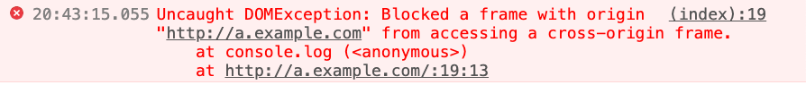

因為 `a.example.com` 跟 `b.example.com` 是 cross origin，所以沒辦法存取到 window。這個規範其實也十分合理，因為如果能存取到 window 的話其實可以做滿多事情的，所以限制在 same origin 底下才能拿到 window。

不過「沒辦法存取 window」這個說法不太精確，因為就算是 cross origin，仍然有一些操作是允許的，例如說：

```javascript
var win = window.open('http://b.example.com')
// 等新的頁面載入完成
setTimeout(() => {
  // 變更開啟的 window 的位置
  win.location = 'https://google.com'
  setTimeout(() => {
    // 關閉視窗
    win.close()
  }, 2000)
}, 2000)
```

可以改變開啟的 window 的 location，也可以關閉開啟的視窗。

相對地，身為被開啟的那個視窗（`b.example.com`），也可以用 `window.opener` 拿到開啟它的網頁（`a.example.com`）的 window，不過一樣只有部分操作是被允許的。

但是呢，如果這兩個網站是在同一個 subdomain 底下，而且你對兩個網站都有控制權，是可以透過更改 `document.domain` 來讓他們的 origin 相同的！

在 `a.example.com`，這樣子做：

```javascript
// 新增這個，把 domain 設為 example.com
document.domain = 'example.com'

var win = window.open('http://b.example.com')
// 等新的頁面載入完成
setTimeout(() => {
  console.log(win.secret) // 12345
}, 2000)
```

在 `b.example.com` 裡面也需要做一樣的事情：

```javascript
document.domain = 'example.com'
window.secret = 12345
```

然後你就會神奇地發現，你現在可以拿到 `b.example.com` 的 window 了！而且幾乎是什麼操作都可以做。

更詳細的介紹可以參考 MDN：[Document.domain](https://developer.mozilla.org/en-US/docs/Web/API/Document/domain)，==會這樣可能是有什麼歷史因素，但未來因為安全性的問題有可能會被拔掉就是了==。

相關的 spec 可以參考：[7.5.2 Relaxing the same-origin restriction](https://html.spec.whatwg.org/multipage/origin.html#relaxing-the-same-origin-restriction)

### 進入正題：其他各種 COXX 是什麼？

前面這兩個其實都只是小菜而已，並不是這一篇著重的主題。這一篇最想跟大家分享的其實是：

1. CORB（Cross-Origin Read Blocking）
2. CORP（Cross-Origin Resource Policy）
3. COEP（Cross-Origin-Embedder-Policy）
4. COOP（Cross-Origin-Opener-Policy）

這幾個東西。

### 嚴重的安全漏洞：Meltdown 與 Spectre

在 2018 年 1 月 3 號，Google 的 Project Zeror 對外發布了一篇名為：[Reading privileged memory with a side-channel](https://googleprojectzero.blogspot.com/2018/01/reading-privileged-memory-with-side.html) 的文章，裡面講述了三種針對 CPU data cache 的攻擊：

- Variant 1: bounds check bypass (CVE-2017-5753)
- Variant 2: branch target injection (CVE-2017-5715)
- Variant 3: rogue data cache load (CVE-2017-5754)

而前兩種又被稱為 Spectre，第三種被稱為是 Meltdown。如果你有印象的話，在當時這可是一件大事，因為問題是出在==CPU==，而且並不是個容易修復的問題。

而這個漏洞的公佈我覺得對於瀏覽器的運作機制有滿大的影響（或至少==加速了瀏覽器演進的過程==），尤其是 spectre 可以拿來攻擊瀏覽器，而這當然也影響了這系列的主題：跨來源資源存取。

因此，稍微理解一下 Spectre 在幹嘛我覺得是很有必要的。如果想要完全理解這個攻擊，需要有滿多的背景知識，但這不是這一篇主要想講的東西，因此底下我會以非常簡化的模型來解釋 Spectre，想要完全理解的話可以參考上面的連結。

### 超級簡化版的 Spectre 攻擊解釋

再次強調，這是為了方便理解所簡化過的版本，跟原始的攻擊有一定出入，但核心概念應該是類似的。

假設現在有一段程式碼（C 語言）長這樣子：

```c
uint8_t arr1[16] = {1, 2, 3}; 
uint8_t arr2[256]; 
unsigned int array1_size = 16;

void run(size_t x) {
  if(x < array1_size) {
    uint8_t y = array2[array1[x]];
  }
}

size_t x = 1;
run(x);
```

我宣告了兩個陣列，型態是 uint8_t，所以每個陣列的元素大小都會是 1 個 byte（8 bit）。而 arr1 的長度是 16，arr2 的長度是 256。

接下來我有一個 function 叫做 run，會传一個數字 x，然後判斷 x 是不是比 array1_size 小，是的話我就先把 `array1[x]` 的值取出來，然後作為索引去存取 `array2`，再把拿到的值給 y。

以上面的例子來說，`run(1)` 的話，就會執行：

```
uint8_t y = array2[array1[1]];
```

而 `array1[1]` 的值是 2，所以就是 `y = array2[2]`。

這段程式碼看起來沒什麼問題，而且我有做了陣列長度的判斷，所以不會有超出陣列索引（Out-of-Bounds，簡稱 OOB）的狀況發生，只有在 x 比 array1_size 小的時候才會繼續往下執行。

不過這只是你看起來而已。

在 CPU 執行程式碼的時候，有一個機制叫做 branch prediction。為了增進程式碼執行的效率，所以 CPU 在執行的時候如果碰到 if 條件，會先預測結果是 true 還是 false，如果預測的結果是 true，就會先幫你執行 if 裡面的程式碼，把結果先算出來。

剛剛講的都只是「預測」，等到實際的 if 條件執行完之後，如果跟預測的結果相同，那就皆大歡喜，如果不同的話，就會把剛剛算完的結果丟掉，這個機制稱為：==預測執行（speculatively execute）==

因為 CPU 會把結果丟掉，所以我們也拿不到預測執行的結果，除非 CPU 有留下一些==線索==。

而這就是==Spectre 攻擊成立的主因==，因為還真的有留下線索。

一樣是為了增進執行的效率，在預測執行的時候會把一些結果放到 ==CPU cache== 裡面，增進之後讀取資料的效率。

假設現在有 ABC 三個東西，一個在 CPU cache 裡面，其他兩個都不在，我們要怎麼知道是哪一個在？

答案是，透過存取這三個東西的時間！因為在 CPU cache 裡面的東西讀取一定比較快，所以如果讀取 A 花了 10ms，B 花了 10ms，C 只花了 1ms，我們就知道 C 一定是在 CPU cache 裡面。==這種透過其他線索來得知資訊的攻擊方法，叫做 side-channel attack==，從其他管道來得知資訊。

上面的方法我們透過時間來判斷，所以又叫做 timing-attack。

結合上述知識之後，我們再回來看之前那段程式碼：

```c
uint8_t arr1[16] = {1, 2, 3}; 
uint8_t arr2[256]; 
unsigned int array1_size = 16;

void run(size_t x) {
  if(x < array1_size) {
    uint8_t y = array2[array1[x]];
  }
}

size_t x = 1;
run(x);
```

假設現在我跑很多次 `run(10)`，==CPU 根據 branch prediction 的機制，合理推測我下一次也會滿足 if 條件，執行到裡面的程式碼==。就在這時候我突然把 x 設成 100，跑了一個 `run(100)`。

這時候 if 裡面的程式碼會被預測執行：

```c
uint8_t y = array2[array1[100]];
```

假設 array1[100] 的值是 38 好了，那就是 `y = array2[38]`，所以 `array2[38]` 會被放到 CPU cache 裡面，增進之後載入的效率。

接著實際執行到 if condition 發現條件不符合，所以把剛剛拿到的結果丟掉，什麼事都沒發生，function 執行完畢。

然後我們根據剛剛上面講的 timing attack，去讀取 array2 的每一個元素，並且計算時間，會發現 `array2[38]` 的讀取時間最短。

這時候我們就知道了一件事：

> array1[100] 的內容是 38

你可能會問說：「那你知道這能幹嘛？」，能做的事情可多了。array1 的長度只有 16，所以我讀取到的值並不是 array1 本身的東西，==而是其他部分的記憶體，是我不應該存取到的地方。而我只要一直複製這個模式，就能把其他地方的資料全都讀出來==。

這個攻擊如果放在瀏覽器上面，我就能讀取同一個 ==process== 的其他資料，換句話說，如果同一個 process 裡面有其他網站的內容，我就能讀取到那個網站的內容！

**這就是 Spectre 攻擊，透過 CPU 的一些機制來進行 side-channal attack，進而讀取到本來不該讀到的資料，造成安全性問題**。

所以用一句白話文解釋，在瀏覽器上面，Spectre 可以讓你有機會讀取到其他網站的資料。

有關 Spectre 的解釋就到這裡了，上面簡化了很多細節，而那些細節我其實也沒有完全理解，想知道更多的話可以參考：

1. [Reading privileged memory with a side-channel](https://googleprojectzero.blogspot.com/2018/01/reading-privileged-memory-with-side.html)
2. [解读 Meltdown & Spectre CPU 漏洞](https://zhuanlan.zhihu.com/p/32757727)
3. [浅谈处理器级Spectre Attack及Poc分析](https://yangrz.github.io/blog/2018/01/09/cpu/)
4. [[閒聊\] Spectre & Meltdown漏洞概論(翻譯)](https://www.ptt.cc/bbs/NetSecurity/M.1515146856.A.750.html)
5. [Spectre漏洞示例代码注释](https://github.com/hdzitao/spectre-attack-zh)
6. [Google update: Meltdown/Spectre](https://developers.google.com/web/updates/2018/02/meltdown-spectre)
7. [Mitigating Spectre with Site Isolation in Chrome](https://security.googleblog.com/2018/07/mitigating-spectre-with-site-isolation.html)

而那些 COXX 的東西，目的都是差不多的，都是要防止一個網站能夠讀取到其他網站的資料。==只要不讓惡意網站跟目標網站處在同一個 process==，這類型的攻擊就失效了。

從這個角度出發，我們來看看各種相關機制。

### CORB（Cross-Origin Read Blocking）

Google 於 Spectre 攻擊公開的一個月後，也就是 2018 年 2 月，在部落格上面發了一篇文章講述 Chrome 做了哪些事情來防堵這類型的攻擊：[Meltdown/Spectre](https://developers.google.com/web/updates/2018/02/meltdown-spectre)。

文章中的 Cross-Site Document Blocking 就是 CORB 的前身。根據 [Chrome Platform Status](https://www.chromestatus.com/feature/5629709824032768)，在 Chrome for desktop release 67 的時候正式預設啟用，那時候大概是 2018 年 5 月，也差不多那個時候，被 merge 進去 fetch 的 spec，成為規格的一部分（[CORB: blocking of nosniff and 206 responses](https://github.com/whatwg/fetch/pull/686)）。

前面有提到過 Spectre 能夠讀取到同一個 process 底下的資料，==所以防禦的其中一個方式就是不要讓其他網站的資料出現在同一個 process 底下==。

一個網站有許多方式可以把跨來源的資源設法弄進來，例如說 `fetch` 或是 `xhr`，但這兩種已經被 CORS 給控管住了，==而且拿到的 response 應該是存在 network 相關的 process 而不是網站本身的 process==，所以就算用 Spectre 也讀不到。

但是呢，用 `` 或是 `<script>` 這些標籤也可以輕易地把其他網站的資源載入。例如說：``，假設 `secret.json` 是個機密的資料，我們就可以把這個機密的資料給「載入」。

你可能會好奇說：「這樣做有什麼用？那又不是一張圖片，而且我用 JS 也讀取不到」。沒錯，這不是一張圖片，但以 Chrome 的運作機制來說，Chrome 在下載之前不知道它不是圖片（有可能副檔名是 .json 但其實是圖片對吧），因此會先下載，下載之後把結果丟進 ==render process==，這時候才會知道這不是一張圖片，然後引發載入錯誤。

看起來沒什麼問題，但別忘了 Spectre 開啟了一扇新的窗，==那就是「只要在同一個 process 的資料我都有機會讀取到」。因此光是「把結果丟進 render process」這件事情都不行，因為透過 Spectre 攻擊，攻擊者還是拿得到存在記憶體裡面的資料。==

因此 ==CORB 這個機制==的目的就是：

> 如果你想讀的資料類型根本不合理，那我根本不需要把讀到 render process，我直接把結果丟掉就好！

延續上面的例子，那個 json 檔的 MIME type 如果是 application/json，代表它絕對不會是一張圖片，因此也不可能放到 img 標籤裡面，這就是我所說的「讀的資料類型不合理」。

==CORB 主要保護的資料類型有三種：HTML、XML 跟 JSON==，那瀏覽器要怎麼知道是這三種類型呢？不如就從 response header 的 content type 判斷吧？

很遺憾，沒辦法。原因是有很多網站的 content type 是設定錯誤的，有可能明明就是 JavaScript 檔案卻設成 `text/html`，就會被 CORB 擋住，網站就會壞掉。

因此 Chrome 會根據內容來==探測（[sniffing](https://mimesniff.spec.whatwg.org/)）==檔案類型是什麼，再決定要不要套用 CORB。

但這其實也有誤判的可能，所以如果你的伺服器給的 content type 都確定是正確的，可以傳一個 response header 是 `X-Content-Type-Options: nosniff`，Chrome 就會直接用你給的 content type 而不是自己探測。

（==这里说的是普通网络请求吧，不是标签载入吧。可能还是标签载入，标签载入也会走一般的网络请求==）


==總結一下，CORB 是個已經預設在 Chrome 裡的機制，會自動阻擋不合理的跨來源資源載入，像是用 `` 來載入 json 或是用 `<script>` 載入 HTML 等等。而除了 Chrome 之外，Safari 跟 Firefox 好像都還沒實裝這個機制。==

更詳細的解釋可以參考：

1. [Cross-Origin Read Blocking for Web Developers](https://www.chromium.org/Home/chromium-security/corb-for-developers)
2. [Cross-Origin Read Blocking (CORB)](https://chromium.googlesource.com/chromium/src/+/master/services/network/cross_origin_read_blocking_explainer.md)

### CORP（Cross-Origin Resource Policy）

==CORB 是瀏覽器內建的機制，自動保護了 HTML、XML 與 JSON==，不讓他們被載入到跨來源的 render process 裡面，就不會被 Spectre 攻擊。但是其他資源呢？如果其他類型的資源，例如說有些照片跟影片可能也是機密資料，我可以保護他們嗎？

這就是 CORP 這個 HTTP response header 的功能。CORP 的前身叫做 From-Origin，下面引用一段來自 [Cross-Origin-Resource-Policy (was: From-Origin) #687](https://github.com/whatwg/fetch/issues/687) 的敘述：

> Cross-Origin Read Blocking (CORB) automatically protects against Spectre attacks that load cross-origin, cross-type HTML, XML, and JSON resources, and is based on the browser’s ability to distinguish resource types. We think CORB is a good idea. From-Origin would offer servers an opt-in protection beyond CORB.

如果你自己知道該保護哪些資源，那就可以用 CORP 這個 header，指定這些資源只能被哪些來源載入。CORP 的內容有三種：

1. Cross-Origin-Resource-Policy: `same-site`
2. Cross-Origin-Resource-Policy: `same-origin`
3. Cross-Origin-Resource-Policy: `cross-origin`

第三種的話就跟沒有設定是差不多的（但其實跟沒設還是有差，之後會解釋），就是所有的跨來源都可以載入資源。接下來我們實際來看看設定這個之後會怎樣吧！

我們先用 express 起一個簡單的 server，加上 CORP 的 header 然後放一張圖片，圖片網址是 `http://b.example.com/logo.jpg`：

```javascript
app.use((req, res, next) => {
  res.header('Cross-Origin-Resource-Policy', 'same-origin')
  next()
})
app.use(express.static('public'));
```

接著在 `http://a.example.com` 引入這張圖片：

```html

```

重新整理打開 console，就會看到圖片無法載入的錯誤訊息，打開 network tab 還會跟你詳細解釋原因：

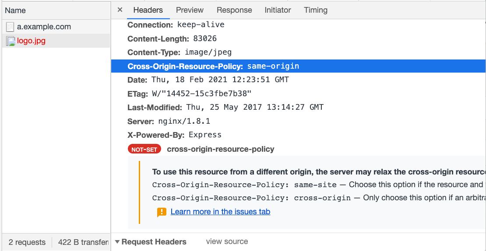

如果把 header 改成 `same-site` 或是 `cross-origin`，就可以看到圖片正確被載入。

所以這個 header 其實就是==「資源版的 CORS」==，原本的 CORS 比較像是 API 或是「資料」間存取的協議，讓跨來源存取資料需要許可。而資源的載入例如說使用 `` 或是 `<script>`，想要阻止跨來源載入的話，應該是只能透過 server side 自行去判斷 `Origin` 或是 `Referer` 之類的值，動態決定是否回傳資料。

而 CORP 這個 header 出現之後，提供了阻止「任何跨來源載入」的方法，只要設定一個 header 就行了。所以這不只是安全性的考量而已，安全性只是其中一點，==重點是你可以阻止別人載入你的資源==。

就如同 CORP 的前身 From-Origin 的 [spec](https://www.w3.org/TR/from-origin/) 所寫到的：

> The Web platform has no limitations on embedding resources from different origins currently. E.g. an HTML document on [http://example.org](http://example.org/) can embed an image from [http://corp.invalid](http://corp.invalid/) without issue. This has led to a number of problems:
>
> Web平台目前在嵌入来自不同来源的资源方面没有任何限制。 例如。 http://example.org上的HTML文档可以嵌入来自http://corp.invalid的图像，而不会出现问题。 这导致了许多问题：

對於這種 embedded resource，基本上 Web 沒有任何限制，想載入什麼就載入什麼，雖然方便但也會造成一些問題，像是：

> Inline linking — the practice of embedding resources (e.g. images or fonts) from another server, causing the owner of that server to get a higher hosting bill.
>
> 内联链接-嵌入来自另一台服务器的资源（例如图像或字体）的做法，导致该服务器（另一台服务器）的所有者要付出更高的托管费用。
>
> Clickjacking — embedding a resource from another origin and attempting to let the visitor click on a concealed link thereof, causing harm to the visitor.
>
> 点击劫持-嵌入来自另一个来源的资源，并试图让访问者单击其隐藏的链接，从而对访问者造成伤害。

例如說在我的部落格直接連到別人家的圖片，這樣流量就是別人家 server 的，帳單也是他要付。除此之外也會有 Clickjacking 的問題。

> Privacy leakage — sometimes resource availability depends on whether a visitor is signed in to a particular website. E.g. only with a I’m-signed-in-cookie will an image be returned, and if there is no such cookie an HTML document. An HTML document embedding such a resource (requested with the user’s credentials) can figure out the existence of that resource and thus whether the visitor is signed in and therefore has an account with a particular service.
>
> 隐私泄露-有时资源的可用性取决于访问者是否登录到特定网站。 例如。 仅使用“我已登录Cookie”，才会返回图片，如果没有此类Cookie，则返回HTML文档。 嵌入此类资源（要求用户提供凭据）的HTML文档可以确定该资源的存在，从而确定访问者是否已登录并因此拥有特定服务的帐户。

這個我之前有看過一個網站但找不到連結了，他可以得知你在某些網站是不是登入狀態。那他怎麼知道的呢？因為有些資源可能只有在你登入的時候有權限存取。假設某個圖片網址只有登入狀態下會正確回傳圖片，沒登入的話就會回傳 server error，那我只要這樣寫就好：

```html

```

透過圖片是否載入成功，就知道你是否登入。不過設定了 SameSite cookie 之後應該就沒這問題了。

> License checking — certain font licenses require that the font be prevented from being embedded on other origins.

字型網站會阻止沒有 license 的使用者載入字型，這種狀況也很適合用這個 header。

總而言之呢，前面介紹的 CORB 只是==「阻止不合理的讀取」==，例如說用 img 載入 HTML，這純粹是為了==安全性考量而已==。

但是 CORP 則是可以==阻止任何的讀取==（除了 iframe，對 iframe 沒作用），可以保護你網站的資源不被其他人載入，是==功能更強大而且應用更廣泛的一個 header==。

現在==主流的瀏覽器都已經支援==這個 header 了。

### Site Isolation

要防止 Spectre 攻擊，有兩條路線：

1. 不讓攻擊者有機會執行 Spectre 攻擊
2. 就算執行攻擊，也拿不到想要的資訊

前面有提過 Spectre 攻擊的原理，透過讀取資料的時間差得知哪一個資料被放到 cache 裡面，就可以從記憶體裡面「偷」資料出來。==那如果瀏覽器上面提供的計時器時間故意不精準的話，不就可以防禦了嗎？==因為攻擊者算出來的秒數會差不多，根本不知道哪一個讀取比較快。

Spectre 攻擊出現之後瀏覽器做了兩件事：

1. 降低 `performance.now` 的精準度
2. 停用 `SharedArrayBuffer`

==第一點很好理解，降低拿時間函式的精準度，就可以讓攻擊者無法判斷正確的讀取速度==。那第二點是為什麼呢？

先講一下 `SharedArrayBuffer` 這東西好了，這東西可以讓你 document 的 JS 跟 web worker 共用同一塊記憶體，共享資料。所以在 web worker 裡面你可以做一個 counter 一直累加，然後在 JS 裡面讀取這個 counter，就達成了計時器的功能。

所以 Spectre 出現之後，瀏覽器就做了這兩個調整，從「防止攻擊源頭」的角度下手，這是第一條路。

而另一條路則是不讓惡意網站拿到跨來源網站的資訊，就是前面所提到的 CORB，以及現在要介紹的：Site Isolation。

先來一段來自 [Site Isolation for web developers](https://developers.google.com/web/updates/2018/07/site-isolation) 的介紹：

> Site Isolation is a security feature in Chrome that offers an additional line of defense to make such attacks less likely to succeed. It ensures that pages from different websites are always put into different processes, each running in a sandbox that limits what the process is allowed to do. It also blocks the process from receiving certain types of sensitive data from other sites
>
> 网站隔离是Chrome的一项安全功能，它提供了一道额外的防线，使此类攻击不太可能成功。它确保来自不同网站的页面总是被放到不同的进程中，每个进程运行在一个沙盒中，限制了进程允许做什么。它还阻止该程序从其他网站接收某些类型的敏感数据

簡單來說呢，==Site Isolation 會確保來自不同網站的資源會放在不同的 process==，所以就算你在自己的網站執行了 Spectre 攻擊也沒關係，因為你讀不到其他網站的資料。

Site Isolation 目前在 Chrome 是預設啟用的狀態，相對應的缺點是使用的記憶體會變多，因為開了更多的 process，其他的影響可以參考上面那篇文章。

而除了 Site Isolation 之外，還有另外一個很容易搞混的東西（我在寫這篇的時候本來以為是一樣的，後來才驚覺原來不同），叫做：「cross-origin isolated state」。

這兩者的差別在哪裡呢？根據我自己的理解（不保證完全正確），在 [Mitigating Spectre with Site Isolation in Chrome](https://security.googleblog.com/2018/07/mitigating-spectre-with-site-isolation.html) 這篇文章中有提到：

> Note that Chrome uses a specific definition of “site” that includes just the scheme and registered domain. Thus, [https://google.co.uk](https://google.co.uk/) would be a site, and subdomains like [https://maps.google.co.uk](https://maps.google.co.uk/) would stay in the same process.

Site Isolation 的 “Site” 的定義就跟 same site 一樣，`http://a.example.com` 跟 `http://b.example.com` 是 same site，所以儘管在 Site Isolation 的狀況下，==這兩個網頁還是會被放在同一個 process 裡面==。

==而 cross-origin isolated state 應該是一種更強的隔離，只要不是 same origin 就隔離開來，就算是 same site 也一樣==。因此 `http://a.example.com` 跟 `http://b.example.com` 是會被隔離開來的。而且 Site Isolation 隔離的對象是 process，cross-origin isolated 看起來是隔離 browsing context group，不讓跨來源的東西處在同一個 browsing context group。

而這個 cross-origin isolated state 並不是預設的，你必須在你的網頁上設置這兩個 header 才能啟用：

1. Cross-Origin-Embedder-Policy: require-corp
2. Cross-Origin-Opener-Policy: same-origin

至於為什麼是這兩個，待會告訴你。

### COEP（Cross-Origin-Embedder-Policy）

要達成 cross-origin isolated state 的話，必須保證你對於自己網站上所有的跨來源存取，都是合法的並且有權限的。

COEP（Cross-Origin-Embedder-Policy）這個 header 有兩個值：

1. unsafe-none
2. require-corp

第一個是預設值，就是沒有任何限制，第二個則是跟我們前面提到的 CORP(Cross-Origin-Resource-Policy) 有關，如果用了這個 require-corp 的話，就代表告訴瀏覽器說：「頁面上所有我載入的資源，都必須有 CORP 這個 header 的存在（或是 CORS），而且是合法的」

現在假設我們有個網站 `a.example.com`，我們想讓它變成 cross-rogin isolated state，因此幫他加上一個 header：`Cross-Origin-Embedder-Policy: require-corp`，然後網頁裡面引入一個資源：

```

```

接著我們在 b 那邊傳送正確的 header：

```javascript
app.use((req, res, next) => {
  res.header('Cross-Origin-Resource-Policy', 'cross-origin')
  next()
})
```

如此一來就達成了第一步。

另外，前面我有講過 CORP 沒有設跟設定成 `cross-origin` 有一個細微的差異，就是差在這邊。上面的範例如果 b 那邊沒有送這個 header，那 Embedder Policy 就不算通過。

### COOP（Cross-Origin-Opener-Policy）

而第二步則是這個 COOP（Cross-Origin-Opener-Policy）的 header，在上面的時候我有說過當你用 `window.open` 開啟一個網頁的時候，你可以操控那個網頁的 location；而開啟的網頁也可以用 `window.opener` 來操控你的網頁。

而這樣子讓 window 之間有關連，就不符合跨來源的隔離。因此 COOP 這個 header 就是來規範 window 跟 opener 之間的關係，一共有三個值：

1. Cross-Origin-Opener-Policy: `unsafe-none`
2. Cross-Origin-Opener-Policy: `same-origin`
3. Cross-Origin-Opener-Policy: `same-origin-allow-popups`

第一個就是預設值，不解釋，因為沒什麼作用。

第二個最嚴格，如果你設定成 `same-origin` 的話，那「被你開啟的 window」也要有這個 header，而且也要設定成 `same-origin`，你們之間才能共享 window。(不共享wondow会是什么样的呢，报错？？？)

底下我們來做個實驗，我們有兩個網頁：

1. http://localhost:5566/page1.html
2. http://localhost:5566/page2.html

page1.html 的內容如下：

```	javascript
<script>
  var win = window.open('http://localhost:5566/page2.html')
  setTimeout(() => {
    console.log(win.secret)
  }, 2000)
</script>
```

page2.html 的內容如下：

```javascript
<script>
  window.secret = 5566
</script>
```

測驗的方式很簡單，如果 page1 成功輸出 5566，代表兩個之間有共享 window。否之則否。

先來試試看不加任何 header 吧！由於這兩個是 same origin，因此本來就可以共享 window，成功印出了 5566。

接下來我們把 server 端的程式碼改成這樣：

```javascript
app.use((req, res, next) => {
  if (req.url === '/page1.html') {
    res.header('Cross-Origin-Opener-Policy', 'same-origin')
  }
  next()
})
```

只有 `page1.html` 有 COOP，`page2.html` 沒有，實驗的結果是：「無法共享」。就算改成這樣：

```javascript
app.use((req, res, next) => {
  if (req.url === '/page1.html') {
    res.header('Cross-Origin-Opener-Policy', 'same-origin')
  }
  if (req.url === '/page2.html') {
    res.header('Cross-Origin-Opener-Policy', 'same-origin-allow-popups')
  }
  next()
})
```

也是無法共享，因為 `same-origin` 的條件就是：

1. 開啟的 window 要在同一個 origin
2. 開啟的 window 的 response header 要有 COOP，而且值一定要是 `same-origin`

只有符合這兩點，才能成功存取到完整的 window。而且有一點要特別注意，那就是一旦設定了這個 header 但是沒有符合規則，不只存取不到完整的 window，連之前那什麼 `openedWindow.close` 跟 `window.opener` 都會拿不到，兩個 window 之間就是徹徹底底沒關聯了。

再來 `same-origin-allow-popups` 的條件比較寬鬆，只有：

1. 開啟的 window 要在同一個 origin
2. 開啟的 window 沒有 COOP，或是 COOP 的值不是 same-origin

簡單來說，`same-origin` 不只保護他人也保護自己，當你設定成這個值的時候，無論你是 open 別人的，或是被 open 的，都一定要是 same origin 然後有相同的 header，才能互相存取 window。

舉一個例子，我調整成這樣：

```javascript
app.use((req, res, next) => {
  if (req.url === '/page1.html') {
    res.header('Cross-Origin-Opener-Policy', 'same-origin-allow-popups')
  }
  next()
})
```

只有 page1 有設定 `same-origin-allow-popups`，page2 什麼都沒設定，這種狀況可以互相存取 window。

接下來如果兩個一樣的話：

```javascript
app.use((req, res, next) => {
  if (req.url === '/page1.html') {
    res.header('Cross-Origin-Opener-Policy', 'same-origin-allow-popups')
  }
  if (req.url === '/page2.html') {
    res.header('Cross-Origin-Opener-Policy', 'same-origin-allow-popups')
  }
  next()
})
```

這也可以，沒什麼問題。

那如果是這樣呢？

```javascript
app.use((req, res, next) => {
  if (req.url === '/page1.html') {
    res.header('Cross-Origin-Opener-Policy', 'same-origin-allow-popups')
  }
  if (req.url === '/page2.html') {
    res.header('Cross-Origin-Opener-Policy', 'same-origin')
  }
  next()
})
```

這樣子就不行。

所以稍微總結一下，假設現在有一個網頁 A 用 window.open 開啟了一個網頁 B：

1. 如果 AB 是 cross-origin，瀏覽器本來就有限制，只能存取 `window.location` 或是 `window.close` 之類的方法。沒辦法存取 DOM 或其他東西
2. 如果 AB 是 same-origin，那他們可以互相存取幾乎完整的 window，包括 DOM。
3. 如果 A 加上 COOP header，而且值是 `same-origin`，代表針對第二種情況做了更多限制，只有 B 也有這個 header 而且值也是 `same-origin` 的時候才能互相存取 window。
4. 如果 A 加上 COOP header，而且值是 `same-origin-allow-popups`，也是對第二種情況做限制只是比較寬鬆，只要 B 的 COOP header 不是 `same-origin` 就可以互相存取 window。

總之呢，要「有機會互相存取 window」，一定要先是 ==same origin==，這點是不會變的。實際上是不是存取的到，就要看有沒有設定 COOP header 以及 header 的值。而如果有設定 COOP header 但不符合規則，那 `window.opener` 會直接變成 null，你連 location 都拿不到（沒設定規則的話，就算是 cross origin 也拿得到）。

 其實根據 [spec](https://html.spec.whatwg.org/multipage/origin.html#cross-origin-opener-policies) 還有第四種：same-origin-plus-COEP，但看起來更複雜就先不研究了。

### 再回到 cross-origin isolated state

前面提到了 cross-origin isolated state 需要設置這兩個 header：

1. Cross-Origin-Embedder-Policy: require-corp
2. Cross-Origin-Opener-Policy: same-origin

為什麼呢？因為一旦設置了，就代表頁面上所有的跨來源資源都是你有權限存取的，如果沒有權限的話會出錯。所以如果設定而且通過了，就代表跨來源資源也都允許你存取，就不會有安全性的問題。

在網站上可以用：

```
self.crossOriginIsolated
```

來判定自己是不是進入 cross-origin isolated state。是的話就可以用一些被封印（？）的功能，因為瀏覽器知道你很安全。

另外，如果進入了這個狀態，一開始講過的透過修改 `document.domain` 繞過 same-origin policy 的招數就不管用了，瀏覽器就不會讓你修改這個東西了。

想知道更多 COOP 與 COEP 還有 cross-origin isolated state，可以參考：

1. [Making your website “cross-origin isolated” using COOP and COEP](https://web.dev/coop-coep/)
2. [Why you need “cross-origin isolated” for powerful features](https://web.dev/why-coop-coep/)
3. [COEP COOP CORP CORS CORB - CRAP that’s a lot of new stuff!](https://scotthelme.co.uk/coop-and-coep/)
4. [Making postMessage() work for SharedArrayBuffer (Cross-Origin-Embedder-Policy) #4175](https://github.com/whatwg/html/issues/4175)
5. [Restricting cross-origin WindowProxy access (Cross-Origin-Opener-Policy) #3740](https://github.com/whatwg/html/issues/3740)
6. [Feature: Cross-Origin Resource Policy](https://www.chromestatus.com/feature/4647328103268352)

### 總結

這篇其實講了不少東西，都是圍繞著安全性在打轉。一開始我們講了 CORS 設定錯誤會造成的結果以及防禦方法，接著講了透過修改 `document.domain` 讓 same-site 變成 same-origin（要兩個網站都同意這樣做才行），最後則是這篇的重頭戲：

1. CORB（Cross-Origin Read Blocking）
2. CORP（Cross-Origin Resource Policy）
3. COEP（Cross-Origin-Embedder-Policy）
4. COOP（Cross-Origin-Opener-Policy）

在找資料的時候花了不少時間，因為名字太像而且功能有些其實有點類似，但看久了其實就會發現差滿多的，每一個 policy 所注重的地方都不同。希望我整理過後的脈絡有幫助大家更好理解這些東西。

如果要用一段話總結這四個東西的話，或許是：

1. CORB：瀏覽器預設的機制，主要是防止載入不合理的資源，像是用 img 載入 HTML
2. CORP：是一個 HTTP response header，決定這個資源可以被誰載入，可以防止 cross-origin 載入圖片、影片或任何資源
3. COEP：是一個 HTTP response header，確保頁面上所有的資源都是合法載入的 (==不懂不懂不懂==)
4. COOP：是一個 HTTP response header，幫 same-origin 加上更嚴格的 window 共享設定

相對於其他幾篇，我對這篇的內容沒有這麼熟悉，如果有哪邊有講錯麻煩不吝指教，感謝。

再來，下一篇就是是這系列文的最後一篇了：[CORS 完全手冊（六）：總結、後記與遺珠](https://blog.huli.tw/2021/02/19/cors-guide-6)

## 六，總結、後記與遺珠

### 前言

這篇技術含量比較少一點，來跟大家分享一下寫這系列文的過程以及寫完之後的一些感想。

如果你還沒看這系列文的話，傳送門如下：

- [CORS 完全手冊（一）：為什麼會發生 CORS 錯誤？](https://blog.huli.tw/2021/02/19/cors-guide-1)
- [CORS 完全手冊（二）：如何解決 CORS 問題？](https://blog.huli.tw/2021/02/19/cors-guide-2)
- [CORS 完全手冊（三）：CORS 詳解](https://blog.huli.tw/2021/02/19/cors-guide-3)
- [CORS 完全手冊（四）：一起看規範](https://blog.huli.tw/2021/02/19/cors-guide-4)
- [CORS 完全手冊（五）：跨來源的安全性問題](https://blog.huli.tw/2021/02/19/cors-guide-5)
- [CORS 完全手冊（六）：總結、後記與遺珠](https://blog.huli.tw/2021/02/19/cors-guide-6)

### 起源

第一篇裡面有提到過想寫這系列文的初衷，因為實在是看過太多人問 CORS 問題了，而且有些人也不管脈絡，一言不合就推薦用 proxy 或是 CORS Anywhere。如果是第三方資源沒有權限，那用這個解法合理，但如果是公司自己的服務，應該是要叫後端設定才對，而不是自己去接 proxy。（==可是吧一般吧访问的接口服务器也没有域名，当然ip也完全不同，还是相当于访问第三方接口，用proxy去接==）

CORS 最常見的錯誤大概就那些，包括：

1. 不知道 CORS 擋的是 response 而不是 request（有 preflight 的除外）
2. 不知道為什麼要有 CORS
3. 不知道怎麼解決 CORS 問題（到處亂試，以為 `no-cors` 是解法）
4. 不知道怎麼 debug（應該要看 console 跟看 network tab）
5. 錯誤地解決 CORS 問題（該後端改的卻自己用 proxy）

在 2020 年 4 月的時候，我有了寫這個系列文的念頭，接下來就開始研究，一開始就規劃了大家看到的這五篇文章，在 2020 年 7 月開始動筆，連續寫了大概兩三天，把第一篇寫完，第二篇大概寫一半，然後就從此擱置了。

那時候會擱置大概是因為第三篇：CORS 詳解不知道該怎麼寫，然後第四篇一起看 spec 也沒太多想法，所以就拖延症一直放著了。直到 2021 年 2 月份才開始繼續寫，並且一口氣把後續文章全部寫完。會重新開始動筆的理由是，這是我心中一顆放不下的石頭，沒有把這系列寫完，我做其他事情的時候就會有些不安，想著「這系列文是不是寫不完了」。

### 後記

但幸好我有寫完。因為從寫文章的過程中我也收穫很多，花了不少時間在理解一些細節，像是 Spectre 的攻擊我就研究了一段時間，雖然最後還是沒有很懂就是了，想要完全理解要把作業系統相關的知識補齊才行。而第五篇那些 COXX 的 header 也花了許多時間，找了很多資料，把當初提案的 issue 都稍微看了一下，會更理解這些 policy 提出的原因。

在研究的過程中也發現許多安全性有關的東西其實是扣在一起的，例如說：

1. Same-origin policy
2. window.open
3. iframe
4. CSP
5. SameSite cookie

http://www.ruanyifeng.com/blog/2019/09/cookie-samesite.html

在找資料的過程中可以看到不少重疊的地方，尤其是 SameSite cookie，越想越覺得這東西真的很重要，而且可以防止滿多的攻擊。對了，在寫這篇文的時候參考資料其實大多都來自於 Google Chrome，所以文中有許多使用「瀏覽器」的地方，有可能現在其實只有 Chrome 有實作而已，其他瀏覽器還沒跟進。

不過 Chrome 確實資源最多，而且常常會 po 一些技術好文在部落格上面，都是很值得參考的資源。

我認為前後端工程師都要對 CORS 有一定的理解，碰到問題的時候才知道該怎麼解決。雖然說 CORS 是許多新手工程師都碰過的問題，但其實把脈絡理清楚之後，我覺得不是特別難，就是要花點時間把 CORS 的運作模式搞清楚。而且一旦弄懂之後，從此以後碰到這問題都不怕了。

再來有關於第五篇那些各種 COXX 的東西，我認為除非你需要用到那些被封印的功能，或是你的網站需要有高度的安全性，否則有時間再去研究就可以了，先聽過有個印象就好。

寫完這系列文之後，有些想講的東西我找不到地方放，因此底下的段落就講一些放不進去的遺珠。

### 可能不是 CORS 問題的 CORS 問題

瀏覽器的錯誤訊息是個很好的資訊來源，但是它有時候卻也不一定可靠。

有些 CORS 問題，不一定是因為 response header 沒設好，有可能是因為之前沒設定好的 response 被 cache 住，或者甚至是憑證問題！可以參考：

1. [CORS request blocked in Firefox but not other browsers #2803](https://github.com/aws-amplify/amplify-js/issues/2803)
2. [Firefox ‘Cross-Origin Request Blocked’ despite headers](https://stackoverflow.com/questions/24371734/firefox-cross-origin-request-blocked-despite-headers)
3. [CORS request did not succeed on Firefox but works on Chrome](https://stackoverflow.com/questions/51831652/cors-request-did-not-succeed-on-firefox-but-works-on-chrome)

### Origin Policy

在使用 CORS 的時候其實我們花了許多時間在 preflight request 上面，先假設沒有快取而且都是非簡單請求的話，那跨來源跟同來源比起來，多了一倍的 request，因為每一個 request 都會額外再附加一個 preflight request。

可是網站對於 CORS 的規則大部分都是一致的，==那為什麼不先寫好一個設定檔讓瀏覽器來讀呢？這樣瀏覽器就會知道某個來源是不是被允許的，就不需要一直發送 preflight request 了==。

這個想法的源頭來自：[RFC: a mechanism to bypass CORS preflight #210](https://github.com/whatwg/fetch/issues/210)，有空的話可以看一下裡面的討論。

而其實不只 CORS，其他 header 也可能有類似的狀況，例如說 CSP，大部分狀況下整個網站的 CSP 其實都是一樣的，可是現在卻是每一個 HTTP response 都要回傳一樣的 CSP header，這也可以透過寫一個設定檔的方式來讓瀏覽器讀取，就不需要再個別傳了。

上面講的這些，==之後被拓展為一個叫做 [Origin Policy](https://github.com/WICG/origin-policy) 的東西，想法大概就是寫好一個檔案放在 `/.well-known/origin-policy` 並且讓瀏覽器來讀，可以節省不少 response 的 size==，不過目前只是個提案而已。

### Cross origin 的圖片讀取

一般在使用 img 的時候都是 ``，就是用一般的方式去抓取資源。

但其實在 HTML 裡面有些標籤可以用「跨來源」的方式去抓取資源，例如說 `` 就是一個，其他可參考：[MDN: HTML attribute: crossorigin](https://developer.mozilla.org/en-US/docs/Web/HTML/Attributes/crossorigin)

只要這樣就可以了：

```html

```

其實 crossorigin 有三個屬性：

1. 不設定/空字串
2. anonymous
3. use-credentials

前兩種是一樣的，而後者就像是 fetch 裡面那個 `credentials: 'include'` 一樣。總之呢，只要加上 `crossorigin`，對於跨來源的檔案，後端就必須跟 CORS 一樣，加上 `Access-Control-Allow-Origin`，前端才能正確存取圖片。

那圖片好端端的，為什麼一定要用 CORS 來載入呢？兩個理由，第一個理由是上一篇我提到說：「如果把 COEP 設成 require-corp 的話，就代表告訴瀏覽器說：『頁面上所有我載入的資源，都必須有 CORP 這個 header 的存在（或是 CORS），而且是合法的』」。

假設你現在把 COEP 設成 require-corp，如果你的網站是用 `` 來載入圖片，那這個圖片一定要有 CORP 的 header 才行。那真的沒有的話怎麼辦呢？

那你可以用跨來源的方式載入圖片，也就是：``，在這個方式底下，圖片不需要有 CORP 的 header，只需要有 `Access-Control-Allow-Origin` 的 header 就行了，因為這是用 CORS 的模式在載入圖片。

而第二個理由，還記得我之前有說過，如果你載入一張跨來源的圖片並試著用==JS 把圖片內容讀出來==，會產生錯誤嗎？如果你是用 cross origin 的模式載入，就不會有這錯誤。詳情可參考：[Allowing cross-origin use of images and canvas](https://developer.mozilla.org/en-US/docs/Web/HTML/CORS_enabled_image)。

### Chromium 處理 CORS 的程式碼

沒仔細看，筆記一下而已：[chromium/chromium/src/+/master:services/network/public/cpp/cors/cors.cc](https://source.chromium.org/chromium/chromium/src/+/master:services/network/public/cpp/cors/cors.cc?originalUrl=https:%2F%2Fcs.chromium.org%2F)

### 一個 URI 一定跟自己是同源嗎？

在 [rfc6454](https://tools.ietf.org/html/rfc6454#section-5) 給出了答案：

> NOTE: A URI is not necessarily same-origin with itself. For example, a data URI [RFC2397] is not same-origin with itself because data URIs do not use a server-based naming authority and therefore have globally unique identifiers as origins.

data URI 跟自己不同源。

不過新的 fetch spec 沒有找到這一段就是了。

### 如何讓 origin 是 “null”

前面有強調過 origin 是 null 跟 “null” 是不同的，因為 origin 確實有可能是字串的 null，例如說你開啟一個 `file:///` 開頭的網頁送出 request，或者是在 sandbox 的 iframe 裡面 AJAX：

```html
<iframe sandbox='allow-scripts' srcdoc='
  <script>
    fetch("/test");
  </script>
'></iframe>
```

程式碼改寫自：[AppSec EU 2017 Exploiting CORS Misconfigurations For Bitcoins And Bounties by James Kettle](https://youtu.be/wgkj4ZgxI4c?t=979)

### 總結

終於寫完這系列文了。

希望大家在看完這系列之後有更理解 CORS 以及其他跨來源的相關概念，之後碰到 CORS 的錯誤都不再害怕，而且知道該怎麼解決。如同我在第一篇開頭說的，希望這系列文能成為 CORS 的寶典，每個碰到問題的人看完這個系列都可以迎刃而解。	

如果有任何錯誤或是缺漏的地方，可以再私訊或是留言跟我說，感謝。

